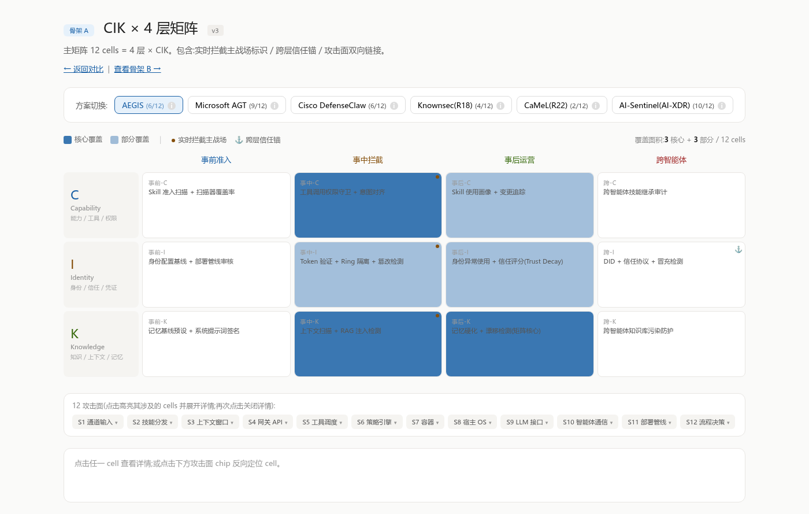
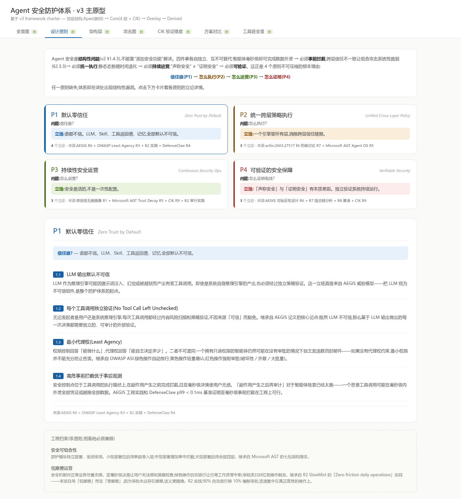
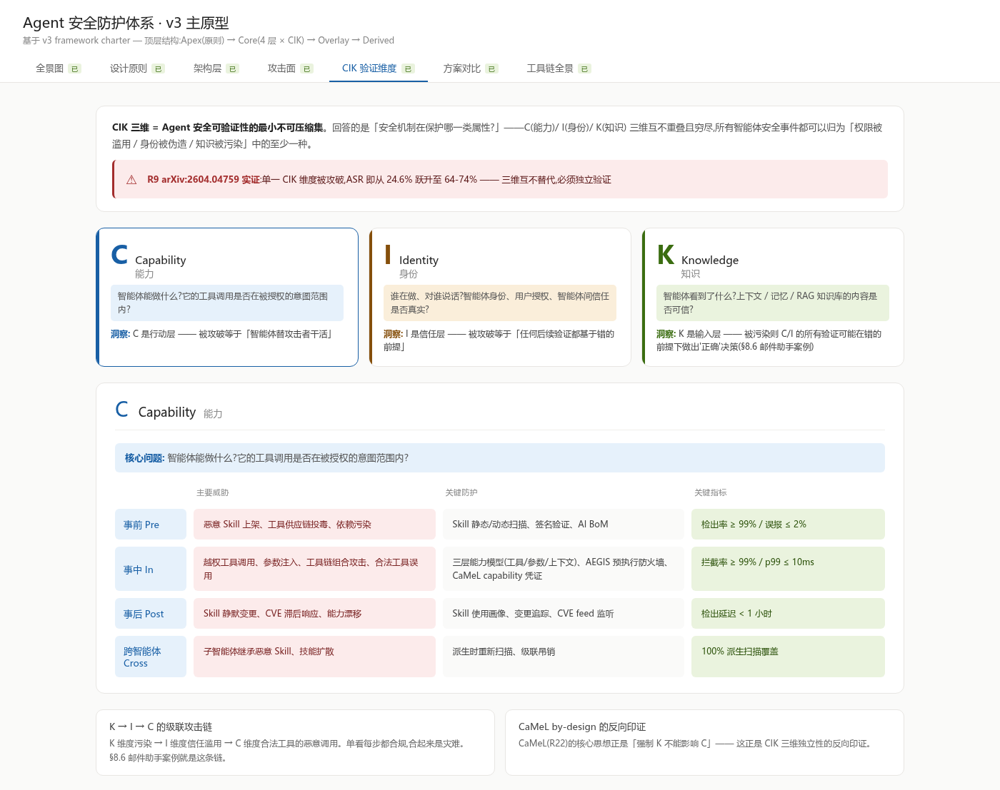
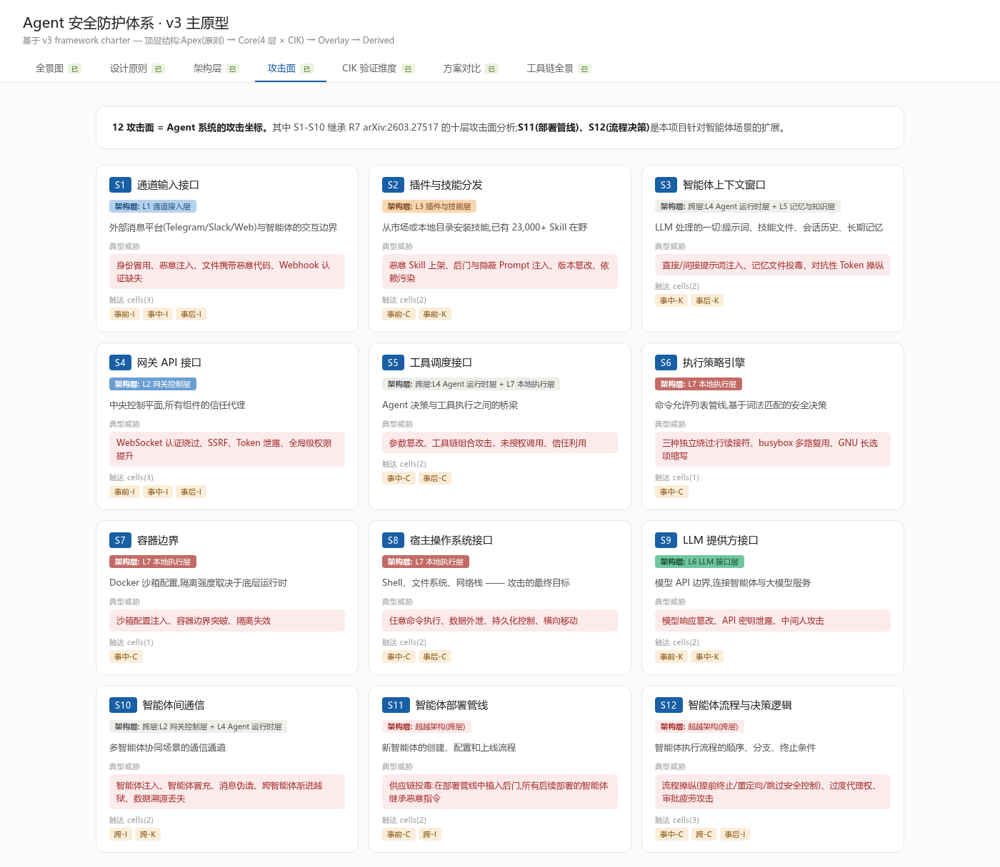
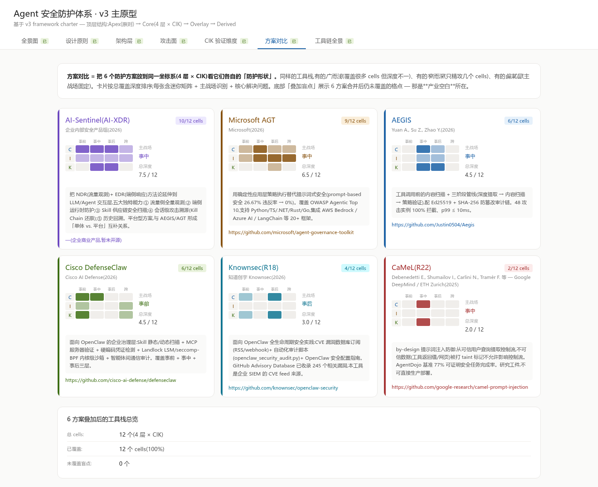
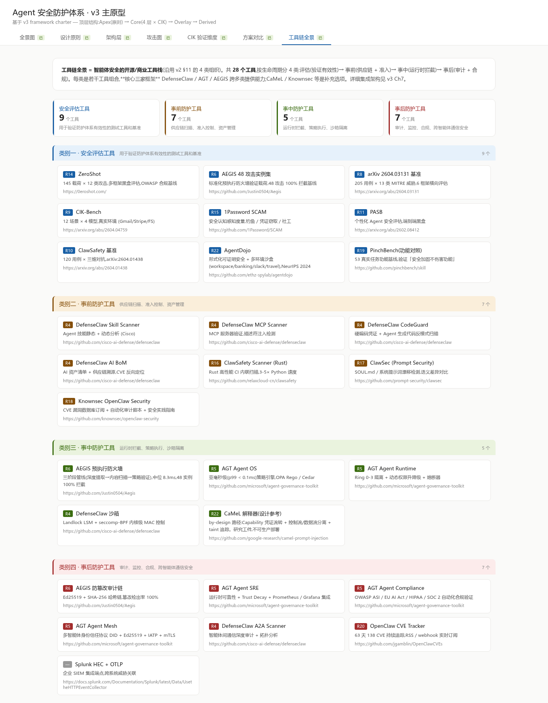

# 自主智能体安全防护体系设计

> 一本面向工程团队的 Agent 安全设计手册——把分散在 25 份论文、白皮书、开源工具中的研究成果(R1–R23),收敛为一个可直接落地的 framework。

📘 **整本 PDF**:见 [Releases 页](../../releases) 下载最新版本(137 页 / ~7 MB)

🌐 **在线浏览交互式原型**:打开 [`prototypes/v3-skeleton/v3-prototype.html`](prototypes/v3-skeleton/v3-prototype.html)(7 个 tab,完全离线可用)

---

## 一图概览

framework 的核心是一个二维矩阵——横轴是按时间组织的 4 层防御,纵轴是按属性组织的 CIK 三维。12 个单元格各自承担一个独立的验证单元,具体防护方案的覆盖以"高亮格点"形式叠加在矩阵上,直观呈现各方案的"防护形状"。



---

## 框架四层语义

```
顶层 ────── 4 设计原则                    回答 WHY
   │
核心矩阵 ── 4 层防御 × CIK 三维 = 12 单元格    回答 WHERE
   │
叠加层 ──── 12 攻击面 + 防护方案              回答 WHAT
   │
派生层 ──── 5 维画像 + 工具链 + 测试库         回答 HOW
```

四层语义的设计立场:**追溯链清晰** —— 任意防护工具向上可追溯到它覆盖哪些核心矩阵单元格、回应哪些设计原则;任意攻击面向下可定位到它在核心矩阵上的触达单元格、需要哪些工具拦截。

### ① 顶层 — 4 设计原则 + 14 立论

**默认零信任 / 统一跨层策略执行 / 持续性安全运营 / 可验证的安全保障** —— 共同构成"信任谁 → 怎么执行 → 怎么运营 → 怎么证明有效"的决策链。



### ② 核心矩阵 — CIK × 4 层 = 12 验证单元格

**横轴**(时间维度):事前准入 / 事中拦截 / 事后运营 / 跨智能体  
**纵轴**(属性维度):**C** 能力 (Capability) / **I** 身份 (Identity) / **K** 知识 (Knowledge)

每格独立承担一类验证目标(目标 / 方法 / 指标 / 频率),其中 **事中层 3 格是实时拦截主战场**,**事后 × 知识** 是矩阵的核心格(对应记忆投毒类威胁),**跨智能体 × 知识** 是当前生态的产业空白。



### ③ 叠加层 — 12 攻击面 + 6 方案"防护形状"

**12 攻击面 S1-S12**:S1-S10 来自 R7 OpenClaw 漏洞分类法,S11(部署管线)与 S12(流程决策)是针对 R12 Microsoft AIRT 识别的新型失效模式所做的扩展。



**6 主流方案在核心矩阵上的"防护形状"** —— 同一坐标系下,各方案覆盖差异一目了然:AI-Sentinel(10/12 平台型最广)/ Microsoft AGT(9/12)/ AEGIS / Cisco DefenseClaw(各 6/12)/ Knownsec(4/12)/ CaMeL(2/12,by-design 概念锚)。



### ④ 派生层 — 28 工具栈

按 **评估 9 / 事前 7 / 事中 5 / 事后 7** 四类组织,共同构成可落地的开源 / 商业工具组合。



---

## 全书结构 · 10 章 + 3 附录(共 137 页)

| 章 | 标题 | 内容要点 |
|--|--|--|
| 第 1 章 | [范式转移](v3_第1章_范式转移与全书摘要.md) | 能力跃迁 / 攻击面扩展 / 三个根本命题 / 全书框架概览 |
| 第 2 章 | [材料综述与归类](v3_第2章_材料综述与归类.md) | 25 份材料的索引 / 类型划分 / 核心引用 |
| 第 3 章 | [Agent 安全框架](v3_第3章_Framework.md) | 顶层 / 核心矩阵 / 叠加层 / 派生层 完整展开 |
| 第 4 章 | [架构建模与攻击面](v3_第4章_架构建模与攻击面.md) | 7 层智能体参考架构 + 12 攻击面 + 信任流分析 + Kill Chain |
| 第 5 章 | [威胁全景与攻击场景](v3_第5章_威胁全景与攻击场景.md) | 7 类对抗技术 × 12 攻击面;OWASP / MITRE / AIRT 三方映射 |
| 第 6 章 | [四层防御实施](v3_第6章_四层防御实施.md) | 事前 / 事中 / 事后 / 跨智能体 + 跨层协同与缝隙 |
| 第 7 章 | [安全可验证性设计](v3_第7章_安全可验证性设计.md) | 12 验证单元格 / 8 测试集合 / 4 标准化接口 / 红蓝对抗 |
| 第 8 章 | [工具链选型与方案对比](v3_第8章_工具链选型与方案对比.md) | 28 工具 / 6 方案 / 三框架协作 / **cross/K 产业空白** |
| 第 9 章 | [部署模式与企业适配](v3_第9章_部署模式与企业适配.md) | 三档蓝图 / 五行业垂直 / 合规对接 / CLAW-10 评估 / 五阶段路线图 |
| 第 10 章 | [真实案例深析](v3_第10章_真实案例深析.md) | 邮件助手记忆投毒 / SSRF→Token→Exec / Crescendo / yahoofinance Skill |
| 附录 A | [攻防全量映射表](v3_附录A_攻防全量映射表.md) | 12 攻击面 × 4 层 / 7 对抗技术触达表 / 三方分类法索引 |
| 附录 B | [测试库与验证接口 Schema](v3_附录B_测试库与验证接口Schema.md) | 8 测试集合 / YAML 用例 Schema / 4 接口 JSON Schema |
| 附录 C | [R 编号 × 章节 引用矩阵](v3_附录C_R编号引用矩阵.md) | 25 × 10 引用矩阵 + 核心论据材料 |

---

## 在线浏览交互式原型

`prototypes/v3-skeleton/` 内含 7 个 tab 的可交互原型(纯静态 HTML + 离线打包的 React/Babel,无需联网):

| Tab | 文件 / 锚点 | 内容 |
|--|--|--|
| 全景图 | [`skeleton-A.html`](prototypes/v3-skeleton/skeleton-A.html) | 4 层 × CIK 矩阵,可切换显示 6 方案的覆盖叠加 |
| 设计原则 | `v3-prototype.html#tab=principles` | 4 原则 + 14 立论卡片 |
| 架构层 | `v3-prototype.html#tab=arch` | 7 层智能体架构 + OpenClaw 实例化映射 |
| 攻击面 | `v3-prototype.html#tab=surfaces` | 12 攻击面卡片 |
| CIK 验证维度 | `v3-prototype.html#tab=cik` | CIK 三维 + 4 层 = 12 验证矩阵 |
| 方案对比 | `v3-prototype.html#tab=schemes` | 6 方案"防护形状"并排迷你矩阵 |
| 工具链 | `v3-prototype.html#tab=tools` | 28 工具的全景视图 |

直接 `open prototypes/v3-skeleton/v3-prototype.html`(macOS)或 `xdg-open`(Linux)即可在浏览器查看。

---

## 本地构建 PDF

```bash
# 依赖
pip install weasyprint markdown pypdf
sudo apt install chromium-browser   # 用于截图;Mermaid 渲染可选

# 构建整本(产出 output/自主智能体安全防护体系设计_完整版.pdf)
python3 tools/build_book.py
```

如需重新生成 prototypes 配图截图:

```bash
cd prototypes/v3-skeleton && python3 -m http.server 8000 &
cd ../../
python3 tools/screenshot_v3_tabs.py    # 截图 → figures/v3/
python3 tools/trim_screenshots.py      # 裁白边
```

---

## 引用材料说明

本书引用的 25 份原始材料(R1-R23)中,**部分材料未直接随仓库分发**:

- **内部文档**(R1 奇安信 / R13a 腾讯 / R13b 行业联合白皮书 / AI-Sentinel 商业 PRD):受发布方约束不公开,仓库仅保留章节中的引用与摘要
- **第三方版权材料**(OWASP 标准 / Microsoft AIRT 白皮书 / NIST 公开标准 / arXiv 预印本):为避免重复分发,请凭 R 编号在 [`materials/materials-outline.md`](materials/materials-outline.md) 查到的来源链接(arXiv URL、GitHub 仓库、官方下载页)自行获取

仓库中保留的 `materials/**/R*.md` 是**研究笔记** —— 作者对各份材料的精炼摘要 + 工程视角分析,非原文转载。

---

## 许可证

本仓库采用**双许可证**模式:

- **代码部分** (`tools/`、`prototypes/`) — [MIT License](LICENSE)
- **内容部分** (`v3_*.md` 章节文本、`figures/v3/*.png` 截图、`materials/**/*.md` 研究笔记) — [Creative Commons Attribution 4.0](LICENSE-CONTENT.md)(允许复制 / 改编 / 商业使用,要求署名)

---

## 引用本书

```bibtex
@book{agentsec2026,
  title  = {自主智能体安全防护体系设计},
  author = {showrun.lee},
  year   = {2026},
  url    = {https://github.com/<your-org>/agent-security-frame},
  note   = {137 页;10 章 + 3 附录}
}
```

---

## 贡献与反馈

欢迎以 issue / discussion 形式提:

- 章节疑问与勘误
- 新材料推荐(R24+)
- **cross/K 产业空白方向**的研究 / 工程进展(详见第 8 章 §8.6)
- 真实案例补充

PR 请优先使用既有的 "R 编号 + 章节 §X.Y" 引用约定,以保持全书的引用一致性。
