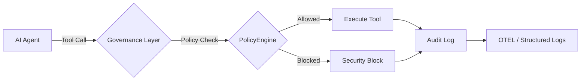

# R5 — Microsoft Agent Governance Toolkit

> **Source**: https://github.com/microsoft/agent-governance-toolkit
> **Default branch**: main
> **Commit SHA (fetched)**: 481905793f
> **Fetched at**: 2026-04-23T10:42:43Z

---

## README.md

🌍 [English](/README.md) | [日本語](./docs/i18n/README.ja.md) | [简体中文](./docs/i18n/README.zh-CN.md)


# Agent Governance Toolkit

[](https://github.com/microsoft/agent-governance-toolkit/actions/workflows/ci.yml)
[](LICENSE)
[](https://pypi.org/project/agent-governance-toolkit/)
[](docs/OWASP-COMPLIANCE.md)
[](https://scorecard.dev/viewer/?uri=github.com/microsoft/agent-governance-toolkit)
[](https://deepwiki.com/microsoft/agent-governance-toolkit)

> [!IMPORTANT]
> **Public Preview** — Microsoft-signed, production-quality releases. May have breaking changes before GA.
> [Open a GitHub issue](https://github.com/microsoft/agent-governance-toolkit/issues) for feedback.

> [!TIP]
> **v3.2.2 is out!** Patch: OpenClaw sidecar docker fix, encryption exports for npm. E2E encrypted agent messaging (Signal protocol), Wire Protocol spec, registry + relay services. [Changelog →](CHANGELOG.md)

**Runtime governance for AI agents** — deterministic policy enforcement, zero-trust identity, execution sandboxing, and SRE for autonomous agents. Covers all **10 OWASP Agentic risks** with **9,500+ tests**.

**Works with any stack** — AWS Bedrock, Google ADK, Azure AI, LangChain, CrewAI, AutoGen, OpenAI Agents, and 20+ more. Python · TypeScript · .NET · Rust · Go.

---

## What This Is (and Isn't)

**What it does:** Sits between your agent framework and the actions agents take. Every tool call, resource access, and inter-agent message is evaluated against policy *before* execution. Deterministic — not probabilistic.

**What it doesn't do:** This is not a prompt guardrail or content moderation tool. It governs agent *actions*, not LLM inputs/outputs. For model-level safety, see [Azure AI Content Safety](https://learn.microsoft.com/azure/ai-services/content-safety/).

```
Agent Action ──► Policy Check ──► Allow / Deny ──► Audit Log    (< 0.1 ms)
```

**Why it matters:** Prompt-based safety ("please follow the rules") has a [26.67% policy violation rate](docs/BENCHMARKS.md) in red-team testing. AGT's deterministic application-layer enforcement: **0.00%**.

---

## Get Started in 90 Seconds

```bash
# 1. Install
pip install agent-governance-toolkit[full]

# 2. Check your installation
agt doctor

# 3. Verify OWASP compliance
agt verify

# 4. Verify runtime evidence, when available
agt verify --evidence ./agt-evidence.json

# 5. Fail CI on weak runtime evidence
agt verify --evidence ./agt-evidence.json --strict
```

Then govern your first action:

```python
from agent_os.policies import PolicyEvaluator, PolicyDocument, PolicyRule, PolicyCondition, PolicyAction, PolicyOperator, PolicyDefaults

evaluator = PolicyEvaluator(policies=[PolicyDocument(
    name="my-policy", version="1.0",
    defaults=PolicyDefaults(action=PolicyAction.ALLOW),
    rules=[PolicyRule(
        name="block-dangerous-tools",
        condition=PolicyCondition(field="tool_name", operator=PolicyOperator.IN, value=["execute_code", "delete_file"]),
        action=PolicyAction.DENY, priority=100,
    )],
)])

result = evaluator.evaluate({"tool_name": "web_search"})    # ✅ Allowed
result = evaluator.evaluate({"tool_name": "delete_file"})   # ❌ Blocked deterministically
```

<details>
<summary><b>TypeScript</b></summary>

```typescript
import { PolicyEngine } from "@microsoft/agent-governance-sdk";

const engine = new PolicyEngine([
  { action: "web_search", effect: "allow" },
  { action: "shell_exec", effect: "deny" },
]);
engine.evaluate("web_search"); // "allow"
engine.evaluate("shell_exec"); // "deny"
```

</details>

<details>
<summary><b>.NET</b></summary>

```csharp
using AgentGovernance;
using AgentGovernance.Extensions.ModelContextProtocol;
using AgentGovernance.Policy;

var kernel = new GovernanceKernel(new GovernanceOptions
{
    PolicyPaths = new() { "policies/default.yaml" },
});

var result = kernel.EvaluateToolCall("did:mesh:agent-1", "web_search",
    new() { ["query"] = "latest AI news" });
// result.Allowed == true

builder.Services
    .AddMcpServer()
    .WithGovernance(options => options.PolicyPaths.Add("policies/mcp.yaml"));
```

</details>

<details>
<summary><b>Rust</b></summary>

```rust
use agent_governance::{AgentMeshClient, ClientOptions};

let client = AgentMeshClient::new("my-agent").unwrap();
let result = client.execute_with_governance("data.read", None);
assert!(result.allowed);
```

</details>

<details>
<summary><b>Go</b></summary>

```go
import agentmesh "github.com/microsoft/agent-governance-toolkit/agent-governance-golang"

client, _ := agentmesh.NewClient("my-agent",
    agentmesh.WithPolicyRules([]agentmesh.PolicyRule{
        {Action: "data.read", Effect: agentmesh.Allow},
        {Action: "*", Effect: agentmesh.Deny},
    }),
)
result := client.ExecuteWithGovernance("data.read", nil)
// result.Allowed == true
```

</details>

> **Full walkthrough:** [QUICKSTART.md](QUICKSTART.md) — zero to governed agents in 10 minutes with YAML policies, OPA/Rego, and Cedar support.
> 🌍 Also available in: [日本語](docs/i18n/QUICKSTART.ja.md) | [简体中文](docs/i18n/QUICKSTART.zh-CN.md)

---

## What You Get

| Capability | What It Does | Links |
|---|---|---|
| **Policy Engine** | Every action evaluated before execution — sub-millisecond, deterministic. Supports YAML, OPA/Rego, and Cedar policies | [Agent OS](packages/agent-os/) · [Benchmarks](docs/BENCHMARKS.md) |
| **Zero-Trust Identity** | Ed25519 + quantum-safe ML-DSA-65 credentials, trust scoring (0–1000), SPIFFE/SVID | [AgentMesh](packages/agent-mesh/) |
| **Execution Sandboxing** | 4-tier privilege rings, saga orchestration, kill switch | [Runtime](packages/agent-runtime/) · [Hypervisor](packages/agent-hypervisor/) |
| **Agent SRE** | SLOs, error budgets, replay debugging, chaos engineering, circuit breakers | [Agent SRE](packages/agent-sre/) |
| **MCP Security Scanner** | Detect tool poisoning, typosquatting, hidden instructions in MCP definitions | [MCP Scanner](packages/agent-os/src/agent_os/mcp_security.py) |
| **Shadow AI Discovery** | Find unregistered agents across processes, configs, and repos | [Agent Discovery](packages/agent-discovery/) |
| **Agent Lifecycle** | Provisioning → credential rotation → orphan detection → decommissioning | [Lifecycle](packages/agent-mesh/src/agentmesh/lifecycle/) |
| **Governance Dashboard** | Real-time fleet visibility — health, trust, compliance, audit events | [Dashboard](demo/governance-dashboard/) |
| **Unified CLI** | `agt verify`, `agt doctor`, `agt lint-policy` — one command for everything | [CLI](packages/agent-compliance/src/agent_compliance/cli/agt.py) |
| **PromptDefense Evaluator** | 12-vector prompt injection audit for compliance testing | [Evaluator](packages/agent-compliance/src/agent_compliance/prompt_defense.py) |

---

## Works With Your Stack

| Framework | Integration |
|-----------|-------------|
| [**Microsoft Agent Framework**](https://github.com/microsoft/agent-framework) | Native Middleware |
| [**Semantic Kernel**](https://github.com/microsoft/semantic-kernel) | Native (.NET + Python) |
| [Microsoft AutoGen](https://github.com/microsoft/autogen) | Adapter |
| [LangGraph](https://github.com/langchain-ai/langgraph) / [LangChain](https://github.com/langchain-ai/langchain) | Adapter |
| [CrewAI](https://github.com/crewAIInc/crewAI) | Adapter |
| [OpenAI Agents SDK](https://github.com/openai/openai-agents-python) | Middleware |
| [pi-mono](https://github.com/badlogic/pi-mono/tree/main/packages/coding-agent) | TypeScript SDK Integration |
| [Google ADK](https://github.com/google/adk-python) | Adapter |
| [LlamaIndex](https://github.com/run-llama/llama_index) | Middleware |
| [Haystack](https://github.com/deepset-ai/haystack) | Pipeline |
| [Dify](https://github.com/langgenius/dify) | Plugin |
| [Azure AI Foundry](https://learn.microsoft.com/azure/ai-studio/) | Deployment Guide |

Full list: [Framework Integrations](packages/agentmesh-integrations/) · [Quickstart Examples](examples/quickstart/)

---

## OWASP Agentic Top 10 — 10/10 Covered

| Risk | ID | AGT Control |
|------|----|-------------|
| Agent Goal Hijacking | ASI-01 | Policy engine blocks unauthorized goal changes |
| Excessive Capabilities | ASI-02 | Capability model enforces least-privilege |
| Identity & Privilege Abuse | ASI-03 | Zero-trust identity with Ed25519 + ML-DSA-65 |
| Uncontrolled Code Execution | ASI-04 | Execution rings + sandboxing |
| Insecure Output Handling | ASI-05 | Content policies validate all outputs |
| Memory Poisoning | ASI-06 | Episodic memory with integrity checks |
| Unsafe Inter-Agent Comms | ASI-07 | Encrypted channels + trust gates |
| Cascading Failures | ASI-08 | Circuit breakers + SLO enforcement |
| Human-Agent Trust Deficit | ASI-09 | Full audit trails + flight recorder |
| Rogue Agents | ASI-10 | Kill switch + ring isolation + anomaly detection |

Full mapping: [OWASP-COMPLIANCE.md](docs/OWASP-COMPLIANCE.md) · Regulatory alignment: [EU AI Act](docs/compliance/), [NIST AI RMF](docs/compliance/nist-ai-rmf-alignment.md), [Colorado AI Act](docs/compliance/)

---

## Performance

Governance adds **< 0.1 ms per action** — roughly 10,000× faster than an LLM API call.

| Metric | Latency (p50) | Throughput |
|---|---|---|
| Policy evaluation (1 rule) | 0.012 ms | 72K ops/sec |
| Policy evaluation (100 rules) | 0.029 ms | 31K ops/sec |
| Policy enforcement | 0.091 ms | 9.3K ops/sec |
| Concurrent (50 agents) | — | 35,481 ops/sec |

> **Note:** These numbers measure policy evaluation only. In distributed multi-agent
> deployments, add ~5–50ms for cryptographic verification and mesh handshake on
> inter-agent messages. See [Limitations — Performance](docs/LIMITATIONS.md#3-performance-policy-eval-vs-end-to-end) for full breakdown.

Full methodology: [BENCHMARKS.md](docs/BENCHMARKS.md)

---

## Install

| Language | Package | Command |
|----------|---------|---------|
| **Python** | [`agent-governance-toolkit`](https://pypi.org/project/agent-governance-toolkit/) | `pip install agent-governance-toolkit[full]` |
| **TypeScript** | [`@microsoft/agent-governance-sdk`](packages/agent-mesh/sdks/typescript/) | `npm install @microsoft/agent-governance-sdk` |
| **.NET** | [`Microsoft.AgentGovernance`](https://www.nuget.org/packages/Microsoft.AgentGovernance) | `dotnet add package Microsoft.AgentGovernance` |
| **.NET MCP** | `Microsoft.AgentGovernance.Extensions.ModelContextProtocol` | `dotnet add package Microsoft.AgentGovernance.Extensions.ModelContextProtocol` |
| **Rust** | [`agent-governance`](https://crates.io/crates/agent-governance) | `cargo add agent-governance` |
| **Go** | [`agent-governance-toolkit`](agent-governance-golang/) | `go get github.com/microsoft/agent-governance-toolkit/agent-governance-golang` |

All 5 language packages implement core governance (policy, identity, trust, audit). Python has the full stack.
See **[Language Package Feature Matrix](docs/SDK-FEATURE-MATRIX.md)** for detailed per-language coverage.

<details>
<summary><b>Individual Python packages</b></summary>

| Package | PyPI | Description |
|---------|------|-------------|
| Agent OS | [`agent-os-kernel`](https://pypi.org/project/agent-os-kernel/) | Policy engine, capability model, audit logging, MCP gateway |
| AgentMesh | [`agentmesh-platform`](https://pypi.org/project/agentmesh-platform/) | Zero-trust identity, trust scoring, A2A/MCP/IATP bridges |
| Agent Runtime | [`agentmesh-runtime`](packages/agent-runtime/) | Privilege rings, saga orchestration, termination control |
| Agent SRE | [`agent-sre`](https://pypi.org/project/agent-sre/) | SLOs, error budgets, chaos engineering, circuit breakers |
| Agent Compliance | [`agent-governance-toolkit`](https://pypi.org/project/agent-governance-toolkit/) | OWASP verification, integrity checks, policy linting |
| Agent Discovery | [`agent-discovery`](packages/agent-discovery/) | Shadow AI discovery, inventory, risk scoring |
| Agent Hypervisor | [`agent-hypervisor`](packages/agent-hypervisor/) | Reversibility verification, execution plan validation |
| Agent Marketplace | [`agentmesh-marketplace`](packages/agent-marketplace/) | Plugin lifecycle management |
| Agent Lightning | [`agentmesh-lightning`](packages/agent-lightning/) | RL training governance |

</details>

---

## Documentation

**Getting Started**
- [Quick Start](QUICKSTART.md) — Zero to governed agents in 10 minutes
- [Tutorials](docs/tutorials/) — 31 numbered tutorials + 7-chapter Policy-as-Code deep dive
- [FAQ](docs/FAQ.md) — Technical Q&A for customers, partners, and evaluators

**Architecture & Reference**
- [Language Package Feature Matrix](docs/SDK-FEATURE-MATRIX.md) — Per-language capability comparison
- [Architecture](docs/ARCHITECTURE.md) — System design, security model, trust scoring
- [Architecture Decisions](docs/adr/README.md) — ADR log
- [Threat Model](docs/THREAT_MODEL.md) — Trust boundaries and STRIDE analysis
- [API: Agent OS](packages/agent-os/README.md) · [AgentMesh](packages/agent-mesh/README.md) · [Agent SRE](packages/agent-sre/README.md)

**Compliance & Deployment**
- [Known Limitations](docs/LIMITATIONS.md) — Honest design boundaries and recommended layered defense
- [OWASP Compliance](docs/OWASP-COMPLIANCE.md) — Full ASI-01 through ASI-10 mapping
- [Deployment Guides](docs/deployment/README.md) — Azure (AKS, Foundry, Container Apps), AWS (ECS/Fargate), GCP (GKE), Docker Compose
- [NIST AI RMF Alignment](docs/compliance/nist-ai-rmf-alignment.md) · [EU AI Act](docs/compliance/) · [SOC 2 Mapping](docs/compliance/soc2-mapping.md)

**Extensions**
- [VS Code Extension](packages/agent-os-vscode/) · [Framework Integrations](packages/agentmesh-integrations/)

---

## Security

This toolkit provides **application-level governance** (Python middleware), not OS kernel-level isolation. The policy engine and agents run in the same process — the same trust boundary as every Python agent framework.

**Production recommendation:** Run each agent in a separate container for OS-level isolation. See [Architecture — Security Boundaries](docs/ARCHITECTURE.md).

> **📖 [Known Limitations & Design Boundaries](docs/LIMITATIONS.md)** — what AGT does *not* do, honest performance numbers for distributed deployments, and the recommended layered defense architecture.

| Tool | Coverage |
|------|----------|
| CodeQL | Python + TypeScript SAST |
| Gitleaks | Secret scanning on PR/push/weekly |
| ClusterFuzzLite | 7 fuzz targets (policy, injection, MCP, sandbox, trust) |
| Dependabot | 13 ecosystems |
| OpenSSF Scorecard | Weekly scoring + SARIF upload |

---

## Contributing

- [Contributing Guide](CONTRIBUTING.md) · [Community](docs/COMMUNITY.md) · [Security Policy](SECURITY.md) · [Changelog](CHANGELOG.md)

**Using AGT?** Add your organization to [ADOPTERS.md](docs/ADOPTERS.md) — it helps the project gain momentum and helps others discover real-world use cases.

## Important Notes

If you use the Agent Governance Toolkit to build applications that operate with third-party agent frameworks or services, you do so at your own risk. We recommend reviewing all data being shared with third-party services and being cognizant of third-party practices for retention and location of data.

## License

This project is licensed under the [MIT License](LICENSE).

## Trademarks

This project may contain trademarks or logos for projects, products, or services. Authorized use of Microsoft
trademarks or logos is subject to and must follow
[Microsoft's Trademark & Brand Guidelines](https://www.microsoft.com/en-us/legal/intellectualproperty/trademarks/usage/general).
Use of Microsoft trademarks or logos in modified versions of this project must not cause confusion or imply Microsoft sponsorship.
Any use of third-party trademarks or logos are subject to those third-party's policies.


---

## SECURITY.md

<!-- BEGIN MICROSOFT SECURITY.MD V1.0.0 BLOCK -->

## Security

Microsoft takes the security of our software products and services seriously, which
includes all source code repositories in our GitHub organizations.

**Please do not report security vulnerabilities through public GitHub issues.**

For security reporting information, locations, contact information, and policies,
please review the latest guidance for Microsoft repositories at
[https://aka.ms/SECURITY.md](https://aka.ms/SECURITY.md).

<!-- END MICROSOFT SECURITY.MD BLOCK -->

## Security Contact

To report a vulnerability, email **secure@microsoft.com**. You will receive acknowledgement
within 24 hours and a detailed response within 72 hours indicating next steps.

## Supported Versions

| Version | Supported          |
|---------|--------------------|
| 2.1.x   | :white_check_mark: |
| 2.0.x   | :white_check_mark: |
| < 2.0   | :x:                |

## Disclosure Policy

We follow a **90-day coordinated disclosure** timeline. After a vulnerability is
reported and confirmed, we will:

1. Acknowledge receipt within **24 hours**.
2. Provide a fix or mitigation within **90 days**.
3. Coordinate public disclosure with the reporter after the fix is released.

If a fix requires more than 90 days, we will negotiate an extended timeline with
the reporter before any public disclosure.

## Security Advisories

### CostGuard Organization Kill Switch Bypass (Fixed in v2.1.0)

**Severity:** High
**Affected versions:** < 2.1.0
**Fixed in:** v2.1.0 (PR #272)

A crafted input using IEEE 754 special values (NaN, Infinity, negative numbers) to
CostGuard budget parameters could bypass the organization-level kill switch, allowing
agents to continue operating after the budget threshold was exceeded.

**Fix:** Input validation now rejects NaN/Inf/negative values. The `_org_killed` flag
persists kill state permanently — once the organization budget threshold is crossed,
all agents are blocked including newly created ones.

**Recommendation:** Upgrade to v2.1.0 or later. No workaround exists for earlier versions.

### Thread Safety Fixes (Fixed in v2.1.0)

**Severity:** Medium
**Affected versions:** < 2.1.0
**Fixed in:** v2.1.0

Four independent thread safety issues were fixed in security-critical paths:
- CostGuard breach history: unbounded growth + missing lock (#253)
- VectorClock: race condition under concurrent access (#243)
- ErrorBudget._events: unbounded deque without size limit (#172)
- .NET SDK: thread safety, caching, disposal sweep (#252)

**Recommendation:** Upgrade to v2.1.0 or later if running under concurrent agent load.

---

## CHANGELOG.md

# Changelog

All notable changes to this project will be documented in this file.

The format is based on [Keep a Changelog](https://keepachangelog.com/en/1.1.0/),
and this project adheres to [Semantic Versioning](https://semver.org/spec/v2.0.0.html).

> [!IMPORTANT]
> All releases are currently **public preview releases**. They are Microsoft-signed
> and production-quality but may have breaking changes before GA.

## [Unreleased]


## [3.2.1] - 2026-04-22

### Fixed
- **TypeScript SDK**: Fixed build compatibility with TypeScript 6.0 — encryption modules (X3DHKeyManager, MeshClient, SecureChannel, DoubleRatchet) now correctly exported from npm package
- **TypeScript SDK**: Fixed `@noble/hashes` import paths (`sha256` → `sha2` module rename)
- **TypeScript SDK**: Replaced removed `edwardsToMontgomeryPriv/Pub` with manual SHA-512 + RFC 7748 clamping
- **TypeScript SDK**: Added Jest `moduleNameMapper` + `transformIgnorePatterns` for ESM `@noble/*` packages

## [3.2.0] - 2026-04-22

### Added
- **AgentMesh Wire Protocol v1.0** specification (`docs/specs/AGENTMESH-WIRE-1.0.md`)
- **TypeScript E2E Encryption** — X3DH + Double Ratchet + SecureChannel ported to `@microsoft/agentmesh-sdk`
- **MeshClient** — high-level relay transport with plaintext peers, KNOCK pending queue, wsFactory hook
- **Registry Service** — first-party agent registry with pre-key bundles, discovery, presence, reputation
- **Relay Service** — store-and-forward WebSocket relay with 72h TTL offline inbox
- Clean-room IP statement and recommended crypto libraries (Appendix A-B of wire spec)

### Fixed
- CI lint errors in encryption modules
- Dependency scan allowlist for mkdocs-minify-plugin## [3.1.1] - 2026-04-21

### Added
- **E2E Encrypted Agent Messaging** — Signal protocol (X3DH + Double Ratchet) for agent-to-agent channels with per-message forward secrecy (#1222, #1223, #1224, #1226)
  - `agentmesh.encryption.x3dh` — X3DH key agreement using Ed25519 identity keys
  - `agentmesh.encryption.ratchet` — Double Ratchet with ChaCha20-Poly1305 encryption
  - `agentmesh.encryption.channel` — SecureChannel high-level send/receive API
  - `agentmesh.encryption.bridge` — EncryptedTrustBridge gates channels on trust verification
  - 61 tests across all encryption modules
- **GitHub Pages documentation site** — MkDocs Material at microsoft.github.io/agent-governance-toolkit (#1186)
- **BinSkim binary security analysis** for .NET SDK in CI (#1245)
- **Customer FAQ** — 13 technical Q&As for customers, partners, and evaluators (#1171, #1185)
- **Tutorial 32** — E2E Encrypted Agent Messaging (#1227)
- **Tutorial 33** — Offline-Verifiable Decision Receipts (#1197)
- **Entra Agent ID bridge tutorial** — DID ↔ Entra identity integration (#1166)
- **Chaos testing tutorial** for AI agents with Agent SRE (#1184)
- **ISO 42001 alignment assessment** (#1183)
- **sb-runtime governance skill** — signed decision receipts with Veritas Acta format (#1203)
- **Physical attestation example** — cold chain sensor governance receipts (#1168)
- **protect-mcp governed example** — Cedar policies + signed receipts (#1159)
- **Container images** — GHCR publishing for AgentMesh components (#1192)
- **.NET SDK**: MCP security namespace, kill switch, lifecycle management (#1021, #1065)
- **Go SDK**: MCP security, execution rings, lifecycle management (#1066)
- **Rust SDK**: Execution rings and lifecycle management (#1067)
- **Graph API group membership sync** for Entra Agent ID bridge (#1191)
- **Workshop materials** — 2-hour AI agent governance session (#1195)

### Security
- Address all 106 open code scanning alerts (#1211)
- Address 14 code scanning alerts (#1211)
- Remove hardcoded credentials flagged by generic secret scanning (#1217)
- Upgrade axios to 1.15.0 for CVE-2026-40175, CVE-2025-62718 (#966)
- Address 6 Dependabot security vulnerabilities (#1212)
- Resolve CodeQL syntax errors (#1213)
- Harden new packages against audit findings (#944)
- XSS, curl|bash, CORS, PII leak, path traversal fixes (#945)

### Fixed
- **ESRP NuGet signing** — add AuthCertName for cert-based auth, fix Windows agent requirement (#1022, #1207, #1208, #1210, #1214, #1232, #1233)
- **CI path filters** — docs-only PRs drop from ~14 checks to ~4 (#1019)
- **CI concurrency groups** — cancel stale duplicate runs on branch updates (#1019)
- Remove pi-mono integration breaking dependency scan (#1190)
- Fix lint errors in encryption modules (#1248)
- Add mkdocs-minify-plugin to dep scan allowlist (#1247)
- Align lotl_prevention_policy.yaml with PolicyDocument schema
- Standardize DID method to did:agentmesh across all SDKs (#1170)
- Downgrade rand 0.9.3 to 0.8.5 for ed25519-dalek compatibility (#1178)
- Fix container publish workflow matrix issues (#1239, #1240, #1241, #1243)
- Rewrite production policy examples to valid PolicyDocument schema (#1011)

### Documentation
- **OpenClaw sidecar** — comprehensive rewrite with verified API examples and working demo (#1163, #1164, #1167)
- v3.1.0 release announcement in README with PyPI badge (#1019)
- OWASP ASI-07 updated with Signal protocol E2E encryption (#1242)
- Governance Maturity Model blog post (#1182)
- Blog post comparing AI agent governance approaches (#1193)
- docs/GOVERNANCE.md, docs/MAINTAINERS.md, docs/ROADMAP.md for foundation submission (#1215)
- Attribution & prior art policy (#1219)
- Sync audit redaction wording with current code (#1014)
- Address external critic gaps in limitations and threat model (#1017, #1025)

### Dependencies
- Bump 25+ dependencies across Python, TypeScript, .NET, and Rust packages


## [3.1.0] - 2026-04-11

### Added
- **Unified `agt` CLI** with plugin discovery, doctor command, and 79 tests (#924)
- **Governance Dashboard** — real-time agent fleet visibility (#925)
- **Agent Lifecycle Management** — provisioning to decommission (#923)
- **Agent Discovery Package** — shadow AI discovery & inventory (#921)
- **Quantum-Safe Signing** — ML-DSA-65 alongside Ed25519 (#927)
- **Vendor Independence Enforcement** across all core packages
- **OWASP ASI 2026 Taxonomy Migration** with reference architecture
- **PromptDefenseEvaluator** — 12-vector prompt audit (#854)
- **EU AI Act Risk Classifier** (`agentmesh.governance.EUAIActRiskClassifier`) — structured risk classification per Article 6 and Annex III, with Art. 6(1) Annex I safety-component path, Art. 6(3) exemptions, GDPR Art. 4(4) profiling override, and configurable YAML categories for regulatory updates (#756)

### Security
- Patched dependency verification bypass and trust handshake DID forgery (#920)
- **Hardened CLI Error Handling** — standardized sanitized JSON error output across all 7 ecosystem tools to prevent internal information disclosure (CWE-209)
- **Audit Log Whitelisting** — implemented strict key-whitelisting in `agentmesh audit` JSON output to prevent accidental leakage of sensitive agent internal state
- **CLI Input Validation** — added regex-based validation for agent identifiers (DIDs/names) in registration and verification commands to prevent injection attacks

### Fixed
- Repo hygiene: MIT headers, compliance disclaimers, dependency confusion, network bindings (#926)
- CI: pyyaml added to agent-compliance direct dependencies
- Code samples updated to v3 API
- Various dependency bumps (cryptography, path-to-regexp, etc.)

### Documentation
- Modern Agent Architecture overview for enterprise sharing
- NIST AI RMF 1.0 alignment assessment
- MCP governance consolidated into docs/compliance/
- Policy-as-code tutorial chapter 4
- Added `EUAIActRiskClassifier` usage example and API docs to `packages/agent-mesh/README.md`
- Updated `QUICKSTART.md` and `Tutorial 04 — Audit & Compliance` with secure JSON error handling examples and schema details
- Added "Secure Error Handling" sections to primary documentation to guide users on interpreting sanitized machine-readable outputs

### Added
- Added optional runtime evidence mode for `agt verify` with `--evidence` and `--strict`.


## [3.0.2] - 2026-04-02

### Security
- Comprehensive security audit remediation (29 findings fixed)
- CI injection prevention: moved all github.event expressions to env blocks
- Supply chain hardening: dependency confusion fixes, npm lockfiles, Dockerfile pinning
- Docker/infra: removed hardcoded passwords, wildcard CORS, added .dockerignore exclusions
- Code quality: XSS prevention in VS Code webviews, Rust panic safety
- Version pinning compliance across all pyproject.toml and Cargo.toml files
- Extended dependency confusion detection script coverage

## [3.0.1] - 2026-04-01

### Added
- Rust SDK (`agentmesh` crate) for native governance integration
- Go SDK module for policy, trust, audit, and identity
- Trust report CLI command (`agentmesh trust report`)
- Secret scanning workflow (Gitleaks)
- 4 new fuzz targets (prompt injection, MCP scanner, sandbox, trust scoring)
- Dependabot coverage expanded to 13 ecosystems (+ cargo, gomod, nuget, docker)
- 7 new tutorials (Rust SDK, Go SDK, delegation chains, budgets, security, SBOM, MCP scan)
- ESRP Release publishing for Rust crates (crates.io)
- Entra Agent ID adapter for managed identity integration
- Secure code generation templates with AST validation
- SBOM generation (SPDX/CycloneDX) with Ed25519 artifact signing
- Tenant isolation checklist and private endpoint deployment examples

### Fixed
- ADO build failures: shebang position (TS18026), Express 5 type narrowing (TS2345)
- NuGetCommand@2 → DotNetCoreCLI@2 for Ubuntu 24.04 compatibility
- path-to-regexp ReDoS vulnerability (8.3.0 → 8.4.0)
- Python 3.10 CI matrix exclusions for packages requiring >=3.11
- TypeScript eslint peer dependency conflicts resolved
- Rust crate dependency pins (rand 0.8, sha2 0.10, thiserror 1)
- Ruff lint errors in agent-sre (E741, F401, E401)
- Policy provider test mock contract alignment
- Dify integration removed from CI (archived package)
- Notebook dependency scanner regex hardened

### Changed
- docs/PUBLISHING.md rewritten with full Microsoft compliance policies (MCR, ESRP, Conda, PMC)
- Branch protection: 13 required status checks, dismiss stale reviews, squash-only merges
- README updated with 5 SDK languages, 20+ framework integrations, security tooling table


## [3.0.0] - 2026-03-26

### Changed
- **Official Microsoft-Signed Public Preview** — all packages are now published
  via ESRP Release with Microsoft signing
- All package descriptions updated from "Community Edition" to "Public Preview"
- All Development Status classifiers standardized to "4 - Beta"
- Package `agent-lightning` renamed to `agentmesh-lightning` on PyPI
- All personal author references replaced with Microsoft Corporation
- Contact email updated to agentgovtoolkit@microsoft.com

### Fixed
- Removed all merge conflict markers from docs
- Updated all old PyPI package name references (agent-runtime → agentmesh-runtime,
  agent-lightning → agentmesh-lightning) across README, QUICKSTART, tutorials,
  workflows, and scripts
- ESRP pipeline service connection hardcoded for ADO compile-time requirement
- ESRP pipeline `each` directive syntax fixed in Verify stages
- License format updated to SPDX string (setuptools deprecation fix)

## [2.3.0] - 2026-03-26

### Added
- MCP server allowlist/blocklist and plugin trust tiers (#425, #426)
- Plugin schema adapters and batch evaluation (#424, #429)
- Governance policy linter CLI command (#404)
- Pre-commit hooks for plugin manifest validation (#428)
- GitHub Actions action for governance verification (#423)
- Event bus, task outcomes, diff policy, and sandbox provider (#398, #396, #395, #394)
- Graceful degradation, budget policies, and audit logger (#410, #409, #400)
- JSON schema validation for governance policies (#305, #367)
- 14 launch-ready tutorials (07–20) covering all toolkit features
- Tutorials landing page README with learning paths (#422)
- Copilot instructions with PR review checklist (#413)
- Pytest markers for slow and integration tests (#375)
- Reference integration example for plugin marketplace governance (#427)

### Changed
- Renamed PyPI package `agent-runtime` → `agentmesh-runtime` (name collision with AutoGen) (#444)
- Renamed PyPI package `agent-marketplace` → `agentmesh-marketplace` (#439)
- Renamed PyPI package `agent-lightning` → `agentmesh-lightning` (name collision on PyPI)

### Fixed
- ESRP pipeline `each` directive syntax in Verify stages
- ESRP pipelines updated to use `ESRP_CERT_IDENTIFIER` secret
- Hardcoded service connection name (ADO compile-time requirement) (#421)
- License format updated to SPDX string (setuptools deprecation) in agent-compliance and agent-lightning
- Corrected license reference in AgentMesh README from Apache 2.0 to MIT (#436)
- .NET GovernanceMetrics test isolation — flush listener before baseline (#417)
- Dependency confusion + pydantic dependency fix (#412)
- Enforced maintainer approval for all external PRs (#392)

### Security
- Moved all ESRP config to pipeline secrets (#370)

### Documentation
- Standardized package README badges (#373)
- Added README files to example and skill integration directories (#371, #372, #390)
- Added requirements for example directories (#372)

## [2.2.0] - 2026-03-17

### Added
- ESRP Release ADO pipeline for PyPI publishing (`pipelines/pypi-publish.yml`)
- ESRP Release ADO pipeline for npm publishing (`pipelines/npm-publish.yml`)
- npm build + pack job in GitHub Actions publish workflow
- Community preview disclaimers across all READMEs, release notes, and package descriptions
- `docs/PUBLISHING.md` guide covering PyPI, npm, and NuGet publishing requirements
- `agent-runtime` re-export wrapper package (`src/agent_runtime/__init__.py`)
- `releases/RELEASE_NOTES_v2.2.0.md`
- `create_policies_from_config()` API — load security policies from YAML config files
- `SQLPolicyConfig` dataclass and `load_sql_policy_config()` for structured policy loading
- 10 sample policy configs in `examples/policies/` (sql-safety, sql-strict, sql-readonly, sandbox-safety, prompt-injection-safety, mcp-security, semantic-policy, pii-detection, conversation-guardian, cli-security-rules)
- Configurable security rules across 7 modules: sandbox, prompt injection, MCP security, semantic policy, PII detection, conversation guardian, CLI checker

### Changed
- GitHub Actions `publish.yml` no longer publishes to PyPI (build + attest only)
- Python package author updated to `Microsoft Corporation` with team DL (all 7 packages)
- npm packages renamed to `@microsoft` scope (from `@agentmesh`, `@agent-os`, unscoped)
- npm package author set to `Microsoft Corporation` (all 9 packages)
- All package descriptions prefixed with `Community Edition`
- License corrected to MIT where mismatched (agent-mesh classifier, 2 npm packages)

### Deprecated
- `create_default_policies()` — emits runtime warning directing users to `create_policies_from_config()` with explicit YAML configs

### Security
- Expanded SQL policy deny-list to block GRANT, REVOKE, CREATE USER, EXEC xp_cmdshell, UPDATE without WHERE, MERGE INTO
- Externalized all hardcoded security rules to YAML configuration across 7 modules

### Fixed
- `agent-runtime` build failure (invalid parent-directory hatch reference)
- Missing `License :: OSI Approved :: MIT License` classifier in 3 Python packages
- Incorrect repository URLs in 2 npm packages

## [2.1.0] - 2026-03-15

### 🚀 Highlights

**Multi-language SDK readiness, TypeScript full parity, .NET NuGet hardening, 70+ commits since v1.1.0.** This release makes the toolkit a true polyglot governance layer — Python, TypeScript, and .NET are all first-class citizens with install instructions, quickstarts, and package metadata ready for registry publishing.

### Added

- **TypeScript SDK full parity** (— PolicyEngine + AgentIdentity) — rich policy evaluation with 4 conflict resolution strategies, expression evaluator, rate limiting, YAML/JSON policy documents, Ed25519 identity with lifecycle/delegation/JWK/JWKS/DID export, IdentityRegistry with cascade revocation. 136 tests passing. (#269)
- **@microsoft/agentmesh-sdk 1.0.0** — TypeScript package now publish-ready with `exports` field, `prepublishOnly` build hook, correct `repository.directory`, MIT license.
- **Multi-language README** — root README now surfaces Python (PyPI), TypeScript (npm), and .NET (NuGet) install sections, badges, quickstart code, and a multi-SDK packages table.
- **Multi-language QUICKSTART** — getting started guide now covers all three SDKs with code examples.
- **Semantic Kernel + Azure AI Foundry** added to framework integration table.
- **5 standalone framework quickstarts** — one-file runnable examples for LangChain, CrewAI, AutoGen, OpenAI Agents, Google ADK.
- **Competitive comparison page** — vs NeMo Guardrails, Guardrails AI, LiteLLM, Portkey (`docs/COMPARISON.md`).
- **GitHub Copilot Extension** — agent governance code review extension for Copilot.
- **Observability integrations** — Prometheus, OpenTelemetry, PagerDuty, Grafana (#49).
- **NIST RFI mapping** — question-by-question mapping to NIST AI Agent Security RFI 2026-00206 (#29).
- **Performance benchmarks** — published docs/BENCHMARKS.md with p50/p99 latency, throughput at 50 concurrent agents (#231).
- **6 comprehensive governance tutorials** — policy engine, trust & identity, framework integrations, audit & compliance, agent reliability, execution sandboxing (#187).
- **Azure deployment guides** — AKS, Azure AI Foundry, Container Apps, OpenClaw sidecar.

### Changed

- **agent-governance** (formerly `ai-agent-compliance`): Renamed PyPI package for better discoverability.
- **README architecture disclaimer** reframed from apology to confidence — leads with enforcement model, composes with container isolation (#240).
- **README tagline** updated for OWASP 10/10 discoverability.
- **.NET NuGet metadata** enhanced — Authors, License, RepositoryUrl, Tags, ReadmeFile in csproj.
- All example install strings updated from `ai-agent-compliance[full]` to `agent-governance[full]`.
- Demo fixed: legacy `agent-hypervisor` path → `agent-runtime`.
- docs/BENCHMARKS.md: fixed stale "VADP version" reference.

### Fixed

- Demo fixed: legacy `agent-hypervisor` path → `agent-runtime`.
- docs/BENCHMARKS.md: fixed stale "VADP version" reference.
- **.NET bug sweep** — thread safety, error surfacing, caching, disposal fixes (#252).
- **Behavioral anomaly detection** implemented in RingBreachDetector.
- **CLI edge case tests** and input validation for agent-compliance (#234).
- **Cross-package import errors** breaking CI resolved (#222).
- **OWASP-COMPLIANCE.md** broken link fix + Copilot extension server hardening (#270).

### Security

- **CostGuard org kill switch bypass** — crafted IEEE 754 inputs (NaN/Inf/negative) could bypass organization-level kill switch. Fixed with input validation + persistent `_org_killed` flag (#272).
- **CostGuard thread safety** — bound breach history + Lock for concurrent access (#253).
- **ErrorBudget._events** bounded with `deque(maxlen=N)` to prevent unbounded growth (#172).
- **VectorClock thread safety** + integrity type hints (#243).
- Block `importlib` dynamic imports in sandbox (#189).
- Centralize hardcoded ring thresholds and constants (#188).

### Infrastructure

- Phase 3 architecture rename propagated across 52 files (#221).
- Deferred architecture extractions — slim OS init, marketplace, lightning (#207).
- Architecture naming review and layer consolidation (#206).
- agentmesh-integrations migrated into monorepo (#138).
- CI test matrix updated with agentmesh-integrations packages (#226).
- OpenSSF Scorecard improved from 5.3 to ~7.7 (#113, #137).

### Install

```bash
# Python
pip install agent-governance-toolkit[full]

# TypeScript
npm install @microsoft/agentmesh-sdk

# .NET
dotnet add package Microsoft.AgentGovernance
```

## [2.0.2] - 2026-03-12

### Changed

- **agent-runtime**: Version bump to align with mono-repo versioning

### Security

- Block `importlib` dynamic imports in sandbox (#189)

## [2.0.1] - 2026-03-11

### Changed

- **agent-runtime**: Centralize hardcoded ring thresholds and constants (#188)

## [1.1.0] - 2026-03-08

### 🚀 Highlights

**15 issues closed, 339+ tests added, 12 architectural features shipped** — in 72 hours from first analysis to merged code. This release transforms the toolkit from a well-structured v1.0 into an enterprise-hardened governance layer with real adversarial durability.

### Added — Security & Adversarial Durability

- **Policy conflict resolution engine** — 4 declared strategies (`DENY_OVERRIDES`, `ALLOW_OVERRIDES`, `PRIORITY_FIRST_MATCH`, `MOST_SPECIFIC_WINS`) with 3-tier policy scope model (global → tenant → agent) and auditable resolution trace. Answers the question every security architect will ask: "if two policies conflict, which wins?" (#91)
- **Session policy pinning** — `create_context()` now deep-copies policy so running sessions get immutable snapshots. Mid-flight policy mutations no longer leak into active sessions. (#92)
- **Tool alias registry** — Canonical capability mapping for 7 tool families (30+ aliases) prevents policy bypass via tool renaming. `bing_search` can no longer dodge a `web_search` block. (#94)
- **Human-in-the-loop escalation** — `EscalationPolicy` with `ESCALATE` tier, `InMemoryApprovalQueue`, and `WebhookApprovalBackend`. Adds the suspend-and-route-to-human path required by regulated industries (healthcare, finance, legal). (#81)

### Added — Reliability & Operations

- **Inter-package version compatibility matrix** — `doctor()` function with runtime compatibility checking across all 5 packages. Detects silent version skew before it causes trust handshake failures. (#83)
- **Credential lifecycle management** — Wired `RevocationList` into `CardRegistry.is_verified()` so revoked credentials are actually rejected. Key rotation now has a kill path. (#82)
- **File-backed trust persistence** — `FileTrustStore` with JSON persistence, atomic writes, and thread safety. Trust scores survive agent restarts — misbehaving agents can no longer reset reputation by crashing. (#86)
- **Policy schema versioning** — `apiVersion` field with validation, migration tooling, and deprecation warnings. Schema evolution in v1.2+ won't silently break existing policy files. (#87)

### Added — Supply Chain & Certification (PR #99)

- **Bootstrap integrity verification** — `IntegrityVerifier` hashes 15 governance module source files and 4 critical function bytecodes (SHA-256) against a published `integrity.json` manifest. Detects supply chain tampering before any policy evaluation occurs. (#95)
- **Governance certification CLI** — `agent-governance verify` checks all 10 OWASP ASI 2026 controls, generates signed attestations, and outputs shields.io badges for README embedding. `agent-governance integrity --generate` creates baseline manifests for release signing.

### Added — Governance Enhancements (PR #90)

- **SIGKILL-analog process isolation** — Real `os.kill(SIGKILL)` for Linux, `TerminateProcess` for Windows, with PID tracking and cgroup integration. Not a simulated kill — actual process-level termination. (#77)
- **OpenTelemetry observability** — `GovernanceTracer` with distributed traces, span events for policy checks, custom metrics (policy evaluations, violations, latency histograms), and OTLP exporter integration. (#76)
- **Async concurrency safety** — `asyncio.Lock` guards on shared state, `ConcurrencyStats` tracking, deadlock detection with configurable timeouts. Concurrent agent evaluations no longer corrupt trust scores. (#75)
- **Policy-as-code CI pipeline** — `PolicyCI` class with YAML linting, schema validation, conflict detection, and dry-run simulation. Integrates with GitHub Actions for PR-time policy validation. (#74)
- **Deep framework integrations** — `LangChainGovernanceCallback`, `CrewAIGovernanceMiddleware`, `AutoGenGovernanceHook` with framework-specific lifecycle hooks, not just wrapper-level interception. (#73)
- **External audit trail integrity** — `SignedAuditEntry` with Ed25519 signatures, `HashChainVerifier` for tamper detection, `FileAuditSink` for append-only external storage. Cryptographic proof that audit logs haven't been modified. (#72)
- **Behavioral anomaly detection** — Statistical anomaly detection for agent behavior patterns (tool call frequency, response time, error rate) with configurable sensitivity. Catches rogue agents before they violate explicit rules. (#71)

### Added — Infrastructure

- **Copilot auto-review workflow** — Automated PR review on every pull request. (#70)
- **7 production module ports** — Episodic Memory Kernel, CMVK, Self-Correcting Agent Kernel, Context-as-a-Service, Agent Control Plane, Trust Engine, Mute Agent infrastructure — ported from internal production with full test coverage. (#63–#69)

### Fixed

- **44 code scanning alerts resolved** — CodeQL SAST findings across the entire repository including CWE-209 (error information exposure), CWE-116 (improper encoding), and CWE-20 (improper input validation). (#79)

### Security

- All cryptographic operations use real Ed25519 primitives (not placeholder/XOR).
- Prompt injection defense verified: `prompt_injection.py` + LlamaFirewall + `OutputValidationMiddleware`.
- SLO alerting verified: `AlertManager` with Slack, PagerDuty, Teams, and OpsGenie channels.

### Test Coverage

- **339+ new tests** across all features with full assertion coverage.
- All 5 packages pass CI independently.

### Install

```bash
pip install agent-governance-toolkit[full]
```

## [1.0.1] - 2026-03-06

### Added

- **CODEOWNERS** — Default and per-package code ownership for review routing.
- **SBOM workflow** — Generates SPDX-JSON and CycloneDX-JSON on every release
  with GitHub attestation via `actions/attest-sbom`.

### Changed

- **Microsoft org release** — First publish from `microsoft/agent-governance-toolkit`
- Added MIT license headers to 1,159 source files across all packages.
- Migrated all 215 documentation URLs from personal repos to Microsoft org.
- Replaced personal email references with team alias (`agentgovtoolkit@microsoft.com`).
- Enhanced README with hero section, CI badge, navigation links, CLA/Code of Conduct sections.
- Bumped all 5 package versions from 1.0.0 to 1.0.1.

### Fixed

- Fixed `agentmesh` PyPI link to `agentmesh-platform` (correct package name).
- Removed internal feed reference from providers.py.

### Security

- Secret scan verified clean — no keys, tokens, or credentials in repository.
- `pip-audit` verified 0 known vulnerabilities across all packages.
- All 43 OSV vulnerabilities from v1.0.0 confirmed resolved.

### Repository

- Archived 6 personal repos with deprecation banners and migration notices.
- Closed 83 open issues and annotated 596 closed items with migration links.
- Posted migration announcements to 89 stargazers.
- Enabled GitHub Discussions, 12 topic tags, OpenSSF Scorecard.
## [1.0.0] - 2026-03-04

### Added

- **Agent OS Kernel** (`agent-os-kernel`) — Policy-as-code enforcement engine with
  syscall-style interception, OWASP ASI 2026 compliance, and Microsoft Agent Framework
  (MAF) native middleware adapter.
- **AgentMesh** (`agentmesh`) — Zero-trust inter-agent identity mesh with SPIFFE-based
  identity, DID-linked credentials, Microsoft Entra Agent ID adapter, and AI-BOM v2.0
  supply-chain provenance.
- **Agent Runtime** (`agent-runtime`) — Runtime sandboxing with capability-based
  isolation, resource quotas, and Docker/Firecracker execution environments.
- **Agent SRE** (`agent-sre`) — Observability toolkit with chaos-engineering probes,
  canary deployment framework, and automated incident response.
- **Agent Compliance** (`agent-governance`, formerly `ai-agent-compliance`) — Unified compliance installer mapping
  OWASP ASI 2026 (10/10), NIST AI RMF, EU AI Act, and CSA Agentic Trust Framework.
- Mono-repo CI/CD: lint (ruff) × 5 packages, test matrix (3 Python versions × 4 packages),
  security scanning (safety), CodeQL SAST (Python + JavaScript).
- Dependabot configuration for 8 ecosystems.
- OpenSSF Best Practices badge and Scorecard integration.
- Comprehensive governance proposal documents for standards bodies (OWASP, CoSAI, LF AI & Data).

### Security

- **CVE-2025-27520** — Bumped `python-multipart` to ≥0.0.20 (arbitrary file write).
- **CVE-2024-53981** — Bumped `python-multipart` to ≥0.0.20 (DoS via malformed boundary).
- **CVE-2024-47874** — Bumped `python-multipart` to ≥0.0.20 (Content-Type ReDoS).
- **CVE-2024-5206** — Bumped `scikit-learn` to ≥1.6.1 (sensitive data leakage).
- **CVE-2023-36464** — Replaced deprecated `PyPDF2` with `pypdf` ≥4.0.0 (infinite loop).
- Removed exception details from HTTP error responses (CWE-209).
- Redacted PII (patient IDs, SSNs) from example log output (CWE-532).
- Fixed ReDoS patterns in policy library regex (CWE-1333).
- Fixed incomplete URL validation in Chrome extension (CWE-20).
- Pinned all GitHub Actions by SHA hash.
- Pinned all Docker base images by SHA256 digest.
- Removed `gradle-wrapper.jar` binary artifact.

[2.1.0]: https://github.com/microsoft/agent-governance-toolkit/releases/tag/v2.1.0
[1.1.0]: https://github.com/microsoft/agent-governance-toolkit/releases/tag/v1.1.0
[1.0.1]: https://github.com/microsoft/agent-governance-toolkit/releases/tag/v1.0.1
[1.0.0]: https://github.com/microsoft/agent-governance-toolkit/releases/tag/v1.0.0

---

## CONTRIBUTING.md

# Contributing to Agent Governance Toolkit

This project welcomes contributions and suggestions. Most contributions require you to agree to a
Contributor License Agreement (CLA) declaring that you have the right to, and actually do, grant us
the rights to use your contribution. For details, visit https://cla.opensource.microsoft.com.

When you submit a pull request, a CLA bot will automatically determine whether you need to provide a
CLA and decorate the PR appropriately (e.g., status check, comment). Simply follow the instructions
provided by the bot. You will only need to do this once across all repos using our CLA.

This project has adopted the [Microsoft Open Source Code of Conduct](https://opensource.microsoft.com/codeofconduct/).
For more information see the [Code of Conduct FAQ](https://opensource.microsoft.com/codeofconduct/faq/) or
contact [opencode@microsoft.com](mailto:opencode@microsoft.com) with any additional questions or comments.

## How to Contribute

### Reporting Issues

- Search [existing issues](https://github.com/microsoft/agent-governance-toolkit/issues) before creating a new one
- Use the provided issue templates when available
- Include reproduction steps, expected behavior, and actual behavior

### Pull Requests

1. Fork the repository and create a feature branch from `main`
2. Read the nearest `AGENTS.md` before changing code in that area
3. Make your changes in the appropriate package or top-level directory for that part of the repo
4. Add or update tests as needed
5. Ensure all tests pass: `pytest`
6. Update documentation if your change affects public APIs
7. Submit a pull request with a clear description of the changes

### Repository Routing

This repo is a monorepo. Choosing the right path up front makes review much faster.
The layout is also evolving: some language implementations now use standalone top-level directories
at the repository root. For contributor routing, treat `agent-governance-dotnet/` as the canonical
.NET home and `agent-governance-golang/` as the matching sibling pattern for Go. Treat the paths
below as contributor-routing guidance rather than a promise that every legacy path remains the long-
term home for that language.

| If your change is about... | Start here |
|----------------------------|------------|
| Core governance/runtime behavior | `packages/` |
| Current shared SDK implementations | `packages/agent-mesh/sdks/` and other languages that still live in the shared layout |
| Standalone language implementations | `agent-governance-dotnet/`, `agent-governance-golang/`, or other `agent-governance-*` siblings at the repository root |
| Tutorials, architecture, package docs | `docs/` |
| Runnable framework integrations | `examples/` |
| Interactive or live demos | `demo/` |
| Azure DevOps publishing/release automation | `pipelines/` |
| GitHub Actions, PR automation, templates | `.github/` |

If a directory contains an `AGENTS.md` file, read it before you start. It captures local
commands, boundaries, and review expectations for that area.
If a standalone top-level language directory exists for the implementation you are changing, prefer
that directory over an older shared path unless maintainers tell you to keep work in the legacy
location. For the standalone .NET SDK, contributor guidance should point to
`agent-governance-dotnet/` as the canonical path.

### Choose the Smallest Correct Surface

- Prefer a docs update when the request is informational.
- Prefer an `examples/` contribution when proving a new external integration.
- Prefer `packages/agentmesh-integrations/` when the integration is reusable and maintained.
- Propose a core package change only when the functionality clearly belongs in AGT long-term.

### Attribution & Prior Art

**All contributions must properly attribute prior work.** This is a hard requirement, not a suggestion.

- If your contribution implements functionality similar to an existing open-source project, you **must** credit that project in your PR description and in code comments or documentation where the pattern is used.
- Copying or closely adapting architecture, API design, CLI conventions, or documentation from another project without attribution is not acceptable, even if the code is rewritten.
- When in doubt, cite the prior art. Over-attribution is always better than under-attribution.
- PRs found to contain uncredited derivatives of other open-source work will be closed.

**Examples of what requires attribution:**
- Adapting a sandboxing approach from another security tool
- Using an algorithm or protocol design described in another project's docs
- Mirroring CLI flags, config schema, or architectural patterns from a known project

**How to attribute:**
- In your PR description: list related projects under "Prior art / related projects"
- In code: add a comment like `# Approach adapted from <project> (<license>)`
- In documentation: include a "Prior art" or "Acknowledgments" section

### External Integrations and Related Projects

We welcome integrations, but we review them as product decisions, not just code submissions.

- If you are proposing support for your own project, explain why AGT users benefit from it.
- Start with the smallest useful contribution shape: docs mention, example, integration package,
  then core-package change.
- Include adoption context when requesting a large integration surface. Small or brand-new projects
  are usually better introduced through examples than through core dependencies.
- New dependencies must be justified, pinned correctly, and appropriate for the part of the repo
  they are entering.
- "Related project" PRs may be closed if they read primarily as promotion rather than user value.

When in doubt, open an issue or discussion first and describe:

1. the user problem
2. the external project involved
3. why the change belongs in AGT
4. whether the first version can live in docs or examples

### AI-Assisted Contributions

AI-assisted contributions are welcome, but they are held to the same standards as any other PR.

- Review, understand, and stand behind every line you submit.
- Verify that generated code and docs match the current repository state.
- Disclose meaningful AI assistance in the PR description when it materially shaped the change.
- Do not use AI to launder unattributed derivative work from other projects.
- Generated code still needs tests, docs updates, and security review where appropriate.
- Maintainers may ask contributors to narrow scope, split commits, or rewrite generated changes
  that are too broad or insufficiently understood.

### Development Setup

```bash
# Clone the repository
git clone https://github.com/microsoft/agent-governance-toolkit.git
cd agent-governance-toolkit

# Install in development mode
pip install -e "packages/agent-os[dev]"
pip install -e "packages/agent-mesh[dev]"
pip install -e "packages/agent-runtime[dev]"
pip install -e "packages/agent-sre[dev]"
pip install -e "packages/agent-compliance[dev]"
pip install -e "packages/agent-marketplace[dev]"  # installs agentmesh-marketplace
pip install -e "packages/agent-lightning[dev]"
pip install -e "packages/agent-hypervisor[dev]"
pip install -e "packages/agentmesh-integrations[dev]"

# Restore the standalone .NET SDK when working in that path
dotnet restore agent-governance-dotnet/AgentGovernance.sln

# Run tests
pytest
```

### Docker Quickstart

If you prefer a containerized development environment, use the root Docker
configuration. The image includes Python 3.11, Node.js 22, the core editable
Python packages in this monorepo, and the TypeScript SDK dependencies.

```bash
# Build and start the development container
docker compose up --build dev

# Open a shell in the running container
docker compose exec dev bash

# Run the full test suite
docker compose run --rm test
```

The repository is bind-mounted into `/workspace`, so Python source changes are
available immediately without rebuilding the image. If you update package
metadata or dependency definitions, rebuild with `docker compose build`.

To launch the optional Agent Hypervisor dashboard:

```bash
docker compose --profile dashboard up --build dashboard
```

### Package Structure

This repo includes these core packages and standalone SDKs today:

| Package | Directory | Description |
|---------|-----------|-------------|
| `agent-os-kernel` | `packages/agent-os/` | Kernel architecture for policy enforcement |
| `agentmesh` | `packages/agent-mesh/` | Inter-agent trust and identity mesh |
| `agentmesh-runtime` | `packages/agent-runtime/` | Runtime sandboxing and capability isolation |
| `agent-sre` | `packages/agent-sre/` | Observability, alerting, and reliability |
| `agent-governance` | `packages/agent-compliance/` | Unified installer and runtime policy enforcement |
| `agentmesh-marketplace` | `packages/agent-marketplace/` | Plugin lifecycle management for governed agent ecosystems |
| `agentmesh-lightning` | `packages/agent-lightning/` | RL training governance with governed runners and policy rewards |
| `agent-hypervisor` | `packages/agent-hypervisor/` | Runtime infrastructure and capability management |
| `agent-governance-dotnet` | `agent-governance-dotnet/` | Standalone .NET SDK for agent governance |
| `agentmesh-integrations` | `packages/agentmesh-integrations/` | Framework integrations and extension library |

Contributor routing for the standalone .NET SDK should use `agent-governance-dotnet/` at the
repository root as the canonical path.

### Coding Guidelines

- Follow [PEP 8](https://peps.python.org/pep-0008/) for Python code
- Use type hints for all public APIs
- Write docstrings for all public functions and classes
- Keep commits focused and use [conventional commit](https://www.conventionalcommits.org/) messages

### Testing Policy

All contributions that add or change functionality **must** include corresponding tests:

- **New features** — Add unit tests covering the primary use case and at least one edge case.
- **Bug fixes** — Add a regression test that reproduces the bug before the fix.
- **Security patches** — Add tests verifying the vulnerability is mitigated.

Tests are run automatically via CI on every pull request. The test matrix covers
Python 3.10–3.12 across all four core packages. PRs will not be merged until
all required CI checks pass.

Run tests locally with:

```bash
cd packages/<package-name>
pytest tests/ -x -q
```

### Security

- Review the [SECURITY.md](SECURITY.md) file for vulnerability reporting procedures.
- **Security scanning runs automatically** on all PRs — see [docs/security-scanning.md](docs/security-scanning.md) for details
- Use `.security-exemptions.json` to suppress false positives (requires justification)
- Never commit secrets, credentials, or tokens.
- Use `--no-cache-dir` for pip installs in Dockerfiles.
- Pin dependencies to specific versions in `pyproject.toml`.

### Merge Policy

> **All PRs from external contributors MUST be approved by a maintainer before merge.**
> AI-only approvals and bot approvals do NOT satisfy this requirement.

This policy is enforced by:
1. **CODEOWNERS** — every file requires review from `@microsoft/agent-governance-toolkit`
2. **`require-maintainer-approval.yml`** — CI check that blocks merge without human maintainer approval
3. **Branch protection** — CODEOWNERS review required on `main`

**Why this policy exists:** PRs #357 and #362 were auto-merged without maintainer review and reintroduced a command injection vulnerability (`subprocess.run(shell=True)`) that had been fixed for MSRC Case 111178 just days earlier. AI code review agents did not catch the security regression.

**What counts as maintainer approval:**
- ✅ A GitHub "Approve" review from a listed CODEOWNER
- ❌ AI/bot approval (Copilot, Sourcery, etc.) — does not count
- ❌ Author self-approval — does not count
- ❌ Admin bypass — should not be used for external PRs

**Security-sensitive paths** (extra scrutiny required):
- `.github/workflows/` and `.github/actions/` — CI/CD configuration
- Any file containing `subprocess`, `eval`, `exec`, `pickle`, `shell=True`
- Trust, identity, and cryptography modules

## Licensing

By contributing to this project, you agree that your contributions will be licensed under the [MIT License](LICENSE).

## Integration Author Guide

This guide walks you through creating a new framework integration for Agent Governance Toolkit — from scaffolding to testing to publishing.

### Integration Package Structure

Each integration is a standalone package under `packages/agentmesh-integrations/`:

```
packages/agentmesh-integrations/your-integration/
├── pyproject.toml          # Package metadata and dependencies
├── README.md               # Documentation with quick start
├── LICENSE                 # MIT License
├── your_integration/       # Source code
│   ├── __init__.py
│   └── ...
└── tests/                  # Test suite
    ├── __init__.py
    └── test_your_integration.py
```

### Key Interfaces to Implement

1. **VerificationIdentity**: Cryptographic identity for agents
2. **TrustGatedTool**: Wrap tools with trust requirements
3. **TrustedToolExecutor**: Execute tools with verification
4. **TrustCallbackHandler**: Monitor trust events

See `packages/agentmesh-integrations/langchain-agentmesh/` for the best reference implementation.

### Writing Tests

- Mock external API calls and I/O operations
- Use existing fixtures from `conftest.py` if available
- Cover primary use cases and edge cases
- Include integration tests for trust verification flows

Example test pattern:

```python
def test_trust_gated_tool():
    identity = VerificationIdentity.generate('test-agent')
    tool = TrustGatedTool(mock_tool, required_capabilities=['test'])
    executor = TrustedToolExecutor(identity=identity)
    result = executor.invoke(tool, 'input')
    assert result is not None
```

### Optional Dependency Pattern

Implement graceful fallback when dependencies are not installed:

```python
try:
    import langchain_core
except ImportError:
    raise ImportError(
        "langchain-core is required. Install with: "
        "pip install your-integration[langchain]"
    )
```

### PR Readiness Checklist

Before submitting your integration PR:

- [ ] Package follows the structure outlined above
- [ ] `pyproject.toml` includes proper metadata (name, version, description, author)
- [ ] README.md includes installation instructions and quick start
- [ ] All public APIs have docstrings
- [ ] Tests pass: `pytest packages/your-integration/tests/`
- [ ] Code follows PEP 8 and uses type hints
- [ ] No secrets or credentials committed
- [ ] Dependencies are pinned to specific versions
- [ ] Prior art and related projects are credited in the PR description
- [ ] The contribution shape is appropriate (example vs integration package vs core package)

### Questions?

- Review existing integrations in `packages/agentmesh-integrations/`
- Open a [discussion](https://github.com/microsoft/agent-governance-toolkit/discussions) for design questions
- Tag `@microsoft/agent-governance-team` for integration review

## Data Model Conventions

- **`@dataclass`** — Use for internal value objects that don't cross serialization boundaries (policy rules, evaluation results, internal state).
- **`pydantic.BaseModel`** — Use for models that cross serialization boundaries (API request/response models, configs loaded from YAML/JSON, manifests).
- **Don't mix** — within a single module, use one pattern consistently.

---

## docs/ADOPTERS.md

# Adopters

Organizations using the Agent Governance Toolkit in production or evaluation.

_If your organization uses AGT, please add it here! It helps the project gain
momentum and credibility. Submit a PR editing this file — see
[CONTRIBUTING.md](CONTRIBUTING.md) for guidelines._

## Production

| Organization | Industry | Use Case | Contact |
|---|---|---|---|
| | | | |

## Evaluation / Pilot

| Organization | Industry | Use Case | Contact |
|---|---|---|---|
| | | | |

## Academic / Research

| Organization | Focus Area | Contact |
|---|---|---|
| | | |

---

## How to Add Your Organization

1. Fork the repository
2. Edit this file — add a row to the appropriate table
3. Submit a pull request

**What to include:**
- **Organization:** Your company/institution name (link to website)
- **Industry:** e.g., Financial Services, Healthcare, Technology, Government
- **Use Case:** Brief description (1-2 sentences) of how you use AGT
- **Contact:** GitHub handle of a representative (optional but helpful)

**Example:**

```markdown
| [Contoso](https://contoso.com) | Financial Services | Policy enforcement for trading agents — deterministic action governance on multi-agent workflows processing market data | [@jsmith](https://github.com/jsmith) |
```

We welcome all adopters — from "just evaluating" to "running in production
at scale." Every entry helps others discover the project and understand
its real-world applicability.

## Why Add Your Name?

- 🏢 **Visibility** — show your organization's AI governance maturity
- 🤝 **Community** — connect with other AGT users facing similar challenges
- 📈 **Project health** — help maintainers prioritize features based on real usage
- 🛡️ **Signal** — demonstrate industry adoption for regulatory conversations

---

## docs/AGENTS.md

# Documentation - Coding Agent Instructions

## Project Overview

The `docs/` tree powers the published documentation site for Agent Governance Toolkit:
reference material, tutorials, architecture docs, threat modeling, compliance content,
package pages, and integration guides.

## Key Files

| File | Purpose |
|------|---------|
| `docs/index.md` | Docs homepage and top-level navigation |
| `docs/packages/` | Package landing pages and package-specific docs |
| `docs/tutorials/` | Step-by-step guides |
| `docs/integrations/` | External integration guides |
| `docs/security/` | Threat model, OWASP, security guidance |
| `mkdocs.yml` | Site navigation and build configuration |

## Documentation Conventions

- Be precise and honest; do not claim a feature is shipped unless the repo actually contains it.
- Prefer updating an existing page over creating a near-duplicate page.
- Use repo-relative links that work from the current document location.
- Match existing tone: technical, direct, and evidence-based.
- Keep package names, CLI commands, and install snippets aligned with the actual repo.
- When documenting repo layout, treat standalone language packages at the repository root as a valid
  first-party pattern. Use `agent-governance-dotnet/` as the canonical .NET path and
  `agent-governance-golang/` as the matching sibling pattern.
- When documenting third-party integrations, explain whether they are examples, adapters,
  or maintained first-party surfaces.

## Content Boundaries

- Do not introduce new ecosystem claims, benchmarks, or adoption numbers without a source.
- Do not add translated docs unless explicitly requested; keep the source English page correct first.
- Do not hide limitations. If behavior is partial or experimental, say so clearly.
- Avoid copying large blocks of vendor docs; summarize and attribute instead.

## When Code Changes Need Docs

- Public API changes should update the nearest package page or tutorial.
- New examples should usually update docs discoverability at least once.
- Security-sensitive changes should review `docs/security/` and `docs/THREAT_MODEL.md`.

## Validation

- Check that links, file paths, and fenced code blocks are valid.
- Keep headings and page titles stable unless a rename is intentional.

---

## docs/ARCHITECTURE.md

# Architecture

## Overview

The Agent Governance Toolkit provides **deterministic application-layer interception** — every agent action is evaluated against policy **before execution**, at sub-millisecond latency. For high-security environments, composes with container/VM isolation for defense-in-depth.

## Video Walkthrough Series

Community video series covering the toolkit architecture:

1. [Agent OS & Policy Engine](https://www.youtube.com/watch?v=jq-3FWk5KlI)
2. [Agent Mesh & Trust Layer](https://www.youtube.com/watch?v=pCJWqCWpXRI)
3. [Agent SRE & Observability](https://youtu.be/5Rey8lzgVvs)

## System Architecture

```
╔══════════════════════════════════════════════════════════════════════════╗
║                    AGENT GOVERNANCE TOOLKIT                              ║
║                 pip install agent-governance-toolkit[full]                        ║
║                                                                          ║
║   Agent Action ───► POLICY CHECK ───► Allow / Deny    (< 0.1 ms)        ║
║                                                                          ║
║   ┌──────────────────────────┐     ┌──────────────────────────────┐      ║
║   │      AGENT OS ENGINE     │◄───►│          AGENTMESH           │      ║
║   │                          │     │                              │      ║
║   │  ● Policy Engine         │     │  ● Zero-Trust Identity       │      ║
║   │  ● Capability Model      │     │  ● Ed25519 / SPIFFE Certs    │      ║
║   │  ● Audit Logging         │     │  ● Trust Scoring (0-1000)    │      ║
║   │  ● Action Interception   │     │  ● A2A + MCP Protocol Bridge │      ║
║   └────────────┬─────────────┘     └───────────────┬──────────────┘      ║
║                │                                   │                     ║
║                ▼                                   ▼                     ║
║   ┌──────────────────────────┐     ┌──────────────────────────────┐      ║
║   │     AGENT RUNTIME        │     │         AGENT SRE            │      ║
║   │                          │     │                              │      ║
║   │  ● Execution Rings       │     │  ● SLO Engine + Error Budgets│      ║
║   │  ● Resource Limits       │     │  ● Replay & Chaos Testing    │      ║
║   │  ● Runtime Sandboxing    │     │  ● Progressive Delivery      │      ║
║   │  ● Termination Control   │     │  ● Circuit Breakers          │      ║
║   └──────────────────────────┘     └──────────────────────────────┘      ║
║                                                                          ║
║   ┌──────────────────────────┐     ┌──────────────────────────────┐      ║
║   │   AGENT MARKETPLACE      │     │      AGENT LIGHTNING         │      ║
║   │                          │     │                              │      ║
║   │  ● Plugin Discovery      │     │  ● RL Training Governance    │      ║
║   │  ● Signing & Verification│     │  ● Policy Rewards            │      ║
║   └──────────────────────────┘     └──────────────────────────────┘      ║
║                                                                          ║
╚══════════════════════════════════════════════════════════════════════════╝
```

## Security Model & Boundaries

| Enforcement Capability | Defense-in-Depth Composition |
|---|---|
| Intercepts and evaluates every agent action before execution | Add container isolation (Docker, gVisor, Kata) for OS-level separation |
| Enforces capability-based least-privilege policies | Add network policies for cross-agent communication control |
| Provides cryptographic agent identity (Ed25519) | Add external PKI for certificate lifecycle management |
| Maintains append-only audit logs with hash chains | Add external append-only sink (Azure Monitor, write-once storage) for tamper-evidence |
| Terminates non-compliant agents via signal system | Add OS-level `process.kill()` for isolated agent processes |

The POSIX metaphor (kernel, signals, syscalls) is an architectural pattern — it provides a familiar, well-understood mental model for agent governance. The enforcement boundary is the Python interpreter, which is the same trust boundary used by every Python-based agent framework (LangChain, AutoGen, CrewAI, OpenAI Agents SDK).

> **Production recommendation:** For high-security deployments, run each agent in a separate container with the governance middleware inside. This gives you both application-level policy enforcement *and* OS-level isolation.

## Trust Score Algorithm

AgentMesh assigns trust scores on a 0–1000 scale with the following tiers:

| Score Range | Tier | Meaning |
|---|---|---|
| 900–1000 | Verified Partner | Cryptographically verified, long-term trusted |
| 700–899 | Trusted | Established track record, elevated privileges |
| 500–699 | Standard | Default for new agents with valid identity |
| 300–499 | Probationary | Limited privileges, under observation |
| 0–299 | Untrusted | Restricted to read-only or blocked |

Default score for new agents: **500** (Standard tier). Score changes are driven by policy compliance history, successful task completions, and trust boundary violations. Full algorithm documentation is in [`packages/agent-mesh/docs/TRUST-SCORING.md`](../packages/agent-mesh/docs/TRUST-SCORING.md).

## Benchmark Methodology

Policy enforcement benchmarks are measured on a **30-scenario test suite** covering the OWASP Agentic Top 10 risk categories. Results (e.g., policy violation rates, latency) are specific to this test suite and should not be interpreted as universal guarantees. See [`packages/agent-os/modules/control-plane/benchmark/`](../packages/agent-os/modules/control-plane/benchmark/) for methodology, datasets, and reproduction instructions.

Full benchmark results: **[BENCHMARKS.md](../BENCHMARKS.md)**

---

## docs/BENCHMARKS.md

# Performance Benchmarks

> **Last updated:** March 2026 · **Toolkit version:** 2.1.0 · **Python:** 3.13 · **OS:** Windows 11 (AMD64)
>
> All benchmarks use `time.perf_counter()` with 10,000 iterations (unless noted).
> Numbers are from a development workstation — CI runs on `ubuntu-latest` GitHub-hosted runners.

## TL;DR

| What you care about | Number |
|---|---|
| **Policy evaluation (single rule)** | **0.011 ms** (p50) — 84K ops/sec |
| **Policy evaluation (100 rules)** | **0.030 ms** (p50) — 32K ops/sec |
| **Kernel enforcement (allow path)** | **0.103 ms** (p50) — 9.7K ops/sec |
| **Adapter governance overhead** | **0.005–0.007 ms** (p50) — 135K–190K ops/sec |
| **Circuit breaker check** | **0.0005 ms** (p50) — 1.83M ops/sec |
| **Concurrent throughput (50 agents)** | **46,329 ops/sec** |
| **Concurrent throughput (1,000 agents)** | **47,085 ops/sec** |

**Bottom line:** Policy enforcement adds **< 0.1 ms** per action. At 1,000 concurrent agents, the governance layer sustains **47K ops/sec** with near-linear scaling — your LLM API call is 1,000–10,000× slower.

---

## 1. Policy Evaluation

Measures `PolicyEvaluator.evaluate()` — the core enforcement path every agent action passes through.

| Benchmark | ops/sec | p50 (ms) | p95 (ms) | p99 (ms) |
|---|---:|---:|---:|---:|
| Single rule evaluation | 84,489 | 0.011 | 0.014 | 0.037 |
| 10-rule policy | 76,406 | 0.012 | 0.017 | 0.049 |
| 100-rule policy | 32,025 | 0.030 | 0.039 | 0.108 |
| SharedPolicy cross-project eval | 116,454 | 0.008 | 0.010 | 0.028 |
| YAML policy load (cold, 10 rules) | 112 | 8.432 | 12.717 | 17.763 |

**Key takeaway:** Rule count scales linearly. Even with 100 rules, p99 is under 0.11 ms. YAML loading is a cold-start cost (once per deployment, not per action).

Source: [`packages/agent-os/benchmarks/bench_policy.py`](packages/agent-os/benchmarks/bench_policy.py)

## 2. Kernel Enforcement

Measures `StatelessKernel.execute()` — the full enforcement path including policy evaluation, audit logging, and execution context management.

| Benchmark | ops/sec | p50 (ms) | p95 (ms) | p99 (ms) |
|---|---:|---:|---:|---:|
| Kernel execute (allow) | 9,668 | 0.103 | 0.198 | 0.347 |
| Kernel execute (deny) | 10,239 | 0.097 | 0.191 | 0.322 |
| Circuit breaker state check | 1,828,845 | 0.001 | 0.001 | 0.001 |

### Concurrent Throughput (Scaling)

| Concurrency | Total ops | Wall time (s) | ops/sec | vs. single-threaded |
|---:|---:|---:|---:|---|
| 50 agents × 200 ops | 10,000 | 0.216 | 46,329 | 4.8× |
| 100 agents × 100 ops | 10,000 | 0.209 | 47,920 | 5.0× |
| 500 agents × 100 ops | 50,000 | 1.085 | 46,089 | 4.8× |
| **1,000 agents × 100 ops** | **100,000** | **2.124** | **47,085** | **4.9×** |

**Key takeaway:** Throughput is **stable at ~47K ops/sec** from 50 to 1,000 concurrent agents — no degradation at scale. The deny path is slightly faster than allow (no downstream execution). Circuit breaker overhead is negligible (sub-microsecond).

Source: [`packages/agent-os/benchmarks/bench_kernel.py`](packages/agent-os/benchmarks/bench_kernel.py)

## 3. Audit System

Measures audit entry creation, querying, and serialization — the observability overhead.

| Benchmark | ops/sec | p50 (ms) | p95 (ms) | p99 (ms) |
|---|---:|---:|---:|---:|
| Audit entry write | 285,202 | 0.002 | 0.006 | 0.008 |
| Audit entry serialization | 343,548 | 0.003 | 0.003 | 0.004 |
| Execution time tracking | 442,206 | 0.002 | 0.002 | 0.003 |
| Audit log query (10K entries) | 1,399 | 0.716 | 0.877 | 1.076 |

**Key takeaway:** Audit writes add ~2 µs per action. Querying 10K entries takes ~0.7 ms (in-memory scan). For production deployments, external append-only stores (e.g., OpenTelemetry export) are recommended for large-scale query workloads.

Source: [`packages/agent-os/benchmarks/bench_audit.py`](packages/agent-os/benchmarks/bench_audit.py)

## 4. Framework Adapter Overhead

Measures the governance check overhead per framework adapter — the cost added to each tool call or agent step.

| Adapter | ops/sec | p50 (ms) | p95 (ms) | p99 (ms) |
|---|---:|---:|---:|---:|
| GovernancePolicy init (startup) | 134,923 | 0.007 | 0.008 | 0.019 |
| Tool allowed check | 3,745,036 | 0.000 | 0.000 | 0.000 |
| Pattern match (per call) | 135,717 | 0.007 | 0.008 | 0.022 |
| **OpenAI** adapter | 166,363 | 0.005 | 0.007 | 0.017 |
| **LangChain** adapter | 156,591 | 0.006 | 0.007 | 0.019 |
| **Anthropic** adapter | 164,194 | 0.006 | 0.008 | 0.017 |
| **LlamaIndex** adapter | 156,157 | 0.006 | 0.007 | 0.016 |
| **CrewAI** adapter | 190,134 | 0.005 | 0.006 | 0.013 |
| **AutoGen** adapter | 169,358 | 0.005 | 0.007 | 0.018 |
| **Google Gemini** adapter | 180,770 | 0.006 | 0.006 | 0.011 |
| **Mistral** adapter | 182,439 | 0.005 | 0.006 | 0.015 |
| **Semantic Kernel** adapter | 170,930 | 0.005 | 0.007 | 0.014 |

**Key takeaway:** All adapters add **< 0.02 ms** (p99) per tool call. This is 3–4 orders of magnitude below a typical LLM API round-trip (200–2000 ms). The governance layer is invisible to end users.

Source: [`packages/agent-os/benchmarks/bench_adapters.py`](packages/agent-os/benchmarks/bench_adapters.py)

## 5. Agent SRE (Reliability Engineering)

Measures chaos engineering, SLO enforcement, and observability primitives.

| Benchmark | ops/sec | p50 (µs) | p99 (µs) |
|---|---:|---:|---:|
| Fault injection | 428,253 | 1.20 | 6.60 |
| Chaos template init | 98,889 | 9.10 | 18.50 |
| Chaos schedule eval | 168,380 | 5.30 | 7.60 |
| SLO evaluation | 29,475 | 30.10 | 96.60 |
| Error budget calculation | 29,851 | 31.70 | 111.70 |
| Burn rate alert | 25,543 | 37.10 | 116.20 |
| SLI recording | 284,274 | 2.40 | 11.10 |

**Key takeaway:** SRE operations are sub-120 µs at p99. SLI recording (the hot path for every action) is ~2.4 µs. These can run alongside every agent action without measurable impact.

Source: [`packages/agent-sre/benchmarks/`](packages/agent-sre/benchmarks/)

## 6. Memory Footprint

Measured with `tracemalloc` — PolicyEvaluator with 100 rules, 1,000 evaluations:

| Metric | Value |
|---|---|
| Evaluator instance (100 rules) | ~2 KB |
| Per-evaluation context overhead | ~0.5 KB |
| Peak process memory (Python runtime + evaluator + 1K evals) | ~126 MB |

> **Note:** The 126 MB peak includes the entire Python runtime, standard library, and imported modules. The evaluator itself is a small fraction. For comparison, a bare `python -c "pass"` process uses ~15 MB.

## Methodology

### Hardware

These benchmarks were run on a development workstation. CI runs on GitHub-hosted `ubuntu-latest` runners (2-core, 7 GB RAM). Expect ±20% variance between runs due to shared infrastructure.

### Measurement

- **Timer:** `time.perf_counter()` (nanosecond resolution)
- **Iterations:** 10,000 per benchmark (100,000 for circuit breaker, 1,000 for YAML load)
- **Percentiles:** Sorted latency array, index-based selection
- **Warm-up:** None (benchmarks measure cold-start-inclusive performance)

### Reproducing

```bash
# Clone and install
git clone https://github.com/microsoft/agent-governance-toolkit.git
cd agent-governance-toolkit

# Policy, kernel, audit, adapter benchmarks
cd packages/agent-os
pip install -e ".[dev]"
python benchmarks/bench_policy.py
python benchmarks/bench_kernel.py
python benchmarks/bench_audit.py
python benchmarks/bench_adapters.py

# SRE benchmarks
cd ../agent-sre
pip install -e ".[dev]"
python benchmarks/bench_chaos.py
python benchmarks/bench_slo.py

# Custom concurrency levels (default: 50 agents × 200 ops)
python -c "
from benchmarks.bench_kernel import bench_concurrent_kernel
import json
result = bench_concurrent_kernel(concurrency=1000, per_task=100)
print(json.dumps(result, indent=2))
"
```

### CI Integration

Benchmarks run automatically on every release via the [`benchmarks.yml`](.github/workflows/benchmarks.yml) workflow. Results are uploaded as workflow artifacts for comparison across releases.

## Comparison Context

For context, here's where the governance overhead sits relative to typical agent operations:

| Operation | Typical latency |
|---|---|
| **Policy evaluation (this toolkit)** | **0.01–0.03 ms** |
| **Full kernel enforcement** | **0.10 ms** |
| **Adapter overhead** | **0.005–0.007 ms** |
| Python function call | 0.001 ms |
| Redis read (local) | 0.1–0.5 ms |
| Database query (simple) | 1–10 ms |
| LLM API call (GPT-4) | 200–2,000 ms |
| LLM API call (Claude Sonnet) | 300–3,000 ms |

The governance layer adds less overhead than a single Redis read and is **10,000× faster than an LLM call**.

## Version History

| Version | Date | Notable changes |
|---|---|---|
| v2.1.0 | March 2026 | Added 1K concurrent agent benchmarks, ~15% faster policy eval vs v1.1.x |
| v1.1.0 | February 2026 | Initial published benchmarks |

---

## docs/COMMUNITY.md

# Community

## Getting Help

- **[GitHub Issues](https://github.com/microsoft/agent-governance-toolkit/issues)** — Bug reports and feature requests
- **[GitHub Discussions](https://github.com/microsoft/agent-governance-toolkit/discussions)** — Questions, ideas, and general conversation
<!-- Stack Overflow tag not yet created - **[Stack Overflow](https://stackoverflow.com/questions/tagged/agent-governance-toolkit)** — Technical Q&A (tag: `agent-governance-toolkit`) -->

## Blog Posts & Articles

Community-written content about agent governance, security, and the toolkit.

| Title | Author | Platform |
|-------|--------|----------|
| [Why AI Agent Governance Matters in 2026](https://dev.to/kanishtyagii/why-ai-agent-governance-matters-in-2026-4mnk) | [@kanish5](https://github.com/kanish5) | Dev.to |
| [Policy-as-Code vs Prompt Engineering — When Guardrails Need Governance](https://dev.to/kanishtyagii/policy-as-code-vs-prompt-engineering-when-guardrails-need-governance-23pi) | [@kanish5](https://github.com/kanish5) | Dev.to |
| [I Added Governance to My AI Agent in 30 Minutes — Here's How](https://dev.to/kanishtyagii/i-added-governance-to-my-ai-agent-in-30-minutes-heres-how-54k6) | [@kanish5](https://github.com/kanish5) | Dev.to |
| [Building Trust Between AI Agents — DIDs, Signatures, and Zero-Trust Mesh](https://dev.to/kanishtyagii/building-trust-between-ai-agents-dids-signatures-and-zero-trust-mesh-4m3j) | [@kanish5](https://github.com/kanish5) | Dev.to |
| [Agent SRE — SLOs, Error Budgets, and Circuit Breakers for AI Agents](https://dev.to/kanishtyagii/agent-sre-slos-error-budgets-and-circuit-breakers-for-ai-agents-1d1d) | [@kanish5](https://github.com/kanish5) | Dev.to |
| [Decentralized Identity in Multi-Agent Systems — From Theory to Production](https://dev.to/moltycel/decentralized-identity-in-multi-agent-systems-from-theory-to-production-1oe3) | [@MoltyCel](https://github.com/MoltyCel) | Dev.to |
| [Scaling AI Agents from 10 to 10,000 — Governance Lessons from the Trenches](https://dev.to/zhangzeyu/scaling-ai-agents-from-10-to-10000-governance-lessons-from-the-trenches-31pd) | [@lawcontinue](https://github.com/lawcontinue) | Dev.to |
| [OWASP Agentic Top 10 — What Every AI Developer Should Know in 2026](https://dev.to/zhangzeyu/owasp-agentic-top-10-what-every-ai-developer-should-know-in-2026-55hi) | [@lawcontinue](https://github.com/lawcontinue) | Dev.to |
| [EU AI Act for AI Agent Developers: A Practical Compliance Checklist](https://eu-ai-act.ai-mvp.com/2026/04/10/eu-ai-act-compliance-checklist-for-ai-agent-developers/) | [@carloshvp](https://github.com/carloshvp) | ai-mvp.com |
| [MCP Security: Why Your AI Agents Need a Firewall for Tool Calls](https://dev.to/aymenhmaidi/mcp-security-why-your-ai-agents-tool-calls-need-a-firewall-3h48) | [@aymenhmaidiwastaken](https://github.com/aymenhmaidiwastaken) | Dev.to |

---

## Stay Updated

- ⭐ **Star** the repository to get notified of new releases
- 👁️ **Watch** for all activity or just releases
- 📰 Check the [Changelog](CHANGELOG.md) for release notes

## Contributing

We welcome contributions of all kinds — code, documentation, bug reports, and feature ideas.

- Read our [Contributing Guide](CONTRIBUTING.md) to get started
- Look for issues labeled [`good first issue`](https://github.com/microsoft/agent-governance-toolkit/issues?q=is%3Aissue+is%3Aopen+label%3A%22good+first+issue%22) if you're new to the project
- Check [`help wanted`](https://github.com/microsoft/agent-governance-toolkit/issues?q=is%3Aissue+is%3Aopen+label%3A%22help+wanted%22) for issues where we'd especially appreciate contributions

## Blog & Articles

| Article | Author | Topic |
|---------|--------|-------|
| [From Chatbot to Autonomous Agent: A Governance Maturity Model](packages/agent-mesh/docs/blog/governance-maturity-model.md) | @lawcontinue | Governance maturity framework for AI agent deployments |
| [Comparing Agent Governance Approaches — A Framework Review](packages/agent-mesh/docs/blog/comparing-governance-approaches.md) | @copilot | Comparative review of prompt guardrails, platform restrictions, policy-as-code, and regulatory compliance |

## Related Projects

| Project | Description |
|---------|-------------|
| [Microsoft Agent Framework](https://github.com/microsoft/agent-framework) | Multi-language framework for building, orchestrating, and deploying AI agents |
| [Microsoft AutoGen](https://github.com/microsoft/autogen) | Multi-agent conversation framework |
| [OWASP Agentic Top 10](https://genai.owasp.org/resource/owasp-top-10-for-agentic-applications-for-2026/) | Security risks for agentic applications |

## Code of Conduct

This project has adopted the [Microsoft Open Source Code of Conduct](https://opensource.microsoft.com/codeofconduct/).
For more information see the [Code of Conduct FAQ](https://opensource.microsoft.com/codeofconduct/faq/) or contact
[opencode@microsoft.com](mailto:opencode@microsoft.com) with any questions.

---

## docs/COMPARISON.md

# Competitive Comparison: Agent Governance Toolkit vs. Alternatives

> **TL;DR:** They guard LLM outputs. We govern agent actions. Complementary, not competing.

---

## Overview

When evaluating agent security tooling, developers often encounter [NeMo Guardrails](https://github.com/NVIDIA/NeMo-Guardrails), [Guardrails AI](https://github.com/guardrails-ai/guardrails), [LiteLLM](https://github.com/BerriAI/litellm), and [Portkey](https://portkey.ai/). These are widely-used, well-regarded tools — but they solve a fundamentally **different problem**.

| Tool | Core Focus | Primary User |
|------|-----------|--------------|
| **Agent Governance Toolkit** | Agent action governance, identity, sandboxing, SRE | Platform / security teams deploying autonomous agents |
| NeMo Guardrails | Conversational rail constraints on LLM responses | Developers building chatbots and dialog systems |
| Guardrails AI | LLM output validation and structured data extraction | Developers needing reliable structured outputs from LLMs |
| LiteLLM | Unified LLM API gateway / proxy | Teams managing multi-provider LLM access |
| Portkey | LLM observability, caching, and routing gateway | Teams optimizing LLM cost, reliability, and visibility |

---

## Feature Comparison

| Feature | Agent Governance Toolkit | NeMo Guardrails | Guardrails AI | LiteLLM | Portkey |
|---------|:----------------------:|:---------------:|:-------------:|:-------:|:-------:|
| **Agent action governance** | ✅ | ❌ | ❌ | ❌ | ❌ |
| **LLM output validation** | ✅ (via [content-policy adapters](../packages/agent-os/)) | ✅ | ✅ | ✅ | ✅ |
| **Agent identity (cryptographic)** | ✅ Ed25519 / SPIFFE | ❌ | ❌ | ❌ | ❌ |
| **Execution sandboxing** | ✅ 4-tier rings | ❌ | ❌ | ❌ | ❌ |
| **SRE (SLOs / error budgets)** | ✅ | ❌ | ❌ | ❌ | ❌ |
| **Inter-agent trust mesh** | ✅ | ❌ | ❌ | ❌ | ❌ |
| **Least-privilege capability model** | ✅ | ❌ | ❌ | ❌ | ❌ |
| **Deterministic pre-execution enforcement** | ✅ < 0.1 ms | ❌ | ❌ | ❌ | ❌ |
| **Chaos / replay testing** | ✅ | ❌ | ❌ | ❌ | ❌ |
| **OWASP Agentic Top 10 mapping** | **10 / 10 categories mapped** | ~2 / 10 ¹ | ~1 / 10 ¹ | ~0 / 10 ¹ | ~1 / 10 ¹ |
| **Framework integrations** | **12+** | 3 (LangChain, NeMo-based, custom) | 2 (LangChain, custom) | N/A (gateway) | N/A (gateway) |
| **LLM provider routing / caching** | ❌ | ❌ | ❌ | ✅ | ✅ |
| **Works alongside existing tools** | ✅ | ✅ | ✅ | ✅ | ✅ |

> ¹ **OWASP scoring methodology:** Each tool was assessed against the ten [OWASP Agentic Top 10 (2026)](https://genai.owasp.org/resource/owasp-top-10-for-agentic-applications-for-2026/) risk categories. A risk is counted as "covered" only when the tool provides a mitigation that addresses the root cause of that risk category (not merely partial or indirect coverage). Scores for NeMo, Guardrails AI, LiteLLM, and Portkey are approximate because none of those tools publish explicit OWASP Agentic Top 10 mappings; they are based on a good-faith review of each tool's documented capabilities as of early 2026.
>
> ² **10/10 means mitigation components exist for each risk category**, not that each risk is fully eliminated. AGT provides application-layer governance — see [Known Limitations](LIMITATIONS.md) for documented gaps including hallucination detection, indirect prompt injection into reasoning, and multi-step workflow correlation.

---

## Detailed Breakdown

### NeMo Guardrails (NVIDIA)

**What it does:** Adds conversational guardrails to LLM-based chatbots — blocking off-topic requests, enforcing dialog flows (Colang), and filtering harmful outputs in real time.

**Where it excels:**
- Chatbot safety and topicality constraints
- Structured dialog flow control (Colang DSL)
- Programmable input/output filters

**What it doesn't cover:**
- Governing *what an agent does* (tool calls, sub-agent spawning, file writes, API invocations)
- Agent identity or authentication between agents
- Runtime privilege rings or sandboxing
- SRE / reliability patterns (SLOs, circuit breakers)
- OWASP Agentic Top 10 risks beyond output filtering (~ASI-05)

**Best used:** Alongside the Agent Governance Toolkit when you want chatbot-level dialog safety **and** full agentic action governance.

---

### Guardrails AI

**What it does:** Validates and coerces LLM outputs into structured formats (JSON schemas, Pydantic models) — ensuring outputs conform to expected shapes and correcting them via re-prompting when they don't.

**Where it excels:**
- Reliable structured data extraction from LLM responses
- Output schema enforcement and type coercion
- Re-prompting pipelines for malformed outputs

**What it doesn't cover:**
- Any form of pre-execution action governance
- Agent identity or trust between agents
- Execution sandboxing or privilege rings
- SRE / error budgets

**Best used:** As a companion for output parsing. The Agent Governance Toolkit handles what an agent *does*; Guardrails AI handles what an LLM *says*.

---

### LiteLLM

**What it does:** Provides a unified API gateway that abstracts over 100+ LLM providers behind a single OpenAI-compatible interface — including routing, load balancing, spend tracking, and basic content moderation hooks.

**Where it excels:**
- Multi-provider LLM management from a single API
- Spend tracking and budget enforcement per model/team
- Basic content policy hooks at the LLM call level

**What it doesn't cover:**
- Agent-level governance (pre-execution policy checks on tool calls, spawns, etc.)
- Agent identity, trust scoring, or zero-trust mesh
- Execution sandboxing
- SRE patterns (SLOs, chaos testing, circuit breakers)

**Best used:** As a transparent LLM proxy in front of any provider while the Agent Governance Toolkit enforces what the calling agent is allowed to do.

---

### Portkey

**What it does:** A production LLM gateway providing observability, semantic caching, routing fallbacks, and prompt management — focused on LLM operational reliability and cost optimization.

**Where it excels:**
- LLM call observability and tracing
- Semantic caching to reduce cost
- Routing fallbacks across providers
- Prompt versioning and A/B testing

**What it doesn't cover:**
- Agent action governance (tool calls are invisible to Portkey)
- Agent identity or cryptographic attestation
- Execution sandboxing or privilege isolation
- SRE / reliability engineering at the *agent* level

**Best used:** As a telemetry and cost-optimization layer for LLM calls while the Agent Governance Toolkit enforces governance on the agent's actions.

---

## The Key Distinction

```
LLM Output Layer (NeMo, Guardrails AI, Portkey, LiteLLM)
  └─ "Did the model say something safe / structured / on-topic?"

Agent Action Layer (Agent Governance Toolkit)
  └─ "Should this agent be allowed to execute this action right now?"
```

These two layers are **complementary, not competing**. A fully governed agentic system typically needs both:

1. **Agent Governance Toolkit** — enforces *what agents do* before every tool call, spawn, or API invocation, with cryptographic identity, privilege rings, SRE reliability, and mappings across all 10 OWASP Agentic Top 10 categories.
2. **An output validator** (Guardrails AI, NeMo) — ensures the LLM's *words* conform to the format and safety rules you need.
3. **An LLM gateway** (LiteLLM, Portkey) — routes, caches, and observes the underlying model calls.

---

## OWASP Agentic Top 10 Coverage Detail

| Risk | Agent Governance Toolkit | NeMo Guardrails | Guardrails AI | LiteLLM | Portkey |
|------|:------------------------:|:---------------:|:-------------:|:-------:|:-------:|
| ASI-01 Agent Goal Hijacking | ✅ Policy engine blocks unauthorized goal changes | ⚠️ Partial (dialog rails) | ❌ | ❌ | ❌ |
| ASI-02 Excessive Capabilities | ✅ Capability model enforces least-privilege | ❌ | ❌ | ❌ | ❌ |
| ASI-03 Identity & Privilege Abuse | ✅ Ed25519 / SPIFFE zero-trust identity | ❌ | ❌ | ❌ | ❌ |
| ASI-04 Uncontrolled Code Execution | ✅ 4-tier execution rings + sandboxing | ❌ | ❌ | ❌ | ❌ |
| ASI-05 Insecure Output Handling | ✅ Content policies validate all outputs | ✅ Output filters | ✅ Schema validation | ⚠️ Basic hooks | ❌ |
| ASI-06 Memory Poisoning | ✅ Episodic memory with integrity checks | ❌ | ❌ | ❌ | ❌ |
| ASI-07 Unsafe Inter-Agent Communication | ✅ Encrypted channels + trust gates | ❌ | ❌ | ❌ | ❌ |
| ASI-08 Cascading Failures | ✅ Circuit breakers + SLO enforcement | ❌ | ❌ | ⚠️ Retries only | ⚠️ Fallback routing |
| ASI-09 Human-Agent Trust Deficit | ✅ Full audit trails + flight recorder | ❌ | ❌ | ⚠️ Logging | ⚠️ Observability |
| ASI-10 Rogue Agents | ✅ Kill switch + ring isolation + anomaly detection | ❌ | ❌ | ❌ | ❌ |

---

## Summary

If your question is:

- *"How do I stop my agent from calling tools it shouldn't?"* → **Agent Governance Toolkit**
- *"How do I ensure my LLM always returns valid JSON?"* → **Guardrails AI**
- *"How do I add topicality constraints to my chatbot?"* → **NeMo Guardrails**
- *"How do I route across 100+ LLM providers with one API?"* → **LiteLLM**
- *"How do I observe and cache my LLM calls?"* → **Portkey**

For production agentic systems, you likely need the Agent Governance Toolkit **plus** one or more of the above tools working together.

---

*See also: [OWASP Compliance Mapping](OWASP-COMPLIANCE.md) · [Architecture Overview](../README.md#architecture) · [Quick Start](../QUICKSTART.md)*

---

## docs/FAQ.md

<!-- Copyright (c) Microsoft Corporation. Licensed under the MIT License. -->

# Frequently Asked Questions

Technical Q&A for customers, partners, and evaluators of the Agent Governance
Toolkit.

> **See also:** [Quick Start](../QUICKSTART.md) · [Architecture](ARCHITECTURE.md) · [Known Limitations](LIMITATIONS.md) · [OWASP Compliance](OWASP-COMPLIANCE.md)

---

## Table of Contents

1. [What is the relationship between AGT and the Foundry Control Plane?](#1-what-is-the-relationship-between-agt-and-the-foundry-control-plane)
2. [Is the Agent Mesh sidecar only intercepting network-related agent actions?](#2-is-the-agent-mesh-sidecar-only-intercepting-network-related-agent-actions)
3. [What is the practical impact of the different SDK integration types?](#3-what-is-the-practical-impact-of-the-different-sdk-integration-types)
4. [How many SDKs are actually supported — 12 or 6?](#4-how-many-sdks-are-actually-supported--12-or-6)
5. [Can an agent identity be linked to Entra IDs?](#5-can-an-agent-identity-be-linked-to-entra-ids)
6. [If I update a policy at runtime, do I need to restart the agent?](#6-if-i-update-a-policy-at-runtime-do-i-need-to-restart-the-agent)
7. [What is the Microsoft product integration roadmap?](#7-what-is-the-microsoft-product-integration-roadmap)
8. [How does Agent Mesh Runtime interact with Agent Mesh and the Sidecar?](#8-how-does-agent-mesh-runtime-interact-with-agent-mesh-and-the-sidecar)
9. [How does Agent Mesh govern authentications to internal and external resources?](#9-how-does-agent-mesh-govern-authentications-to-internal-and-external-resources)
10. [What is the difference between agent-hypervisor and agent-runtime?](#10-what-is-the-difference-between-agent-hypervisor-and-agent-runtime)
11. [Is AGT geared towards Foundry agents or any agent type?](#11-is-agt-geared-towards-foundry-agents-or-any-agent-type)
12. [What is the relationship between AGT and Agent 365?](#12-what-is-the-relationship-between-agt-and-agent-365)
13. [How is AGT different from DLP and communication compliance policies?](#13-how-is-agt-different-from-dlp-and-communication-compliance-policies)

---

## 1. What is the relationship between AGT and the Foundry Control Plane?

**Short answer:** They are complementary — AGT enforces governance at the agent execution level (runtime), while the Foundry Control Plane provides centralized fleet management, observability, and lifecycle operations at the organizational level. Think of AGT as the enforcement engine and the Foundry Control Plane as the management dashboard.

| Aspect | Agent Governance Toolkit | Foundry Control Plane |
|--------|------------------------|-----------------------|
| **Scope** | Per-agent runtime security and policy enforcement | Organization-wide fleet management, monitoring, and lifecycle |
| **Where it runs** | In-process middleware or sidecar alongside each agent | Centralized Azure service |
| **What it does** | Intercepts every agent action, enforces policy, verifies identity, audits | Provides agent inventory, health monitoring, lifecycle operations, centralized policy definition |
| **Latency** | Sub-millisecond (<0.1ms p99) | Dashboard/API-level |
| **License** | Open-source (MIT) | Azure managed service |

### How They Work Together

```
┌────────────────────────────────────────────────────────┐
│              Foundry Control Plane                      │
│  ┌──────────────┐  ┌───────────┐  ┌────────────────┐  │
│  │ Agent        │  │ Health    │  │ Policy         │  │
│  │ Inventory    │  │ Monitoring│  │ Definition     │  │
│  └──────────────┘  └───────────┘  └────────────────┘  │
└────────────────────────┬───────────────────────────────┘
                         │  Publishes policies, collects telemetry
                         ▼
┌────────────────────────────────────────────────────────┐
│              Agent Governance Toolkit                    │
│  (runs alongside each agent — middleware or sidecar)    │
│                                                         │
│  Policy Engine ──► Identity Verification ──► Audit Log  │
│      (<0.1ms)        (Ed25519 + DID)        (immutable) │
└────────────────────────────────────────────────────────┘
```

In practice:

- The **Control Plane** defines and distributes policies, aggregates telemetry, and provides a single pane of glass for operators.
- The **Toolkit** enforces those policies deterministically at runtime — every tool call, resource access, and inter-agent message is evaluated before execution.
- Foundry Control Plane can report on AGT-enforced events (blocked actions, identity assertions, trust scores) as part of its observability features.

### Deployment Patterns

- **Azure AI Foundry Agent Service** — AGT plugs directly into Foundry's middleware pipeline. No sidecar needed. This is the tightest integration.
- **AKS Sidecar** — AGT runs as a sidecar container in the same Kubernetes Pod as your agent. The Control Plane manages the fleet; AGT governs each agent.
- **Azure Container Apps** — Serverless container deployment with AGT governance.
- **Hybrid** — Foundry middleware for Foundry-native agents + AKS sidecar for custom agents, both feeding into the same Control Plane.

---

## 2. Is the Agent Mesh sidecar only intercepting network-related agent actions?

**Short answer:** No. The sidecar operates at the **application layer** — intercepting JSON-RPC tool calls, enforcing policy decisions, verifying trust, managing identity, auditing actions, and sanitizing outputs. It is not a network packet inspector; it is a governance proxy.

### What the Sidecar Intercepts

| Category | What It Does | Layer |
|----------|-------------|-------|
| Tool call interception | Intercepts JSON-RPC `tools/call` messages (MCP protocol) before they reach the target server | Application (L7) |
| Policy enforcement | Evaluates every action against YAML/OPA/Cedar policy rules — allow, deny, or flag | Application |
| Identity verification | Verifies agent DID (Ed25519 signature), checks trust score thresholds | Cryptographic |
| Capability gating | Ensures the agent has the required capabilities before allowing tool execution | Application |
| Output sanitization | Sanitizes tool results, strips PII, appends verification footers | Application |
| Non-JSON smuggling prevention | Blocks non-JSON payloads that could bypass policy inspection | Application |
| Audit logging | Logs every governance check, violation, and action for compliance | Observability |
| Prompt injection scanning | Scans inputs for injection attacks before they reach the agent | Security |
| Rate limiting | Enforces per-agent, per-tool rate limits | Application |
| Health/readiness probes | Kubernetes `/health` and `/ready` endpoints for orchestration | Infrastructure |
| Metrics export | Governance check counts, violation rates, latency via `/api/v1/metrics` | Observability |

### Key Distinction

- **Service mesh sidecars** (e.g., Envoy/Istio) operate at Layer 3–4 (TCP/TLS) — they handle mTLS, load balancing, and network routing.
- **AGT sidecar** operates at Layer 7 (application) — it understands the *semantics* of agent actions (tool calls, MCP messages, A2A protocol) and makes governance decisions based on *what the agent is trying to do*, not just where the traffic is going.

> **Current limitation:** Transparent tool-call interception is not yet implemented in the sidecar. The agent or orchestration layer must call the sidecar API explicitly (HTTP calls to `localhost:8081`). Transparent interception (via iptables or eBPF) is on the roadmap.

---

## 3. What is the practical impact of the different SDK integration types?

**Short answer:** The integration type determines how deeply governance is woven into the agent framework's execution pipeline — from a single line of configuration (native middleware) to a lightweight adapter you wrap around your agent. The governance capabilities are identical regardless of type; the difference is developer experience and coupling depth.

### Integration Types

| Type | Coupling | Developer Effort | What It Means |
|------|----------|-----------------|---------------|
| **Native Middleware** | Deepest | Minimal — add middleware to existing pipeline | Governance runs as a first-class middleware layer. Every action passes through it automatically. No code changes to agent logic. |
| **Native** | Deep | Minimal — import and configure | Hooks directly into the framework's native extension points (e.g., Semantic Kernel filters/plugins). |
| **Adapter** | Moderate | Low — wrap your agent/kernel | A thin wrapper class that bridges the framework's API to AGT. Typical: `LangChainKernel(agent=my_agent)`. |
| **Middleware/Pipeline** | Moderate | Low — register as callback/component | Hooks into lifecycle callbacks or pipeline stages. In Haystack, it's a pipeline component; in OpenAI Agents SDK, it's an async hook. |
| **Plugin** | Lightest | Minimal — install from marketplace | Drop-in plugin in platforms that support marketplaces. In Dify, governance appears as a tool in the Dify Marketplace. |
| **Deployment Guide** | N/A | Varies | Not a code integration — a documented deployment pattern. For Azure AI Foundry, governance is deployed via infrastructure configuration. |

### Framework-by-Framework Mapping

| Framework | Integration Type | Governance Class | Practical Impact |
|-----------|-----------------|-----------------|-----------------|
| Microsoft Agent Framework | Native Middleware | `GovernanceMiddleware` | Add 1 middleware registration. All tool calls governed automatically. |
| Semantic Kernel | Native (.NET + Python) | `SemanticKernelAdapter` | Register as a Semantic Kernel filter. Transparent governance. |
| AutoGen | Adapter | `AutoGenKernel` | Wrap your AutoGen agent. Governance injected at tool-call boundaries. |
| LangChain / LangGraph | Adapter | `LangChainKernel` / `LangGraphKernel` | Wrap chains/graphs. Published on PyPI (`langgraph-trust`). |
| CrewAI | Adapter | `CrewAIKernel` | Wrap crew tasks. Trust verification before inter-agent delegation. |
| OpenAI Agents SDK | Middleware | `OpenAIAgentsKernel` | Async hooks on tool calls. Published on PyPI (`openai-agents-trust`). |
| Google ADK | Adapter | `GoogleADKKernel` | Plugin-style integration via ADK's extension system. |
| LlamaIndex | Middleware | `LlamaIndexAdapter` | `TrustedAgentWorker` + `TrustGatedQueryEngine` merged upstream. |
| Haystack | Pipeline | `HaystackAdapter` | `GovernancePolicyChecker` + `TrustGate` pipeline components. |
| Dify | Plugin | `DifyPlugin` | Install from Dify Marketplace. Zero-code governance. |
| Azure AI Foundry | Deployment Guide | MAF Middleware | `GovernancePolicyMW`, `CapabilityGuardMW`, `AuditTrailMW`, `RogueDetectionMW`. |

### Which Should You Choose?

- **Microsoft Agent Framework or Semantic Kernel** → Use native middleware — governance is invisible and automatic.
- **LangChain, CrewAI, AutoGen, or Google ADK** → Use the adapter — 2–3 lines of code.
- **Dify** → Install the plugin from the marketplace.
- **Azure AI Foundry** → Follow the deployment guide for MAF middleware.

All types deliver the same governance capabilities — policy enforcement, identity verification, audit logging, trust scoring.

---

## 4. How many SDKs are actually supported — 12 or 6?

**Short answer:** The numbers refer to different things:

- **5 language packages/modules** — Python, TypeScript, .NET, Rust, Go
- **6 production framework integrations** (for AgentMesh specifically) — Dify, LlamaIndex, Agent-Lightning, LangGraph, OpenAI Agents, Haystack
- **12+ framework integrations** (for the full toolkit) — includes all 6 above plus Microsoft Agent Framework, Semantic Kernel, AutoGen, LangChain, CrewAI, Google ADK, PydanticAI, and more

### Language Packages / Modules (5)

| Language | Package | Status |
|----------|---------|--------|
| Python | `agent-governance-toolkit[full]` | ✅ Full-featured, primary package |
| TypeScript | `@microsoft/agentmesh-sdk` | ✅ Published on npm |
| .NET | `Microsoft.AgentGovernance` | ✅ Published on NuGet |
| Rust | `agentmesh` crate | ✅ Published on crates.io |
| Go | `github.com/microsoft/agent-governance-toolkit/agent-governance-golang` | ✅ Module available |

### AgentMesh Framework Integrations (6)

The AgentMesh package README lists 6 production integrations specific to the trust/identity layer:

| Framework | Stars | Status |
|-----------|-------|--------|
| Dify | 65K ⭐ | ✅ Merged in Marketplace |
| LlamaIndex | 47K ⭐ | ✅ Merged upstream |
| Agent-Lightning | 15K ⭐ | ✅ Merged |
| LangGraph | 24K ⭐ | 📦 Published on PyPI |
| OpenAI Agents SDK | — | 📦 Published on PyPI |
| Haystack | 22K ⭐ | 🔄 In Review |

### Full Toolkit Framework Integrations (12+)

The root README lists all frameworks the entire toolkit supports, including Agent OS policy engine integrations: Microsoft Agent Framework, Semantic Kernel, AutoGen, LangGraph, LangChain, CrewAI, OpenAI Agents SDK, Google ADK, LlamaIndex, Haystack, Dify, Azure AI Foundry, plus community adapters for PydanticAI, Mistral, Anthropic, and Gemini.

### Why the Discrepancy?

The AgentMesh README counts only its own production-merged or PyPI-published integrations (6). The root README counts all integrations across all 7 packages in the toolkit (12+). Both numbers are accurate — they just scope differently.

---

## 5. Can an agent identity be linked to Entra IDs?

**Short answer:** Yes. AgentMesh provides first-class Microsoft Entra Agent ID integration that bridges the toolkit's DID-based identity system with enterprise Entra ID. Agents can authenticate via Azure Managed Identities (both system-assigned and user-assigned), and the toolkit maps DIDs to Entra tenant/client/object IDs.

### Architecture

```
┌──────────────────────────────────────────────────────────┐
│  Agent Governance Toolkit Identity Layer                  │
│                                                           │
│  ┌────────────────────────────────────────────────────┐  │
│  │  AgentIdentity (DID: did:agentmesh:<agent-name>)         │  │
│  │  ├── Ed25519 keypair (signing/verification)         │  │
│  │  ├── Human sponsor (alice@company.com)              │  │
│  │  ├── Capabilities (["read:data", "write:reports"])  │  │
│  │  └── Trust score (0–1000)                           │  │
│  └──────────────────────┬─────────────────────────────┘  │
│                          │ bridges to                      │
│  ┌──────────────────────▼─────────────────────────────┐  │
│  │  EntraAgentID (Entra integration adapter)           │  │
│  │  ├── Entra Tenant ID                                │  │
│  │  ├── Entra Client ID                                │  │
│  │  ├── Entra Object ID                                │  │
│  │  ├── JWT claim validation                           │  │
│  │  └── Conditional Access policy support              │  │
│  └──────────────────────┬─────────────────────────────┘  │
│                          │ authenticates via               │
│  ┌──────────────────────▼─────────────────────────────┐  │
│  │  Azure Managed Identity                             │  │
│  │  ├── System-assigned (VM, App Service, AKS)         │  │
│  │  ├── User-assigned (shared across resources)        │  │
│  │  └── IMDS token acquisition (169.254.169.254)       │  │
│  └────────────────────────────────────────────────────┘  │
└──────────────────────────────────────────────────────────┘
```

### Key Components

| Component | Source File | Purpose |
|-----------|------------|---------|
| `AgentIdentity` | `identity/agent_id.py` | Core DID identity with Ed25519 keys, sponsor, capabilities |
| `EntraAgentID` | `identity/entra_agent_id.py` | Maps DID ↔ Entra tenant/client IDs, bootstraps from IMDS or env vars |
| `EntraAgentIdentity` | `identity/entra.py` | Extended identity binding DID to Entra object IDs, sponsor, scopes, lifecycle states |
| `EntraAgentRegistry` | `identity/entra.py` | Registry of Entra-backed agent identities with lookup by DID or Entra object ID |
| `EntraManagedIdentity` | `identity/managed_identity.py` | Uses Azure IMDS to acquire tokens for Managed Identities |

### Practical Usage

```python
from agentmesh.identity import AgentIdentity
from agentmesh.identity.entra_agent_id import EntraAgentID

# Create an agent identity linked to Entra
identity = AgentIdentity.create(
    name="trading-agent",
    sponsor="alice@contoso.com",
    capabilities=["read:market-data", "execute:trades"],
)

# Bridge to Entra ID
entra = EntraAgentID(
    agent_identity=identity,
    tenant_id="your-entra-tenant-id",    # or auto-detected from AZURE_TENANT_ID
    client_id="your-app-registration-id", # or auto-detected from AZURE_CLIENT_ID
)

# On Azure (AKS, App Service, VM), use Managed Identity
from agentmesh.identity.managed_identity import EntraManagedIdentity

managed = EntraManagedIdentity()  # Auto-detects IMDS
token = managed.get_token(scope="https://graph.microsoft.com/.default")
```

### What This Enables

- **Enterprise SSO** — Agents authenticate with the same Entra ID used by your organization.
- **Conditional Access** — Apply Entra Conditional Access policies to agent identities.
- **Lifecycle Management** — Entra-backed agents inherit lifecycle states from both AGT and Entra ID.
- **RBAC Integration** — Agents can be assigned Azure RBAC roles through their Managed Identity.
- **Audit Trail** — Entra sign-in logs capture agent authentication events alongside human events.
- **Credential-less** — Managed Identity means no secrets to manage in code or configuration.

> **Multi-cloud:** The toolkit also provides adapters for AWS IAM (instance roles, STS assume-role) and GCP Workload Identity (service accounts, metadata server) in `identity/managed_identity.py`.

---

## 6. If I update a policy at runtime, do I need to restart the agent?

**Short answer:** No. Policies can be reloaded at runtime without restarting the agent.

### In-Process Reload (Explicit)

```python
from agent_os.policies import AsyncPolicyEvaluator

evaluator = AsyncPolicyEvaluator(policy_dir="./policies")

# Later, when policies have been updated on disk:
await evaluator.reload_policies(directory="./policies")
# All subsequent evaluations use the new policies — no restart needed
```

The reload operation:
1. Acquires a write lock (blocking concurrent reads momentarily)
2. Clears the existing policy cache
3. Loads all policy files from the directory
4. Releases the lock
5. All subsequent evaluations use the new policies

### OPA Remote Server (Hot Reload)

When using OPA as the policy backend in Remote Server mode, you get true policy hot-reload — OPA watches the policy bundle and applies changes automatically:

| Feature | Remote OPA Server | Local CLI | Built-in Fallback |
|---------|:-----------------:|:---------:|:-----------------:|
| Policy hot-reload | ✅ | ❌ | ❌ |
| Sub-millisecond latency | ✅ | ❌ | ✅ |
| Centralized management | ✅ | ❌ | ❌ |

### Sidecar Deployment

In sidecar deployments, the governance sidecar can be updated independently of the agent container:

1. Update the policy ConfigMap in Kubernetes
2. The sidecar picks up the new policies
3. The agent container continues running uninterrupted

### Practical Recommendation

| Scenario | Approach |
|----------|---------|
| Development/testing | Call `reload_policies()` explicitly after editing policy files |
| Production (single agent) | Use OPA Remote Server for automatic hot-reload |
| Production (fleet) | Use Foundry Control Plane to distribute policy updates → sidecar picks up changes via ConfigMap |

---

## 7. What is the Microsoft product integration roadmap?

### Current State (as of April 2026)

| Microsoft Product | Status | Details |
|-------------------|--------|---------|
| Azure AI Foundry Agent Service | ✅ Available | Native MAF middleware |
| Azure Kubernetes Service (AKS) | ✅ Available | Sidecar deployment with Helm charts |
| Azure Container Apps | ✅ Available | Serverless deployment guide |
| Semantic Kernel | ✅ Available | Native .NET + Python integration |
| Microsoft Agent Framework | ✅ Available | Native middleware integration |
| Microsoft AutoGen | ✅ Available | Adapter integration |
| Microsoft Agent-Lightning | ✅ Merged | RL training governance — merged upstream |
| VS Code Extension | ✅ Available | `agent-os-vscode` package |
| Azure Monitor | ✅ Available | OpenTelemetry + Prometheus metrics export |
| Microsoft Entra Agent ID | ✅ Available | DID ↔ Entra identity bridge with Managed Identity support |

### Published Package Ecosystem

| Ecosystem | Package | Status |
|-----------|---------|--------|
| PyPI | `agent-governance-toolkit[full]`, `agent-os-kernel`, `agentmesh-platform`, `agentmesh-runtime`, `agent-sre`, `agentmesh-marketplace`, `agentmesh-lightning`, `openai-agents-trust`, `langgraph-trust` | ✅ Published |
| npm | `@microsoft/agentmesh-sdk` | ✅ Published |
| NuGet | `Microsoft.AgentGovernance` | ✅ Published |
| crates.io | `agentmesh` | ✅ Published |
| Dify Marketplace | Trust verification plugin | ✅ Merged |

### Open-Source Community Direction

The project is MIT-licensed and Microsoft has stated the aspiration to move it into a foundation home for shared community stewardship. Active engagements include OWASP Agent Security Initiative, LF AI & Data Foundation, and CoSAI (Coalition for Secure AI) working groups.

---

## 8. How does Agent Mesh Runtime interact with Agent Mesh and the Sidecar?

**Short answer:** These are three distinct layers of the governance stack:

| Component | Role | Analogy |
|-----------|------|---------|
| **AgentMesh** (platform) | Trust, identity, and governance layer — the "brain" | SSL/TLS for the web |
| **Agent Mesh Sidecar** | Deployment mode — a local governance proxy in a Kubernetes Pod | Envoy sidecar in Istio |
| **Agent Mesh Runtime** (agent-runtime / agent-hypervisor) | Execution supervisor — privilege rings, sagas, kill switch | OS kernel / hypervisor |

### How They Interact

```
┌───────────────────────────────────────────────────────────────┐
│                     Kubernetes Pod                             │
│                                                               │
│  ┌──────────────────────┐  ┌───────────────────────────────┐ │
│  │  Agent Container      │  │  Governance Sidecar            │ │
│  │                       │  │                                │ │
│  │  Your AI Agent        │  │  ┌───────────────────────┐    │ │
│  │  (any framework)      │  │  │  AgentMesh (Layer 1)  │    │ │
│  │                       │  │  │  Identity + Trust     │    │ │
│  │  ┌─────────────────┐ │  │  │  DID, Ed25519, IATP   │    │ │
│  │  │ Agent Runtime    │ │  │  └───────────┬───────────┘    │ │
│  │  │ (in-process)     │ │  │              │                 │ │
│  │  │ Execution rings  │ │  │  ┌───────────▼───────────┐    │ │
│  │  │ Saga orchestr.   │ │  │  │  Agent OS (Layer 2)   │    │ │
│  │  │ Kill switch      │ │  │  │  Policy Engine        │    │ │
│  │  └─────────────────┘ │  │  │  YAML / OPA / Cedar   │    │ │
│  │           │           │  │  └───────────┬───────────┘    │ │
│  │  Tool call ───────────────► Governance  │  Proxy          │ │
│  │           ◄─────────────── Allow/Deny   │                 │ │
│  └──────────────────────┘  └──────────────┼────────────────┘ │
│                                            ▼                  │
│                                    External APIs / MCP        │
└───────────────────────────────────────────────────────────────┘
```

### Interaction Flow

1. **Agent wants to act** — e.g., call a tool, send a message to another agent, access a resource.
2. **Agent Runtime checks execution ring** — Is this agent in Ring 2 (standard) or Ring 3 (sandbox)? Does it have the privilege level?
3. **Request goes to AgentMesh** (via sidecar or in-process):
   - **Identity check** — Is the caller's DID valid and active?
   - **Trust check** — Does the peer meet the trust score threshold?
   - **Policy check** — Does the Agent OS policy engine allow this action?
4. **If allowed** → Forward to target (MCP server, another agent, external API)
5. **If denied** → Block, return reason, log the violation
6. **Always** → Audit log entry written

### When Each Component Is Used

| Scenario | AgentMesh | Sidecar | Runtime |
|----------|:---------:|:-------:|:-------:|
| Single agent, in-process governance | ✅ (library) | ❌ | Optional |
| Multi-agent on Kubernetes | ✅ | ✅ | ✅ |
| Azure AI Foundry | ✅ (middleware) | ❌ | Optional |
| Multi-step workflows with rollback | ✅ | Optional | ✅ (saga) |
| Emergency agent termination | ✅ | Optional | ✅ (kill switch) |

---

## 9. How does Agent Mesh govern authentications to internal and external resources?

**Short answer:** AgentMesh uses different mechanisms for internal (agent-to-agent) and external (agent-to-service) authentication, but both are governed through the same policy engine.

### Internal Authentication (Agent-to-Agent)

```
Agent A                    TrustBridge                    Agent B
  │                            │                             │
  ├─── verify_peer(B, min=700)──►                            │
  │                            ├──── IATP Challenge ─────────►
  │                            │     (nonce + timestamp)      │
  │                            ◄──── Signed Response ────────┤
  │                            │     (Ed25519 signature)      │
  │                    Verify:                                │
  │                    1. DID registered in registry?          │
  │                    2. Identity active (not revoked)?       │
  │                    3. Ed25519 signature valid?             │
  │                    4. Public key matches registry?         │
  │                    5. Trust score ≥ threshold?             │
  │                    6. Required capabilities present?       │
  ◄─── Result (verified/denied)│                              │
```

Key controls:

- **DID-based identity** — Every agent gets a `did:agentmesh:` identifier with Ed25519 keypair
- **Ed25519 challenge-response** — Cryptographic proof the peer owns the claimed DID
- **Registry-backed verification** — Peer must be registered and active
- **Trust scoring** — Dynamic trust scores (0–1000) with behavioral decay
- **Capability scoping** — Agents only get access to capabilities they're registered for
- **Protocol bridges** — A2A, MCP, IATP translated through a unified trust model

### External Authentication (Agent-to-Service)

| External Resource | How AgentMesh Governs It |
|-------------------|--------------------------|
| **MCP Servers** (tools) | Proxy intercepts tool calls → policy check → allow/deny → audit. Supports allowlists, rate limits, output sanitization. |
| **LLM APIs** (OpenAI, Azure OpenAI, etc.) | Policy engine can restrict which models, endpoints, and parameters an agent can use. Rate limiting per agent. |
| **Databases** | Tool-call governance — if the agent accesses a DB through a tool, the proxy enforces policy on that tool call. |
| **External APIs** | Same tool-call interception pattern. Capability gating ensures agents only call APIs they're authorized for. |
| **Cloud Resources** | Managed Identity adapters (Entra, AWS IAM, GCP WI) handle authentication. AGT governance layer controls authorization. |

**Key distinction:**

- **Authentication** (proving who you are) to external services is handled via managed identities / workload identity — the same credential-less approach used by any Azure service.
- **Authorization** (what you're allowed to do) is where AgentMesh adds governance — policy enforcement, capability gating, rate limiting, and audit logging sit between the agent and the external resource.

---

## 10. What is the difference between agent-hypervisor and agent-runtime?

**Short answer:** They are the same subsystem with different package names. `agent-hypervisor` is the canonical upstream implementation; `agentmesh-runtime` (`agent-runtime`) is a thin re-export wrapper created to avoid a PyPI naming collision with Microsoft AutoGen's `agent-runtime` package.

| Aspect | agent-hypervisor | agent-runtime (agentmesh-runtime) |
|--------|-----------------|----------------------------------|
| **PyPI Package** | `agent-hypervisor` | `agentmesh-runtime` |
| **Role** | Canonical implementation | Thin re-export wrapper |
| **Why it exists** | Primary development package | PyPI name collision avoidance with AutoGen |
| **Tests** | 644+ tests | Import compatibility tests |
| **Install** | `pip install agent-hypervisor` | `pip install agentmesh-runtime` |
| **Import** | `from hypervisor import Hypervisor` | `from hypervisor import Hypervisor` (same) |

### What the Hypervisor / Runtime Provides

| Feature | Description |
|---------|-------------|
| **Execution Rings (Ring 0–3)** | Graduated privilege levels based on trust score. Ring 0 = system (highest), Ring 3 = sandbox (most restricted). |
| **Session Isolation** | Multi-agent sessions with VFS namespacing and DID-bound identity. |
| **Saga Orchestration** | Multi-step transactions with automatic compensation (rollback). |
| **Kill Switch** | Immediate or graceful termination of runaway agents with audit trail. |
| **Joint Liability** | Attribution tracking across multi-agent collaborations. Bonded reputation with collateral slashing. |
| **Rate Limiting** | Per-agent rate limits to prevent resource exhaustion. |
| **Hash-Chained Audit Trail** | Tamper-evident, append-only execution logs. |
| **Temporary Ring Elevation (Sudo)** | Agents can request temporary privilege escalation with a TTL that auto-expires. |

### OS Concepts Mapping

| OS / VM Hypervisor | Agent Hypervisor | Why It Matters |
|-------------------|-----------------|----------------|
| CPU rings (Ring 0–3) | Execution Rings — privilege levels based on trust score | Graduated access, not binary allow/deny |
| Process isolation | Session isolation — VFS namespacing, DID-bound identity | Rogue agents can't corrupt other sessions |
| Memory protection | Liability protection — bonded reputation, collateral slash | Sponsors have skin in the game |
| System calls | Saga transactions — multi-step ops with automatic rollback | Failed workflows undo themselves |
| Watchdog timer | Kill switch — graceful termination with step handoff | Stop runaway agents without data loss |

---

## 11. Is AGT geared towards Foundry agents or any agent type?

**Short answer:** Any agent type. AGT is framework-agnostic and vendor-independent by design — the core packages (`agent-os-kernel`, `agentmesh-platform`, etc.) have zero vendor dependencies.

It works with Azure AI Foundry, AWS Bedrock, Google ADK, LangChain, CrewAI, AutoGen, OpenAI Agents, OpenClaw, and 20+ other frameworks. See the full list in the [README](../README.md#works-with-your-stack).

### How It Works

AGT follows an **adapter pattern**: core governance packages are vendor-neutral (pydantic + cryptography only), while framework-specific integrations are published as separate packages. This means:

- **Foundry agents** get native middleware integration (`GovernancePolicyMW`, `CapabilityGuardMW`, `AuditTrailMW`) — governance is invisible and automatic.
- **Non-Foundry agents** (LangChain, CrewAI, OpenClaw, etc.) use adapters or the sidecar HTTP API — 2–3 lines of code.
- The **governance capabilities are identical** regardless of framework — policy enforcement, identity verification, audit logging, trust scoring.

See the [Independence & Dependency Policy](../INDEPENDENCE.md) for the full vendor-neutrality matrix and the [SDK Integration Types FAQ](#3-what-is-the-practical-impact-of-the-different-sdk-integration-types) for framework-by-framework details.

---

## 12. What is the relationship between AGT and Agent 365?

**Short answer:** They operate at different layers and are complementary. Agent 365 is the M365 control plane for fleet management; AGT is runtime governance middleware for per-action policy enforcement.

### Layer Comparison

| Aspect | Agent Governance Toolkit | Agent 365 |
|--------|------------------------|-----------| 
| **What it is** | Runtime governance middleware | M365 control plane |
| **Scope** | Per-action enforcement inside each agent | Tenant-level fleet governance |
| **Where it runs** | In-process middleware or sidecar alongside each agent | Centralized Azure / M365 service |
| **What it does** | Intercepts every tool call, enforces policy, verifies identity, audits | Agent registry, Entra Agent ID, lifecycle management, admin dashboards, Defender + Purview integration |
| **Latency** | Sub-millisecond (<0.1ms p99) | Dashboard / API-level |
| **Works with** | Any framework, any cloud, any runtime | M365 tenant boundary |
| **License** | Open-source (MIT) | M365 licensed service |

### How to Think About It

- **Agent 365** answers: *"Which agents are allowed to exist in my org and what data can they access?"*
- **AGT** answers: *"Should this specific agent be allowed to execute this specific tool call right now?"*

Agent 365 manages the fleet from the admin center. AGT enforces policy inside each agent's runtime. They are complementary — not competing.

There is no formal integration between them today. AGT is an open-source MIT project; Agent 365 is a licensed M365 service.

---

## 13. How is AGT different from DLP and communication compliance policies?

**Short answer:** DLP and communication compliance govern **content** (sensitive data in messages, prompts, responses). AGT governs **actions** (tool calls, API invocations, code execution, inter-agent messages). They are complementary layers.

### Comparison

| | DLP / Communication Compliance | AGT |
|---|---|---|
| **What it governs** | *Content* — sensitive data in messages, prompts, responses | *Actions* — tool calls, API invocations, code execution, inter-agent messages |
| **When it acts** | After content is generated (inspects text) | Before execution (intercepts the action) |
| **Enforcement model** | Pattern matching on sensitive information types (SITs), regex, classifiers | Deterministic policy rules on action metadata (tool name, agent identity, trust score, parameters) |
| **Example** | Blocks a message containing a credit card number | Blocks an agent from calling `delete_database` even if the content contains no sensitive data |
| **Scope** | M365 workloads (Exchange, Teams, Copilot, extending to agents) | Any runtime, any cloud, any framework |

### The Gap DLP Does Not Cover

An agent can do dangerous things **without ever touching sensitive content**. For example:

- Calling `execute_code("rm -rf /")` — no PII, but destructive
- Invoking a privileged API with valid but unauthorized parameters — no sensitive data patterns to match
- Sending inter-agent messages that coordinate a multi-step attack — each message is individually benign

DLP won't catch any of these because there's no sensitive content to flag. AGT's policy engine evaluates the **action itself** (tool name, parameters, agent identity, trust score) and blocks it deterministically in <0.1ms.

### Where They Overlap

Both can block prompt injection. DLP uses content classifiers; AGT uses a dedicated [PromptInjectionDetector](../packages/agent-os/src/agent_os/prompt_injection.py) with 7 attack-type detection. In practice you'd want both layers — DLP for data classification + AGT for action governance.

### Bottom Line

DLP and communication compliance are **data-layer controls**. AGT is an **action-layer controls**. A fully governed agent needs both:

- **DLP** ensures sensitive data doesn't leak
- **AGT** ensures the agent doesn't do things it shouldn't

---

## Appendix: Quick Reference — All Packages

| Package | PyPI | Purpose |
|---------|------|---------|
| Agent OS | `agent-os-kernel` | Stateless policy engine — YAML, OPA/Rego, Cedar policies |
| AgentMesh | `agentmesh-platform` | Trust, identity, governance — DID, Ed25519, trust scoring, protocol bridges |
| Agent Runtime | `agentmesh-runtime` | Execution rings, saga orchestration, kill switch (re-exports from agent-hypervisor) |
| Agent Hypervisor | `agent-hypervisor` | Canonical runtime — session isolation, privilege rings, joint liability |
| Agent SRE | `agent-sre` | SLOs, error budgets, circuit breakers, chaos engineering, replay debugging |
| Agent Marketplace | `agentmesh-marketplace` | Plugin lifecycle — Ed25519 signing, trust-tiered capability gating |
| Agent Lightning | `agentmesh-lightning` | RL training governance — policy-enforced runners, reward shaping |
| Agent Compliance | `agent-governance-toolkit` | Unified installer + compliance verification (EU AI Act, HIPAA, SOC2, OWASP) |
| Agent Discovery | `agent-discovery` | Shadow AI discovery — find unregistered agents across processes, configs, repos |

## Appendix: Key Links

| Resource | URL |
|----------|-----|
| GitHub Repository | https://github.com/microsoft/agent-governance-toolkit |
| Launch Blog Post | https://opensource.microsoft.com/blog/2026/04/02/introducing-the-agent-governance-toolkit-open-source-runtime-security-for-ai-agents/ |
| PyPI (Full Stack) | https://pypi.org/project/agent-governance-toolkit/ |
| npm (TypeScript) | `@microsoft/agentmesh-sdk` |
| NuGet (.NET) | `Microsoft.AgentGovernance` |
| DeepWiki | https://deepwiki.com/microsoft/agent-governance-toolkit |
| OWASP Agentic Top 10 | https://genai.owasp.org/resource/owasp-top-10-for-agentic-applications-for-2026/ |
| Quick Start Guide | [QUICKSTART.md](../QUICKSTART.md) |
| Deployment Guides | [docs/deployment/](deployment/) |

---

## docs/GLOSSARY.md

# Glossary of Agent Governance Toolkit

This document provides simple explanations for the technical terms used in this toolkit.

### Security & Policy
* **Deterministic Policy Enforcement**: A system that ensures rules are applied exactly as written, with no ambiguity. If a rule says "No Shell Access", the system blocks it every single time.
* **Execution Sandboxing**: A security mechanism for separating running programs. It creates a "safe box" where an AI agent can work without being able to damage the rest of your computer.
* **Middleware**: A software layer that sits between the AI agent and the tools it uses. It acts as a filter to check if an action is allowed before it happens.

### Trust & Identity
* **Trust Score**: A dynamic rating (0-1000) assigned to an agent. Higher scores mean the agent is more "trusted" and has more permissions.
* **Zero-Trust Identity**: A security model where no agent is trusted by default. Every agent must prove its identity using cryptographic keys (like Ed25519) for every action.
* **Audit Logs with Hash Chains**: A tamper-proof record of everything the agent did. Each log entry is mathematically linked to the previous one, so no one can delete or change history without being caught.

### Agentic Issues (ASI)
* **Goal Hijacking (ASI-01)**: When an attacker tricks an AI agent into ignoring its original instructions to follow new, malicious ones.
* **Exfiltration (ASI-06)**: The unauthorized transfer of sensitive data from within the system to an external location controlled by an attacker.

---

## docs/GOVERNANCE.md

# Governance

This document describes the governance model for the Agent Governance Toolkit (AGT).

## Project Scope

The Agent Governance Toolkit provides runtime governance for autonomous AI agents:
deterministic policy enforcement, zero-trust identity, execution sandboxing, and
reliability engineering.

## Roles

### Maintainers

Maintainers have merge authority and are responsible for the project's technical
direction, security posture, and release management. See [MAINTAINERS.md](MAINTAINERS.md)
for the current list.

**Responsibilities:**
- Review and merge pull requests
- Triage security vulnerabilities (MSRC coordination)
- Manage releases and signing (ESRP)
- Enforce contribution policies

### Contributors

Anyone who submits a pull request, files an issue, or participates in discussions.
See [CONTRIBUTING.md](CONTRIBUTING.md) for guidelines.

### Community Extension Authors

External contributors who build integrations under `packages/agentmesh-integrations/`.
Extensions are community-maintained and clearly separated from core.

## Core vs Community Extension Boundary

| Path | Ownership | Review Policy |
|------|-----------|--------------|
| `packages/agent-os/` | Microsoft maintainers | Maintainer approval required |
| `packages/agent-mesh/src/` | Microsoft maintainers | Maintainer approval required |
| `packages/agent-hypervisor/` | Microsoft maintainers | Maintainer approval required |
| `packages/agent-sre/` | Microsoft maintainers | Maintainer approval required |
| `packages/agent-compliance/` | Microsoft maintainers | Maintainer approval required |
| `packages/agent-runtime/` | Microsoft maintainers | Maintainer approval required |
| `packages/agent-marketplace/` | Microsoft maintainers | Maintainer approval required |
| `agent-governance-dotnet/` | Microsoft maintainers | Maintainer approval required |
| `packages/agentmesh-integrations/` | Community + maintainers | Maintainer review, community may author |
| `docs/integrations/` | Community + maintainers | Maintainer review, community may author |
| `docs/adr/` | Community + maintainers | Maintainer review for proposed ADRs |
| `examples/` | Community + maintainers | Maintainer review |

**Core packages** (agent-os, agent-mesh, agent-hypervisor, agent-sre, agent-compliance,
agent-runtime, agent-marketplace, agent-governance-dotnet) are maintained exclusively
by Microsoft. External contributions to core require a prior discussion in a GitHub Issue
and explicit maintainer approval before a PR is opened.

**Community extensions** under `packages/agentmesh-integrations/` are welcome from any
contributor. Extensions must not modify core packages. Each extension must include its
own README, tests, and license notice.

## Decision Making

- **Technical decisions** are made by maintainers via GitHub Issues and ADRs
  (Architecture Decision Records) in `docs/adr/`.
- **Security decisions** follow the [SECURITY.md](SECURITY.md) process and coordinate
  with MSRC when applicable.
- **Roadmap priorities** are set by the maintainer team with community input via
  GitHub Discussions and Issues.

## Releases

- Releases follow [Semantic Versioning](https://semver.org/).
- All packages are signed via ESRP (Microsoft's approved signing service).
- Python packages are published to PyPI, npm packages to npmjs.com, NuGet packages
  to NuGet.org, Rust crates to crates.io.
- Release notes are published in `RELEASE_NOTES_*.md` and GitHub Releases.

## Code of Conduct

This project follows the [Microsoft Open Source Code of Conduct](CODE_OF_CONDUCT.md).

## License

MIT License. See [LICENSE](LICENSE).

## Amendments

This governance document may be amended by maintainer consensus. Changes are tracked
via pull requests to this file.

---

## docs/INDEPENDENCE.md

<!--
  MIT License — Copyright (c) Microsoft Corporation.
-->

# Independence & Dependency Policy

The Agent Governance Toolkit is designed to be a **standalone governance standard** with zero vendor lock-in in its core packages.

## Core Independence Rule

> **No core package may import from any vendor framework at module level without a try/except guard.**

Core paths (`agent_os/`, `agentmesh/`, `agent_hypervisor/`, `agent_sre/`) must function with only standard-library and widely-adopted infrastructure dependencies (pydantic, cryptography, pyyaml).

## Package Independence Matrix

| Package | Hard Vendor Deps | Status |
|---------|-----------------|--------|
| **agent-os-kernel** (Python) | None — pydantic only | ✅ Independent |
| **agentmesh-platform** (Python) | None — pydantic + cryptography | ✅ Independent |
| **agent-hypervisor** (Python) | None — pydantic only | ✅ Independent |
| **agent-sre** (Python) | None — pydantic + structlog | ✅ Independent |
| **agent-governance-toolkit** (Python) | None — pydantic only | ✅ Independent |
| **agentmesh** (Rust) | None — pure crypto + serde | ✅ Independent |
| **agentmesh-mcp** (Rust) | None — pure crypto + serde | ✅ Independent |
| **agentmesh** (Go) | None — yaml.v3 only | ✅ Independent |
| **@microsoft/agentmesh-sdk** (TypeScript) | None — zero runtime deps | ✅ Independent |
| **Microsoft.AgentGovernance** (.NET) | None — YamlDotNet only | ✅ Independent |

## Adapter Pattern

Framework integrations are published as **separate packages** that depend on AGT core + the target framework. This keeps the core clean while enabling any ecosystem:

| Adapter Package | Framework | Install |
|-----------------|-----------|---------|
| `langchain-agentmesh` | LangChain | `pip install langchain-agentmesh` |
| `llamaindex-agentmesh` | LlamaIndex | `pip install llamaindex-agentmesh` |
| `crewai-agentmesh` | CrewAI | `pip install crewai-agentmesh` |
| `openai-agents-agentmesh` | OpenAI Agents | `pip install openai-agents-agentmesh` |
| `pydantic-ai-governance` | Pydantic AI | `pip install pydantic-ai-governance` |
| `aps-agentmesh` | APS | `pip install aps-agentmesh` |
| `scopeblind-protect-mcp` | ScopeBlind | `pip install scopeblind-protect-mcp` |

Adapters **must** use try/except for all framework imports so they fail gracefully when the framework isn't installed.

## Observability Integrations

`agent-sre` supports 12+ observability platforms as **optional dependencies**. None are required:

```bash
pip install agent-sre                    # Core only — zero vendor deps
pip install agent-sre[arize]             # + Arize Phoenix
pip install agent-sre[langfuse]          # + Langfuse
pip install agent-sre[wandb]             # + Weights & Biases
pip install agent-sre[datadog]           # + DataDog
pip install agent-sre[full]              # All integrations
```

All vendor integrations live under `agent_sre/integrations/` and use try/except import guards.

## Policy Engine Backends

The policy engine supports multiple backends without hard dependencies:

| Backend | Dependency | Required? |
|---------|-----------|-----------|
| Native YAML | Built-in | ✅ Always available |
| OPA/Rego | `opa` CLI (external) | Optional |
| Cedar | `cedarpy` | Optional |

## What This Means for Adopters

1. **`pip install agent-governance-toolkit`** gives you full governance with zero vendor deps
2. Add framework adapters only for frameworks you actually use
3. Core packages will never require LangChain, OpenAI, Anthropic, or any specific LLM provider
4. Rust, Go, .NET, and TypeScript SDKs follow the same zero-vendor-dep principle

## Contributing

When adding new code to core packages:
- ❌ Do not add vendor framework imports at module level
- ✅ Use try/except guards for any optional imports
- ✅ Place framework-specific code in `integrations/` directories or separate adapter packages
- ✅ Add new dependencies to `[project.optional-dependencies]`, not `[project.dependencies]`

---

## docs/LIMITATIONS.md

# Known Limitations & Design Boundaries

> **Transparency is a feature.** This document describes what AGT does *not* do
> so you can make informed architecture decisions.

## 1. Action Governance, Not Reasoning Governance

AGT governs **what agents do** (tool calls, resource access, inter-agent messages).
It does **not** govern what agents *think* or *say*.

**What this means in practice:**

- ✅ AGT blocks an agent from calling `delete_file` if policy forbids it
- ❌ AGT does **not** detect if the *content* passed to an allowed tool is a hallucination
- ❌ AGT does **not** detect indirect prompt injection that corrupts the agent's reasoning
- ❌ AGT does **not** correlate sequences of individually-allowed actions that form a malicious workflow

**Example gap:** If policy allows both `read_database` and `send_slack_message`,
an agent could read your customer list and post it to a public channel — both
actions are individually permitted.

**Mitigations available today:**
- Use **content policies** with blocked patterns (regex) to catch PII in outputs
- Use **PromptDefenseEvaluator** to test for prompt injection vulnerabilities
- Combine AGT with a model-level safety layer like [Azure AI Content Safety](https://learn.microsoft.com/azure/ai-services/content-safety/)
- Use **max_tool_calls** limits to cap action sequences

**What we're building:**
- **Workflow-level policies** that evaluate action *sequences*, not just individual actions
- **Intent declaration** where agents declare what they plan to do before doing it,
  and the policy engine validates the plan

## 2. Audit Logs Record Attempts, Not Outcomes

AGT's audit trail records **what the agent attempted** and whether the governance
layer allowed or denied it. It does **not** verify whether the action actually
succeeded in the external world.

**Example gap:** An agent calls a web API that returns `200 OK` but the data
was stale. AGT logs "action allowed, executed" — but the agent's goal was not
actually achieved.

**Mitigations available today:**
- Use the **SRE module** with SLOs to track action success rates over time
- Use **saga orchestration** with compensating actions for multi-step workflows
- Implement application-level result validation in your agent code

**What we're building:**
- **Post-action verification hooks** where users register validators that check
  world-state after action execution
- **Outcome attestation** in audit logs (succeeded/failed/unknown)

## 3. Performance: Policy Eval vs. End-to-End

Our published benchmark (<0.1ms policy evaluation) measures the **policy engine
only** — the deterministic rule evaluation step. This is accurate and reproducible.

In a **distributed multi-agent deployment**, the full governance overhead includes:

| Component | Typical Latency | When It Applies |
|-----------|-----------------|-----------------|
| Policy evaluation | <0.1 ms | Every action |
| Ed25519 signature verification | 1–3 ms | Inter-agent messages |
| Trust score lookup | <1 ms | Inter-agent messages |
| IATP handshake (first contact) | 10–50 ms | First message between two agents |
| Network round-trip (mesh) | 1–10 ms | Distributed deployments only |

**For single-agent, single-process deployments:** the <0.1ms number is the full overhead.

**For multi-agent mesh deployments:** expect 5–50ms per governed inter-agent
interaction, dominated by cryptographic verification and network latency — not
the policy engine itself.

## 4. Complexity Spectrum

AGT is designed for enterprise governance. For simple use cases, the full stack
(mesh identity, execution rings, SRE) may be overkill.

**Minimal path (no mesh, no identity):**
```python
from agent_os.policies import PolicyEvaluator
evaluator = PolicyEvaluator()
evaluator.load_policies("policies/")
# That's it — just policy evaluation, no crypto, no mesh
```

**Full path (everything):**
```bash
pip install agent-governance-toolkit[full]
```

You do **not** need to adopt the entire stack. Each package is independently
installable and useful on its own.

## 5. Vendor Independence

AGT is MIT-licensed with **zero Azure/Microsoft dependencies** in the core packages.
The policy engine, identity system, trust scoring, and execution rings work
entirely offline with no cloud services required.

**Cloud integrations exist** (Azure AI Foundry deployment guide, Entra ID adapter)
but they are optional and in separate packages. You can run AGT on AWS, GCP,
on-premises, or air-gapped environments.

**To verify:** run `agt doctor` — it shows all installed packages and none require
cloud connectivity.

**Migration path:** All governance state (policies, audit logs, identity keys)
is stored in standard formats (YAML, JSON, Ed25519 keys). There is no proprietary
format or cloud-locked state.

## 6. What AGT Is Not

| AGT Is | AGT Is Not |
|--------|------------|
| Runtime action governance | Model safety / content moderation |
| Deterministic policy enforcement | Probabilistic guardrails |
| Application-layer middleware | OS kernel / hardware isolation |
| Framework-agnostic library | A managed cloud service |
| Audit trail of actions | Audit trail of outcomes |
| Permission layer (L3/L4) | Application logic security (L7) |
| Action governance | Knowledge / data provenance governance |
| Enforcement infrastructure | Turnkey compliance solution |

## Recommended Architecture

For production deployments, we recommend a **layered defense**:

```
┌─────────────────────────────────┐
│   Model Safety Layer            │  Azure AI Content Safety, Llama Guard
│   (input/output filtering)      │  ← catches hallucinations, toxic content
├─────────────────────────────────┤
│   AGT Governance Layer          │  Policy engine, identity, trust, audit
│   (action enforcement)          │  ← catches unauthorized actions
├─────────────────────────────────┤
│   Application Layer             │  Your agent code, framework adapters
│   (business logic validation)   │  ← catches domain-specific errors
├─────────────────────────────────┤
│   Infrastructure Layer          │  Containers, network policies, IAM
│   (OS/network isolation)        │  ← catches escape attempts
└─────────────────────────────────┘
```

AGT is one layer in a defense-in-depth strategy, not the entire strategy.

---

## 7. Knowledge Governance Gap

AGT governs **agent actions** (tool calls, resource access, inter-agent messages).
It does **not** govern the **knowledge agents consume** — the documents, databases,
embeddings, and context retrieved during reasoning.

**What this means in practice:**

- ✅ AGT blocks an agent from calling `send_email` if policy forbids it
- ❌ AGT does **not** verify the provenance, freshness, or authorization of
  documents retrieved via RAG
- ❌ AGT does **not** track which knowledge sources influenced an agent's decision
- ❌ AGT does **not** enforce data classification labels on retrieved context

**Example gap:** An agent retrieves a confidential HR document via a search tool
(which AGT permits via policy), then summarizes it in a Slack message (also
permitted). Both actions are individually governed, but the *knowledge flow* —
confidential data reaching an unauthorized channel — is invisible to AGT.

**Mitigations available today:**
- Use **egress policies** to restrict which domains agents can send data to
- Use **blocked_patterns** to catch PII/confidential patterns in tool arguments
- Combine AGT with a **data classification** layer that labels context before
  it reaches the agent

**What we're building:**
- Integration points for external knowledge governance systems
- Context provenance tracking in audit logs

> *This gap was identified in external analysis by [Mojar AI](https://www.mojar.ai/blog/industry-news/microsoft-agent-governance-toolkit-missing-knowledge-layer).*

## 8. Credential Persistence Gap

AGT governs **what agents do** with tools. It does **not** manage or observe the
**credentials agents hold** across tasks within a session.

**What this means in practice:**

- ✅ AGT blocks an agent from calling a tool it's not authorized to use
- ❌ AGT does **not** track which API keys, OAuth tokens, or secrets an agent
  is currently holding
- ❌ AGT does **not** revoke credentials at task boundaries within a session
- ❌ AGT does **not** detect credential accumulation beyond what's needed for
  the current task

**Example gap:** An agent receives an email API token for Task A, then moves to
Task B (which doesn't require email access). The token persists. If the agent is
compromised during Task B, the attacker gains email access that should no longer
be active.

**Mitigations available today:**
- Use **scoped capabilities** in Agent OS policies to limit which tools are
  available per task context
- Use **short-lived credentials** with external secret managers (e.g., Azure
  Key Vault, HashiCorp Vault) and TTL-based rotation
- Use **trust decay** in AgentMesh to reduce trust scores over time

**What we're building:**
- Task-scoped credential lifecycle hooks
- Automatic credential revocation at context switches

> *This gap was identified in external analysis by [Moltbook](https://www.moltbook.com/post/c3fdafe4-f58e-4854-9fd6-eec2052b7638).*

## 9. Initialization and Configuration Bypass Risk

AGT's governance enforcement requires **correct initialization**. If the
governance middleware is imported but not properly configured, agents may run
without effective policy enforcement.

**What this means in practice:**

- ✅ When properly initialized with policies loaded, AGT enforces all rules
  before execution
- ⚠️ If the policy evaluator has **no policies loaded**, the default action is
  `allow` — all actions pass through ungoverned
- ⚠️ If `permissive` mode is used without realizing it allows all actions, agents
  run effectively ungoverned
- ✅ On **runtime errors** during policy evaluation, AGT fails closed (denies
  access) — this is correct behavior

**Example gap:** A developer imports `agent_os` and adds it to their agent
framework integration, but forgets to load policy files. The governance
dashboard shows "governed" status, but no rules are enforced.

**Mitigations available today:**
- Use `strict` mode (deny-by-default) in production — this requires explicit
  allow rules for every permitted action
- Use `agt audit` CLI command to verify loaded policies and detect permissive
  defaults
- Use the **MCP Security Scanner** to validate tool configurations
- Run `agt doctor` to check that all components are properly initialized

**What we're building:**
- Startup validation that warns when no policies are loaded
- Dashboard indicators for effective enforcement state (not just import state)

> *This risk was identified in external red-team analysis by [Periculo](https://www.periculo.co.uk/cyber-security-blog/red-teaming-the-microsoft-agent-governance-toolkit-15-bypass-vectors).*

## 10. Physical AI and Embodied Agent Governance

AGT governs **software agents** that call tools via APIs, MCP, or inter-agent
protocols. It does **not** provide governance primitives specific to **physical
agents** (robots, drones, autonomous vehicles, industrial actuators).

**What this means in practice:**

- ✅ AGT can govern the *software decision layer* of a robotic agent (e.g.,
  blocking an API call to arm a mechanism)
- ❌ AGT does **not** provide hardware kill switches, force-limiting, or actuator
  safety interlocks
- ❌ AGT does **not** model physical world state, collision boundaries, or
  safety zones
- ❌ AGT does **not** address latency requirements for real-time control loops
  (typically <10ms) — policy evaluation at <0.1ms is fast enough, but the
  full governance stack (identity, trust, audit) may not be

**Example gap:** A warehouse robot governed by AGT has its `move_to_location`
call approved by policy, but the target location is occupied by a human. AGT
has no spatial awareness to detect this.

**Mitigations available today:**
- Use AGT's policy engine for the *decision layer* — blocking unsafe commands
  before they reach the actuator layer
- Combine AGT with domain-specific robot safety frameworks (e.g., ROS 2 Safety
  Controller, ISO 10218 / ISO 15066 compliance layers)
- Use **execution rings** to isolate physical actuator calls in Ring 0 with
  human-in-the-loop approval

**Status:** Physical AI governance is out of scope for AGT's current roadmap.
We welcome community contributions exploring this space.

## 11. Streaming Data and Real-Time Assurance

AGT evaluates policies **per-action at invocation time**. It does not provide
continuous assurance over **streaming data**, real-time sensor feeds, or
long-running data pipelines.

**What this means in practice:**

- ✅ AGT can govern an agent's decision to *subscribe* to a data stream
- ❌ AGT does **not** inspect individual messages within an active stream
- ❌ AGT does **not** guarantee data freshness, completeness, or consistency
  in streaming contexts
- ❌ AGT does **not** detect stale or poisoned data arriving via a governed
  stream after the initial subscription was approved

**Example gap:** An agent subscribes to a real-time market data feed (permitted
by policy). The feed starts returning stale data due to an upstream outage.
AGT logs the subscription as approved but has no visibility into data quality
degradation.

**Mitigations available today:**
- Use **SRE SLOs** to monitor data freshness and error rates at the stream level
- Use **circuit breakers** to halt agent actions when upstream data quality
  degrades
- Implement application-level stream validation in your agent code

## 12. DID Method Inconsistency Across SDKs

AGT uses two DID (Decentralized Identifier) method prefixes across its SDKs:

| SDK | DID Format | Example |
|-----|-----------|---------|
| Python | `did:mesh:*` | `did:mesh:a7f3b2c1...` |
| .NET | `did:mesh:*` | `did:mesh:a7f3b2c1...` |
| TypeScript | `did:agentmesh:*` | `did:agentmesh:analyst:abc123` |
| Rust | `did:agentmesh:*` | `did:agentmesh:agent_id` |
| Go | `did:agentmesh:*` | `did:agentmesh:agent_id` |

**What this means in practice:**

- Both formats use the same cryptographic primitives (Ed25519) and are
  functionally equivalent
- Cross-SDK agent interactions work if both sides parse the DID correctly
- Policy rules that match on DID prefix (e.g., `did:mesh:*`) will not match
  agents using `did:agentmesh:*` and vice versa

**Mitigations available today:**
- Use wildcard DID matching in policies (e.g., `did:*`) to match both formats
- Normalize DIDs at your application boundary before passing to the policy engine
- When building cross-SDK systems, use the same SDK family for identity
  generation

**What we're building:**
- DID method standardization to `did:agentmesh:*` across all SDKs (planned for v4.0)
- Migration tooling to update existing identity registries

---

*This document is maintained alongside the codebase. If you find a limitation
not listed here, please [open an issue](https://github.com/microsoft/agent-governance-toolkit/issues).*

---

## docs/MAINTAINERS.md

# Maintainers

Current maintainers of the Agent Governance Toolkit.

## Active Maintainers

| Name | GitHub | Role | Scope |
|------|--------|------|-------|
| Imran Siddique | [@imran-siddique](https://github.com/imran-siddique) | Project Lead | All packages |

## Maintainer Responsibilities

- Review and approve pull requests within 5 business days
- Triage and respond to security vulnerabilities (MSRC coordination)
- Manage releases, signing (ESRP), and package publishing
- Enforce the [Governance](GOVERNANCE.md) and [Contributing](CONTRIBUTING.md) policies
- Maintain CI/CD pipelines and infrastructure

## Becoming a Maintainer

Maintainers are added by existing maintainers based on sustained, high-quality
contributions. The typical path:

1. **Contributor** — Multiple merged PRs demonstrating deep understanding of the codebase
2. **Trusted Contributor** — Invited to review PRs; demonstrates good judgment on design
3. **Maintainer** — Nominated by an existing maintainer, approved by project lead

## Emeritus Maintainers

Maintainers who are no longer active but made significant contributions.

| Name | GitHub | Contribution Period |
|------|--------|-------------------|
| | | |

## Contact

- **Email:** agentgovtoolkit@microsoft.com
- **GitHub Issues:** [microsoft/agent-governance-toolkit/issues](https://github.com/microsoft/agent-governance-toolkit/issues)
- **Discussions:** [microsoft/agent-governance-toolkit/discussions](https://github.com/microsoft/agent-governance-toolkit/discussions)

---

## docs/OWASP-COMPLIANCE.md

<div align="center">

# 🛡️ OWASP Agentic Top 10 — Compliance Mapping

**How the Agent Governance stack covers the [OWASP Top 10 for Agentic Applications (2026)](https://genai.owasp.org/resource/owasp-top-10-for-agentic-applications-for-2026/)**

</div>

---

## Coverage Summary

| # | OWASP Risk | Coverage | Component |
|---|-----------|----------|-----------|
| ASI-01 | Agent Goal Hijack | ✅ Covered | Agent OS — Policy Engine |
| ASI-02 | Tool Misuse & Exploitation | ✅ Covered | Agent OS — Capability Sandboxing |
| ASI-03 | Identity & Privilege Abuse | ✅ Covered | AgentMesh — DID Identity & Trust Scoring |
| ASI-04 | Agentic Supply Chain Vulnerabilities | ✅ Covered | AgentMesh — AI-BOM (model + data + weights provenance) |
| ASI-05 | Unexpected Code Execution | ✅ Covered | Agent Runtime — Execution Rings |
| ASI-06 | Memory & Context Poisoning | ✅ Covered | Agent OS — VFS Policies + CMVK Verification |
| ASI-07 | Insecure Inter-Agent Communication | ✅ Covered | AgentMesh — IATP + Encrypted Channels |
| ASI-08 | Cascading Failures | ✅ Covered | Agent SRE — Circuit Breakers + SLOs |
| ASI-09 | Human-Agent Trust Exploitation | ✅ Covered | Agent OS — Approval Workflows |
| ASI-10 | Rogue Agents | ✅ Covered | Agent Runtime — Kill Switch + Ring Isolation |

**Mappings in place for all 10 risk categories.** Coverage is provided through the combined governance stack; deployers should pair these controls with the layered defenses described in `docs/LIMITATIONS.md` for production use.

---

## Detailed Mapping

### ASI-01: Agent Goal Hijack

> *Attackers manipulate the agent's objectives via indirect prompt injection or poisoned inputs.*

**Mitigation:** Agent OS enforces **policy-based action interception** at the application layer. Every agent action passes through the policy engine before execution. Unauthorized goal changes are blocked before they reach the agent's tools.

- **Policy Engine** — declarative rules controlling what agents can and cannot do
- **Action Interception** — governance middleware intercepts agent actions before execution
- **Policy Modes** — `strict` (deny by default), `permissive` (allow by default), `audit` (log only)
- **MCP Governance Proxy** — policy enforcement for MCP tool calls

```python
from agent_os import StatelessKernel, ExecutionContext

kernel = StatelessKernel()
ctx = ExecutionContext(agent_id="my-agent", policies=["read_only"])

# This action is blocked by policy — goal hijack prevented
result = await kernel.execute(
    action="delete_database",
    params={"target": "production"},
    context=ctx,
)
# result.success = False, result.error = "Policy violation: read_only"
```

**Component:** [Agent OS](https://github.com/microsoft/agent-governance-toolkit) — `src/agent_os/policy/`, `extensions/mcp-server/src/services/policy-engine.ts`

---

### ASI-02: Tool Misuse & Exploitation

> *An agent's authorized tools are abused in unintended ways, such as exfiltrating data via read operations.*

**Mitigation:** Agent OS provides **capability-based security** inspired by POSIX. Agents are granted specific, scoped capabilities — not blanket tool access. Tool inputs are sanitized for injection patterns.

- **Capability Sandboxing** — agents receive explicit capability grants (read, write, execute, network)
- **Tool Allowlists/Denylists** — built-in strict mode blocks `run_shell`, `execute_command`, `eval`
- **Input Sanitization** — command injection detection, shell metacharacter blocking
- **`verify_code_safety`** MCP tool — checks generated code before execution

**Component:** [Agent OS](https://github.com/microsoft/agent-governance-toolkit) — capability model, MCP proxy policy rules

---

### ASI-03: Identity & Privilege Abuse

> *Agents escalate privileges by abusing identities or inheriting excessive credentials.*

**Mitigation:** AgentMesh implements **zero-trust identity** using Decentralized Identifiers (DIDs). Every agent has a cryptographic identity with scoped capabilities. Trust is earned, not assumed.

- **DID Identity** — `did:agentmesh:{agentId}:{fingerprint}` with Ed25519 key pairs
- **Trust Scoring** — tiered model: `Untrusted → Provisional → Trusted → Verified`
- **Delegation Chains** — track trust inheritance with verifiable credentials
- **Challenge-Response Handshake** — cryptographic authentication at connection time
- **Trust Decay** — scores degrade over time without positive signals

```python
from agentmesh import AgentIdentity

identity = AgentIdentity.create(
    name="data-analyst",
    sponsor="admin@company.com",
    capabilities=["read:data"],  # Scoped — cannot write or delete
)
```

**Component:** [AgentMesh](https://github.com/microsoft/agent-governance-toolkit) — `sdks/typescript/src/identity.ts`, `sdks/typescript/src/trust.ts`

---

### ASI-04: Agentic Supply Chain Vulnerabilities

> *Vulnerabilities in third-party tools, plugins, agent registries, or runtime dependencies that agents use to act, plan, or delegate.*

**Mitigation:** AgentMesh implements the **AI-BOM (AI Bill of Materials)** — a comprehensive standard for tracking the full AI supply chain including model provenance, dataset lineage, weights versioning, and software dependencies.

- **Model Provenance** — base model ancestry, fine-tuning history, training cutoff dates
- **Dataset Tracking** — training data, RAG sources, and evaluation benchmarks with data cards (PII status, bias assessment, consent tracking)
- **Weights Versioning** — cryptographic hashes (SHA-256), quantization records, LoRA adapter metadata, SLSA build provenance
- **Software Dependencies** — SPDX-aligned package tracking, CI security scanning (Bandit)
- **Compliance Mapping** — tracks coverage against OWASP, CSA ATF, EU AI Act frameworks
- **Cryptographic Signing** — Ed25519 signatures from sponsor and platform

```python
# AI-BOM tracks the full supply chain
ai_bom = {
    "modelProvenance": {
        "primary": {"provider": "anthropic", "model": "claude-3-sonnet"},
        "fineTuning": {"method": "LoRA", "evaluationMetrics": {"accuracy": 0.94}},
    },
    "datasets": [
        {"name": "FAQ KB", "type": "fine-tuning", "dataCard": {"piiStatus": "redacted"}},
        {"name": "Product Docs", "type": "rag-source", "updateFrequency": "weekly"},
    ],
    "weights": {"hash": "sha256:...", "format": "safetensors", "precision": "bf16"},
}
```

**Component:** [AgentMesh](https://github.com/microsoft/agent-governance-toolkit) — `docs/RFC_AGENT_SBOM.md` (AI-BOM v2.0 specification)

---

### ASI-05: Unexpected Code Execution

> *Agents trigger remote code execution through tools, interpreters, or APIs.*

**Mitigation:** Agent Runtime implements **CPU ring-inspired execution isolation**. Agents run in restricted rings with resource limits and can be terminated instantly.

- **Execution Rings (Ring 0–3)** — privilege tiers from kernel (0) to untrusted (3)
- **Resource Limits** — CPU, memory, time bounds per agent execution
- **Kill Switch** — instant termination of runaway agents
- **Saga Compensation** — automatic rollback when execution fails
- **Sandboxed Execution** — code runs in isolated contexts

**Component:** [Agent Runtime](https://github.com/microsoft/agent-governance-toolkit) — execution rings, resource management, saga orchestration

---

### ASI-06: Memory & Context Poisoning

> *Persistent memory or long-running context is poisoned with malicious instructions.*

**Mitigation:** Agent OS provides **policy-controlled virtual filesystem (VFS)** for agent memory with read-only policy enforcement and multi-model claim verification.

- **VFS Memory Policies** — `vfs://{agent_id}/mem/*` with per-agent access control
- **Policy-Protected Context** — `vfs://{agent_id}/policy/*` is read-only
- **CMVK (Cross-Model Verification Kernel)** — verifies claims across multiple AI models to detect poisoned context
- **Prompt Injection Detection** — sanitizer blocks `ignore previous instructions`, `disregard prior` patterns
- **PII Protection** — detects and redacts sensitive data in agent context

**Component:** [Agent OS](https://github.com/microsoft/agent-governance-toolkit) — VFS, CMVK verification, MCP proxy sanitizer

---

### ASI-07: Insecure Inter-Agent Communication

> *Agents collaborate without adequate authentication, confidentiality, or validation.*

**Mitigation:** AgentMesh provides **IATP (Inter-Agent Trust Protocol)** and **E2E encrypted channels** using the Signal protocol (X3DH + Double Ratchet) for secure multi-agent communication.

- **IATP Sign/Verify** — cryptographic trust attestations for every message
- **E2E Encrypted Channels** — Signal protocol (X3DH key agreement + Double Ratchet) provides per-message forward secrecy and post-compromise security
- **Trust-Gated Encryption** — `EncryptedTrustBridge` requires successful trust handshake before encrypted channel establishment
- **Trust Scoring at Connection** — agents evaluated before communication is established
- **Reputation System** — ongoing trust tracking with decay and penalty
- **Mutual Authentication** — both sides must prove identity via Ed25519 challenge-response

```python
from agentmesh.encryption.bridge import EncryptedTrustBridge

bridge = EncryptedTrustBridge(agent_did="did:mesh:alice", key_manager=keys)
channel = await bridge.open_secure_channel("did:mesh:bob", bob_bundle)
ciphertext = channel.send(b"governed action")  # E2E encrypted
```

**Component:** [AgentMesh](https://github.com/microsoft/agent-governance-toolkit) — IATP protocol, trust scoring, E2E encryption ([Tutorial 32](tutorials/32-e2e-encrypted-messaging.md))

---

### ASI-08: Cascading Failures

> *An initial error or compromise triggers multi-step compound failures across chained agents.*

**Mitigation:** Agent SRE provides **production-grade reliability engineering** specifically designed for agent fleets.

- **Circuit Breakers** — automatic isolation of failing agents before failures cascade
- **Cascading Failure Detection** — monitors dependency chains for propagation patterns
- **SLO Enforcement** — Service Level Objectives with error budgets per agent
- **Error Budgets** — quantified failure tolerance that triggers automatic intervention
- **Canary Deploys** — gradual rollout of agent changes to detect issues early
- **OpenTelemetry Integration** — distributed tracing across multi-agent workflows

**Component:** [Agent SRE](https://github.com/microsoft/agent-governance-toolkit) — circuit breakers, SLO engine, cascading failure detection, chaos testing

---

### ASI-09: Human-Agent Trust Exploitation

> *Attackers leverage misplaced user trust in agents' autonomy to authorize dangerous actions.*

**Mitigation:** Agent OS implements **approval workflows** that require explicit human confirmation for high-risk agent actions.

- **Approval Workflows** — configurable human-in-the-loop for sensitive operations
- **Risk Assessment** — automatic classification: `critical`, `high`, `medium`, `low`
- **Quorum Logic** — critical actions require multiple approvals
- **Expiration Tracking** — approval requests time out to prevent stale authorizations
- **`require_approval` Policy Action** — built-in policy rule for human review gates

**Component:** [Agent OS](https://github.com/microsoft/agent-governance-toolkit) — `extensions/mcp-server/src/services/approval-workflow.ts`

---

### ASI-10: Rogue Agents

> *Agents operating outside their defined scope by configuration drift, reprogramming, or emergent misbehavior.*

**Mitigation:** Agent Runtime provides **runtime behavioral monitoring** with instant kill capability, combined with AgentMesh trust decay.

- **Ring Isolation** — rogue agents are confined to their execution ring and cannot escalate
- **Kill Switch** — immediate termination of agents exhibiting rogue behavior
- **Behavioral Monitoring** — trust score decay on failures, anomaly tracking
- **Immutable Audit Trail** — hash-chain audit logs detect tampering
- **Shapley-Value Fault Attribution** — identify which agent in a multi-agent system is responsible for failures
- **Merkle Audit Trails** — cryptographic proof of agent action history

**Component:** [Agent Runtime](https://github.com/microsoft/agent-governance-toolkit) + [AgentMesh](https://github.com/microsoft/agent-governance-toolkit) trust decay

---

## One Install, Nine Protections

```bash
pip install agent-governance-toolkit[full]
```

This single command installs the complete governance stack:

| Layer | Package | OWASP Risks Covered |
|-------|---------|-------------------|
| **Kernel** | `agent-os-kernel` | ASI-01, ASI-02, ASI-06, ASI-09 |
| **Trust Mesh** | `agentmesh-platform` | ASI-03, ASI-04, ASI-07, ASI-10 |
| **Runtime** | `agentmesh-runtime` | ASI-05, ASI-10 |
| **SRE** | `agent-sre` | ASI-08 |

---

## Cross-Cutting Principle: Least Agency

The **Least Agency** principle is emphasized throughout the OWASP Agentic Top 10 as a foundational design principle for secure agentic systems. It states:

> *Agents should be granted the minimum capabilities, permissions, and autonomy necessary to complete their assigned tasks.*

Our stack enforces Least Agency at every layer:

| Layer | Least Agency Mechanism |
|-------|----------------------|
| **Agent OS** | Policy engine enforces deny-by-default; agents must be explicitly granted each capability |
| **AgentMesh** | DID identity with scoped capabilities; delegation requires narrowing (child ≤ parent) |
| **Agent Runtime** | Execution rings (Ring 0–3) enforce privilege tiers; untrusted agents run in Ring 3 |
| **Agent SRE** | Resource limits and error budgets cap agent impact radius |
| **Agent Compliance** | Governance policies audit capability grants against Least Agency principle |

```python
# Example: Least Agency in action
identity = AgentIdentity.create(
    name="report-generator",
    sponsor="admin@company.com",
    capabilities=["read:reports"],  # Only what's needed — not "read:*"
)

# Delegation MUST narrow, never widen
child = identity.delegate(
    name="chart-helper",
    capabilities=["read:reports:charts"],  # Subset of parent
)
```

---

## Alignment with Other Frameworks

| Framework | Status |
|-----------|--------|
| [OWASP Agentic Top 10 (2026)](https://genai.owasp.org/resource/owasp-top-10-for-agentic-applications-for-2026/) | Mappings in place across all 10 categories |
| [NIST AI RMF](https://www.nist.gov/artificial-intelligence/ai-risk-management-framework) | Govern, Map, Measure, Manage functions addressed |
| [NIST AI Agent Standards Initiative](https://www.nist.gov/news-events/news/2026/02/announcing-ai-agent-standards-initiative-interoperable-and-secure) | Agent identity (IATP), authentication, audit trails |
| [Singapore MGF for Agentic AI](https://www.imda.gov.sg/-/media/imda/files/about/emerging-tech-and-research/artificial-intelligence/mgf-for-agentic-ai.pdf) | Zero-trust, accountability, oversight layers |
| [EU AI Act (Aug 2026)](https://digital-strategy.ec.europa.eu/en/policies/regulatory-framework-ai) | Risk classification, audit trails, human oversight |

---

<div align="center">

*Last updated: March 2026*

**[⬅ Back to README](../README.md)** · **[🛡️ MCP Top 10 Mapping](compliance/mcp-owasp-top10-mapping.md)** · **[📈 Traction](TRACTION.md)**

</div>

---

## docs/PUBLISHING.md

# Publishing Guide

> [!IMPORTANT]
> **Public Preview Releases** — All packages published from this repository
> are Microsoft-signed public preview releases. Publishing follows Microsoft's
> centralized publishing policies. **Do NOT publish from personal accounts.**

This document describes the requirements and compliance policies for publishing
packages from the Agent Governance Toolkit to public registries.

For all registries, the approved path is **ESRP Release** via Azure DevOps
pipelines (`pipelines/esrp-publish.yml`) unless noted otherwise.

> [!WARNING]
> **GitHub Packages** is not an approved general-purpose package registry for
> Microsoft official releases. Publish to the official registries (PyPI,
> npmjs.com, NuGet.org, crates.io, MCR). GitHub Packages may only be used for
> interim/nightly builds or basic engineering assets, not official releases.
> All official releases must be code signed via ESRP per SDL requirements.

---

## Python Packages (PyPI)

### Policy

All Python packages are published via **ESRP Release** — the only approved
method for publishing under the Microsoft PyPI account. Personal/team accounts
must not be used. See [ESRP Onboarding](https://aka.ms/esrp-onboarding).

- Packages show **"Microsoft"** as the maintainer (not individuals)
- Use a team distribution list as the email contact in metadata
- Do **not** start package names with `microsoft` or `windows` (reserved)
- If using `azure` branding, coordinate with the Azure SDK team
- GitHub Actions Trusted Publishers are **not** used for PyPI publishing

> **To delete or yank a package** published via ESRP, contact the Python team.

### Published Packages

| Package | PyPI Name | Directory |
|---------|-----------|-----------|
| Agent OS Kernel | `agent-os-kernel` | `packages/agent-os` |
| AgentMesh Platform | `agentmesh-platform` | `packages/agent-mesh` |
| Agent Hypervisor | `agent-hypervisor` | `packages/agent-hypervisor` |
| Agent Runtime | `agentmesh-runtime` | `packages/agent-runtime` |
| Agent SRE | `agent-sre` | `packages/agent-sre` |
| Agent Governance Toolkit | `agent-governance-toolkit` | `packages/agent-compliance` |
| Agent Lightning | `agentmesh-lightning` | `packages/agent-lightning` |

### Building Packages

```bash
python -m pip install --upgrade pip build
cd packages/agent-os
python -m build
```

Each package produces a wheel (`.whl`, **required**) and source distribution (`.tar.gz`).

### Metadata Requirements

- **Author**: `Microsoft Corporation`
- **Contact email**: Team distribution list (not personal)
- **License**: MIT with `License :: OSI Approved :: MIT License` classifier
- **README**: `readme = "README.md"` in `pyproject.toml`
- For Linux wheels with native extensions, use `manylinux` tags

### Conda

Conda packages may be published to the `microsoft` channel on
[anaconda.org](https://anaconda.org/microsoft) using the separate Conda process:

1. Build with `conda-build`; ensure packages work with Anaconda `defaults` channel only
2. Fill out the [online form](https://aka.ms/conda-publish) to request initial publish approval
3. Generate an API token at `anaconda.org/<USERNAME>/settings/access`
4. Publish: `anaconda --token <TOKEN> upload --user microsoft <FILES>`

Avoid depending on packages only available on `conda-forge`, as this may block
enterprise adoption. Join the **PyPI Package Owners** group on idweb for notifications.

---

## npm Packages

### Policy

All `@microsoft`-scoped npm packages are published via **ESRP Release**.
Individual/direct publishing to the `@microsoft` scope is not permitted.
See [ESRP Onboarding](https://aka.ms/esrp-onboarding).

- Packages show **"Microsoft"** as maintainer (not individuals)
- Use a team distribution list in package metadata
- Do **not** create new npm scopes without OSS Exec Council approval
- Internal packages should use the `@msinternal` scope on Azure Artifacts
- GitHub Actions is **not** used for npm publishing

> **To unpublish or deprecate**, contact `npmjs-admin@microsoft.com` with subject
> `[Package Name] NPM Package Deletion/Deprecation`. SLA: 48 hours.

### Official Microsoft npm Scopes

Only the `@microsoft` scope is used by this repository. Do not create new scopes.
See the full list of Microsoft-controlled scopes: `@microsoft`, `@azure`,
`@msinternal`, `@ospo`, `@vscode`, and others managed by specific teams.

### Published Packages

| Package | npm Name | Directory |
|---------|----------|-----------|
| AgentMesh Copilot Governance | `@microsoft/agentmesh-copilot-governance` | `packages/agentmesh-integrations/copilot-governance` |
| AgentMesh Mastra | `@microsoft/agentmesh-mastra` | `packages/agentmesh-integrations/mastra-agentmesh` |
| AgentMesh API | `@microsoft/agentmesh-api` | `packages/agent-mesh/services/api` |
| AgentMesh MCP Proxy | `@microsoft/agentmesh-mcp-proxy` | `packages/agent-mesh/packages/mcp-proxy` |
| AgentMesh SDK | `@microsoft/agentmesh-sdk` | `packages/agent-mesh/sdks/typescript` |
| Agent OS Copilot Extension | `@microsoft/agent-os-copilot-extension` | `packages/agent-os/extensions/copilot` |
| AgentOS MCP Server | `@microsoft/agentos-mcp-server` | `packages/agent-os/extensions/mcp-server` |

The VS Code and Cursor extensions are published via their respective marketplaces,
not npm.

### Building & Packing

```bash
cd packages/agent-mesh/sdks/typescript
npm ci
npm run build
npm pack
```

### Metadata Requirements

- **Scope**: `@microsoft` (ESRP reserved)
- **Author**: `Microsoft Corporation`
- **License**: `MIT`
- **Repository**: pointing to `microsoft/agent-governance-toolkit`
- **`private`**: must **not** be set to `true`

---

## .NET Packages (NuGet)

### Policy

NuGet packages are published following the process at [aka.ms/nuget](https://aka.ms/nuget).
Publishing uses the ADO pipeline (`pipelines/esrp-publish.yml` with target `nuget`).

- GitHub Actions is **not** used for NuGet publishing
- Follow Microsoft's NuGet signing and namespace reservation requirements
- Packages are published under the `Microsoft.AgentGovernance` namespace

### Published Packages

| Package | NuGet Name | Directory |
|---------|------------|-----------|
| Agent Governance .NET SDK | `Microsoft.AgentGovernance` | `agent-governance-dotnet` |

---

## Rust Crate (crates.io)

### Policy

The Rust crate is published to [crates.io](https://crates.io) via **ESRP Release**
using the ADO pipeline (`pipelines/esrp-publish.yml` with target `rust`).
All crates are published under the official
[`microsoft-oss-releases`](https://crates.io/users/microsoft-oss-releases) account.

- Personal `cargo publish` with `CARGO_REGISTRY_TOKEN` is **not** used
- ESRP handles code signing, malware scanning, and code archival
- Crates must be packaged as `.crate` files via `cargo package`

> **To yank a crate**, file an IcM incident with the ESRP Release team.
> Programmatic yanking is not currently supported.

### Published Packages

| Package | Crate Name | Directory |
|---------|------------|-----------|
| AgentMesh Rust SDK | `agentmesh` | `packages/agent-mesh/sdks/rust/agentmesh` |

### Prerequisites

- ESRP Release onboarding completed (same as PyPI/npm)
- Crate is published under the `microsoft-oss-releases` crates.io account
- No additional secrets needed beyond the shared ESRP configuration

### Building Locally

```bash
cd packages/agent-mesh/sdks/rust/agentmesh
cargo build --release
cargo test --release
cargo package --list   # preview what gets published
```

### Metadata Requirements

- **License**: `MIT`
- **Repository**: pointing to `microsoft/agent-governance-toolkit`
- **`rust-version`**: minimum supported Rust version (currently `1.70`)
- **Keywords**: max 5 in `Cargo.toml`
- **Categories**: valid crates.io categories

### Version Bumping

Update `version` in `Cargo.toml` before publishing. crates.io does not allow
re-publishing the same version.

---

## Go Module

### Policy

Go modules are published via the [Go module proxy](https://proxy.golang.org).
No explicit upload is needed — the proxy indexes modules automatically when a
matching git tag is pushed.

The ADO pipeline (`pipelines/esrp-publish.yml` with target `go`) builds, tests,
and tags the module.

### Published Packages

| Package | Module Path | Directory |
|---------|-------------|-----------|
| AgentMesh Go SDK | `github.com/microsoft/agent-governance-toolkit/agent-governance-golang` | `agent-governance-golang` |

### Tag Format

Go modules in subdirectories require a tag prefixed with the module's path:

```
agent-governance-golang/v0.1.0
```

### Building & Testing Locally

```bash
cd agent-governance-golang
go build ./...
go vet ./...
go test -v -race ./...
```

### Triggering Proxy Indexing

After pushing a tag:

```bash
GOPROXY=https://proxy.golang.org GO111MODULE=on \
  go get github.com/microsoft/agent-governance-toolkit/agent-governance-golang@v0.1.0
```

---

## Docker Containers (MCR)

### Policy

Docker images must be published through the **Microsoft Container Registry (MCR)**.
Do **not** publish containers to GitHub Container Registry, GitHub Packages, or
DockerHub directly. Follow onboarding at [aka.ms/mcr/onboarding](https://aka.ms/mcr/onboarding).

### Dockerfiles in This Repository

| Image | Dockerfile | Purpose |
|-------|-----------|---------|
| Agent OS | `packages/agent-os/Dockerfile` | Core governance runtime |
| Copilot Extension | `packages/agent-os/extensions/copilot/Dockerfile` | GitHub Copilot extension |
| MCP Server | `packages/agent-os/extensions/mcp-server/Dockerfile` | MCP server for Claude Desktop |
| Cloud Board | `packages/agent-os/services/cloud-board/Dockerfile` | Cloud board service |
| CMVK | `packages/agent-os/modules/cmvk/Dockerfile` | Cross-Model Verification Kernel |
| IATP | `packages/agent-os/modules/iatp/Dockerfile` | Inter-Agent Trust Protocol |
| IATP Sidecar (Go) | `packages/agent-os/modules/iatp/sidecar/go/Dockerfile` | Go trust sidecar |
| Control Plane | `packages/agent-os/modules/control-plane/Dockerfile` | Agent control plane |
| SCAK | `packages/agent-os/modules/scak/Dockerfile` | Safety-Critical Agent Kernel |
| CaaS | `packages/agent-os/modules/caas/Dockerfile` | Compliance as a Service |

### Image Requirements

- **Automated builds** — images must be built via CI, not manually pushed
- **Regular updates** — rebuild at least monthly to pick up base image patches
- **Tags** — use semver (`1.0.0`, `1.0`, `1`, `latest`) with suffix variants (e.g., `-alpine`)
- **Labels** — include at minimum:
  - `org.label-schema.vendor=Microsoft`
  - `org.label-schema.url` — where users can find info about the image
  - `org.label-schema.vcs-url` — source code URL
  - `org.label-schema.version`
  - `org.label-schema.build-date`
- **HEALTHCHECK** — include in Dockerfile for CI validation
- **Link Dockerfile** — MCR description must link to the source Dockerfile

### Best Practices

- Combine `RUN` lines to reduce layers; use `\` for readability
- Use `CMD` and/or `ENTRYPOINT` appropriately
- Reference: [Dockerfile best practices](https://docs.docker.com/engine/userguide/eng-image/dockerfile_best-practices/)

---

## Linux Packages (PMC)

### Policy

Linux-native packages (`.rpm`, `.deb`) are published through
**packages.microsoft.com (PMC)**. See [aka.ms/pmcrepo](https://aka.ms/pmcrepo)
for onboarding and publishing guidance.

This repository does not currently publish Linux packages, but if needed in
the future, follow the PMC onboarding process.

---

## Pipeline Overview

The unified ESRP pipeline (`pipelines/esrp-publish.yml`) supports these targets:

| Target | Registry | Method |
|--------|----------|--------|
| `pypi` | PyPI | ESRP Release |
| `npm` | npmjs.com (`@microsoft`) | ESRP Release |
| `nuget` | NuGet.org | DotNetCoreCLI push |
| `rust` | crates.io | ESRP Release |
| `go` | proxy.golang.org | Git tag |
| `all` | All of the above | — |

Use `dryRun=true` for build-only validation without publishing.

---

## Contact

| Topic | Contact |
|-------|---------|
| Python / PyPI / Conda | python@microsoft.com |
| npm scope management | npmjs-admin@microsoft.com |
| NuGet publishing | [aka.ms/nuget](https://aka.ms/nuget) |
| ESRP Release support | esrprelpm@microsoft.com |
| Malicious package reports | malicioss@microsoft.com |
| MCR / Container onboarding | [aka.ms/mcr/onboarding](https://aka.ms/mcr/onboarding) |
| Linux packages (PMC) | [aka.ms/pmcrepo](https://aka.ms/pmcrepo) |
| General OSS questions | oss@microsoft.com |

---

## docs/ROADMAP.md

# Roadmap

Public roadmap for the Agent Governance Toolkit. Items are not commitments — they
reflect current direction and priorities. Community input is welcome via
[GitHub Discussions](https://github.com/microsoft/agent-governance-toolkit/discussions).

## Current Release: v3.2.0 (Public Preview)

### Shipped
- 8 Python packages (agent-os, agent-mesh, agent-hypervisor, agent-sre, agent-compliance, agent-runtime, agent-lightning, agent-marketplace)
- 5 SDK languages (Python, TypeScript, .NET, Rust, Go)
- 12+ framework integrations (Semantic Kernel, AutoGen, LangChain, CrewAI, Google ADK, OpenAI Agents, MCP, A2A, etc.)
- 32 tutorials + 7 policy-as-code chapters
- 9,500+ tests, 10/10 OWASP Agentic coverage
- OpenClaw sidecar for Kubernetes governance
- Container images on GHCR (trust-engine, policy-server, audit-collector, api-gateway)

## Near-Term (Next 1-2 Releases)

### Governance Core
- [ ] Policy hot-reload without agent restart
- [ ] Cedar policy language GA support
- [ ] OPA/Rego integration hardening
- [ ] Multi-tenant policy isolation

### Identity & Trust
- [ ] Entra ID ↔ Agent DID bridge (Graph API integration)
- [ ] SPIFFE/SVID production deployment guide
- [ ] ML-DSA-65 (post-quantum) signing GA

### Deployment & Operations
- [ ] Published container images on GHCR (automated via release)
- [ ] Helm chart v1.0 with production defaults
- [ ] Agent SRE dashboard (Grafana templates)
- [ ] Shadow AI discovery scanner GA

### Compliance
- [ ] ISO 42001 mapping completion
- [ ] EU AI Act Annex IV automated evidence generation
- [ ] SOC 2 audit trail export tooling

## Medium-Term (3-6 Months)

### Platform Integration
- [ ] Microsoft Foundry Control Plane integration
- [ ] Azure AI Foundry governance middleware
- [ ] GitHub Copilot Extensions governance hooks

### Ecosystem
- [ ] AAIF (AI Alliance) project submission
- [ ] LF AI & Data Foundation sandbox submission
- [ ] CoSAI/OASIS WS4 reference implementation

### Advanced Governance
- [ ] Multi-agent delegation chain verification
- [ ] Economic scope limits (budget governance)
- [ ] Constitutional constraint layer (community extension)
- [ ] Agent behavior anomaly detection

## Long-Term (6-12 Months)

- [ ] Federated trust across organizational boundaries
- [ ] Formal verification of policy evaluation
- [ ] Hardware-backed agent identity (TPM/SGX)
- [ ] Agent governance as a managed Azure service

## How to Influence the Roadmap

1. **Vote on existing issues** — 👍 issues you care about
2. **Open a discussion** — Propose new features or directions
3. **Submit an ADR** — For architectural proposals, see `docs/adr/`
4. **Contribute** — PRs are the strongest signal of priority

---

## docs/SDK-FEATURE-MATRIX.md

# Language Package Feature Matrix

> **Last updated:** April 2026 · AGT v3.1.0

The Agent Governance Toolkit ships language packages in **5 languages**. Python is the primary
implementation; the other language packages provide the core governance primitives needed to build
governed agents in each ecosystem.

## Quick Comparison

| Capability | Python | TypeScript | .NET | Rust | Go |
|---|:---:|:---:|:---:|:---:|:---:|
| **Policy Engine** | ✅ | ✅ | ✅ | ✅ | ✅ |
| **Identity & Auth** | ✅ | ✅ | ◑ | ✅ | ✅ |
| **Trust Scoring** | ✅ | ✅ | ✅ | ✅ | ✅ |
| **Audit Logging** | ✅ | ✅ | ✅ | ✅ | ✅ |
| **MCP Security** | ✅ | ✅ | ✅ | ✅ | ✅ |
| **Execution Rings** | ✅ | — | ✅ | ✅ | ✅ |
| **SRE / SLOs** | ✅ | — | ✅ | — | — |
| **Kill Switch** | ✅ | — | ✅ | — | — |
| **Lifecycle Management** | ✅ | ✅ | ✅ | ✅ | ✅ |
| **Framework Integrations** | ✅ | — | ✅ | — | — |
| **Unified CLI** | ✅ | — | — | — | — |
| **Governance Dashboard** | ✅ | — | — | — | — |
| **Shadow AI Discovery** | ✅ | — | — | — | — |
| **Prompt Defense Evaluator** | ✅ | — | — | — | — |

**Legend:** ✅ Implemented · ◑ Partial · — Not yet available

---

## Detailed Breakdown

### Core Governance (all 5 language packages)

Every language package implements the four foundational governance primitives. These are sufficient
to build governed agents in any language:

| Primitive | What It Does | Python | TS | .NET | Rust | Go |
|---|---|---|---|---|---|---|
| Policy evaluation | Evaluate actions against rules before execution | `PolicyEvaluator` | `PolicyEngine` | `PolicyEngine` | `PolicyEngine` | `PolicyEngine` |
| Agent identity | Cryptographic credentials | `AgentIdentity` | `AgentIdentity` | `AgentIdentity` (.NET 8 compatibility signing, delegation, JWK/JWKS, DID docs) | `Identity` | `Identity` |
| Trust scoring | 0–1000 score based on behavior | `TrustEngine` | `TrustEngine` | `TrustStore` | `TrustEngine` | `TrustEngine` |
| Audit logging | Append-only action log | `AuditLogger` | `AuditLogger` | `AuditLogger` | `AuditLogger` | `AuditLogger` |

### Python-Only Capabilities

These capabilities are only available in Python today. They represent the full
governance stack for enterprise deployments:

| Capability | Package | Description |
|---|---|---|
| **Replay Debugging** | `agent-sre` | Deterministic replay of agent sessions |
| **Shadow AI Discovery** | `agent-discovery` | Find unregistered agents in processes, configs, repos |
| **Governance Dashboard** | `demo/` | Real-time fleet visibility (Streamlit) |
| **Unified CLI (`agt`)** | `agent-compliance` | `agt verify`, `agt doctor`, `agt lint-policy` |
| **Prompt Defense** | `agent-compliance` | 12-vector prompt injection audit |
| **OWASP Verification** | `agent-compliance` | ASI 2026 compliance attestation |
| **OPA/Rego Policies** | `agent-os` | Evaluate policies via Open Policy Agent |
| **Cedar Policies** | `agent-os` | Evaluate policies via Cedar (Amazon Verified Permissions) |
| **20+ Framework Adapters** | `agentmesh-integrations` | LangChain, CrewAI, AutoGen, OpenAI Agents, Google ADK, etc. |

### TypeScript package

**Package:** [`@microsoft/agentmesh-sdk`](https://www.npmjs.com/package/@microsoft/agentmesh-sdk) ·
**Source:** [`packages/agent-mesh/sdks/typescript/`](../packages/agent-mesh/sdks/typescript/)

| Module | Features |
|--------|----------|
| `PolicyEngine` | Rule evaluation, allow/deny decisions, effect-based policies |
| `AgentIdentity` | Ed25519 key generation, DID creation, credential signing/verification |
| `TrustEngine` | Trust score tracking, tier classification, decay |
| `AuditLogger` | Structured audit events, JSON export |
| `McpSecurityScanner` | Tool poisoning, typosquatting, hidden instruction, rug pull detection |
| `LifecycleManager` | 8-state lifecycle with validated transitions and event logging |
| `AgentMeshClient` | High-level client combining all primitives |

**Roadmap:** Framework middleware (Express, Fastify), execution rings.

### .NET package

**Package:** [`Microsoft.AgentGovernance`](https://www.nuget.org/packages/Microsoft.AgentGovernance) ·
**Source:** [`agent-governance-dotnet/`](../agent-governance-dotnet/)

| Namespace | Features |
|-----------|----------|
| `Policy` | `PolicyEngine` with YAML/JSON policy loading, organization scope, and richer decision metadata |
| `Trust` | `AgentIdentity`, `IdentityRegistry`, `FileTrustStore`, delegation helpers, JWK/JWKS, DID document export |
| `Audit` | `AuditLogger`, `AuditEmitter` with structured events |
| `Hypervisor` | `ExecutionRings` (4-tier), `SagaOrchestrator`, `KillSwitch` |
| `Lifecycle` | `LifecycleManager` with 8-state machine and validated transitions |
| `Sre` | `SloEngine` with objectives and error budget tracking |
| `Integration` | `GovernanceMiddleware` for ASP.NET / Agent Framework |
| `RateLimiting` | Token bucket rate limiter |
| `Telemetry` | OpenTelemetry integration |
| `Mcp` | `McpSecurityScanner` (poisoning, typosquatting, hidden instructions, rug pull, schema abuse, cross-server), `McpResponseSanitizer`, `McpCredentialRedactor`, `McpGateway` |

**Roadmap:** Native asymmetric Ed25519 signing once the target runtime supports it broadly, plus full lifecycle persistence.

### Rust crate

**Crate:** [`agentmesh`](https://crates.io/crates/agentmesh) +
[`agentmesh-mcp`](https://crates.io/crates/agentmesh-mcp) ·
**Source:** [`packages/agent-mesh/sdks/rust/`](../packages/agent-mesh/sdks/rust/)

| Module | Features |
|--------|----------|
| `policy` | Rule-based policy evaluation with allow/deny effects |
| `identity` | Ed25519 key generation, DID creation, credential signing |
| `trust` | Trust scoring, tier classification, behavioral tracking |
| `audit` | Append-only audit log with structured events |
| `mcp` | MCP tool definition scanning, poisoning detection |
| `rings` | 4-tier execution privilege rings with configurable permissions |
| `lifecycle` | 8-state lifecycle manager with validated transitions |

The standalone `agentmesh-mcp` crate provides MCP-specific security primitives
(gateway, rate limiting, redaction, session management) without pulling in the
full governance stack.

**Roadmap:** Async runtime support, framework integrations (Rig, Swarm-RS), SRE primitives.

### Go module

**Module:** `github.com/microsoft/agent-governance-toolkit/agent-governance-golang` ·
**Source:** [`agent-governance-golang/`](../agent-governance-golang/)

| File | Features |
|------|----------|
| `policy.go` | Rule-based policy evaluation, conflict resolution |
| `identity.go` | Ed25519 identity generation, DID creation |
| `trust.go` | Trust scoring, tier classification, behavioral events |
| `audit.go` | Structured audit logging |
| `mcp.go` | MCP security scanning — tool poisoning, typosquatting, hidden chars, rug pull |
| `rings.go` | 4-tier execution privilege rings with default-deny access control |
| `lifecycle.go` | 8-state lifecycle manager with validated transitions |
| `client.go` | High-level client combining all primitives |

**Roadmap:** Framework integrations, gRPC transport, SRE primitives.

---

## Policy Backend Support

| Backend | Python | TS | .NET | Rust | Go |
|---------|:---:|:---:|:---:|:---:|:---:|
| **YAML rules** | ✅ | ✅ | ✅ | ✅ | ✅ |
| **OPA / Rego** | ✅ | — | — | — | — |
| **Cedar** | ✅ | — | — | — | — |
| **Programmatic** | ✅ | ✅ | ✅ | ✅ | ✅ |

---

## Install

| Language | Command |
|----------|---------|
| Python | `pip install agent-governance-toolkit[full]` |
| TypeScript | `npm install @microsoft/agentmesh-sdk` |
| .NET | `dotnet add package Microsoft.AgentGovernance` |
| Rust | `cargo add agentmesh` |
| Rust (MCP only) | `cargo add agentmesh-mcp` |
| Go | `go get github.com/microsoft/agent-governance-toolkit/agent-governance-golang` |

---

## Contributing

Want to add a feature to a non-Python SDK? We welcome contributions!
See [CONTRIBUTING.md](../CONTRIBUTING.md) for guidelines. The Python
implementation serves as the reference — match its behavior and test patterns.

---

## docs/TESTING_GUIDE.md

# Testing Guide — How to Use the Agent Governance Toolkit

> This guide walks you through using the Agent Governance Toolkit as an external
> customer would, from zero to a fully governed AI agent. No prior knowledge required.

## What Is This Toolkit?

The Agent Governance Toolkit is **not** a portal or a UI. It's a **Python library** that sits
between your AI agent and the tools it uses (APIs, databases, files). Think of it as a
security middleware — every action your agent tries to take gets checked against your
policies before it's allowed to execute.

```
Your Agent → [Governance Toolkit] → Tool/API/Database
                    ↓
              Policy check: ALLOW or DENY
              Audit log: who did what, when
```

## Prerequisites

- Python 3.10+ installed
- An API key for any LLM provider (OpenAI, Azure OpenAI, or Google Gemini)
- 10 minutes

---

## Path 1: Run the Live Demo (Fastest — 5 minutes)

This is the best way to see what the toolkit does. The demo runs 4 governance
scenarios with a real LLM and shows you policy enforcement in action.

### Step 1: Clone and install

```bash
git clone https://github.com/microsoft/agent-governance-toolkit.git
cd agent-governance-toolkit
pip install -e "packages/agent-os[dev]"
pip install -e "packages/agent-mesh"
pip install -e "packages/agent-compliance"
pip install httpx pyyaml
```

### Step 2: Set your LLM API key

Pick ONE of these (the demo auto-detects which one you have):

```bash
# Option A: OpenAI
export OPENAI_API_KEY="sk-..."

# Option B: Azure OpenAI
export AZURE_OPENAI_API_KEY="..."
export AZURE_OPENAI_ENDPOINT="https://your-resource.openai.azure.com"

# Option C: Google Gemini
export GOOGLE_API_KEY="..."
```

On Windows PowerShell, use `$env:OPENAI_API_KEY = "sk-..."` instead of `export`.

### Step 3: Run the demo

```bash
python demo/maf_governance_demo.py
```

You'll see 4 scenarios:

| Scenario | What Happens | What Governance Does |
|----------|-------------|---------------------|
| 1. Policy Enforcement | Agent tries to use tools | Policies allow/deny based on YAML rules |
| 2. Capability Sandboxing | Agent tries a blocked tool | Governance blocks it before execution |
| 3. Rogue Agent Detection | Agent behaves suspiciously | Behavioral scoring flags the anomaly |
| 4. Content Filtering | Agent gets a dangerous prompt | Governance blocks it pre-LLM |

### Step 4: Run adversarial attacks

```bash
python demo/maf_governance_demo.py --include-attacks
```

This adds a 5th scenario that tries to break governance:
- Prompt injection ("ignore all previous instructions...")
- Tool alias bypass (calling a blocked tool by another name)
- Trust score manipulation
- SQL injection

You'll see each attack attempt and whether governance blocked it.

### What to look for

- **⚠ Storage: IN-MEMORY ONLY** warning at startup (expected — demo doesn't persist)
- **⚠ Policy: SAMPLE CONFIG** warning (expected — demo uses sample policies)
- **BLOCKED** messages when governance denies an action
- **Audit entries** count at the end showing all governance decisions were logged

---

## Path 2: Govern Your Own Agent (15 minutes)

This shows how a real customer would add governance to their existing agent code.

### Step 1: Install

```bash
pip install agent-governance-toolkit[full]
```

### Step 2: Create a policy file

Save this as `my-policy.yaml`:

```yaml
version: "1.0"
name: my-first-policy
description: Basic governance for testing

kernel:
  mode: strict

policies:
  - name: tool-restrictions
    description: Control which tools agents can use
    deny:
      - patterns:
          - "execute_shell"
          - "run_command"
          - "delete_.*"
    allow:
      - action: "search_web"
      - action: "read_file"
      - action: "write_report"
    limits:
      - action: tool_call
        max_per_session: 20

audit:
  enabled: true
  level: all
```

### Step 3: Use the toolkit in your code

```python
from agent_os import StatelessKernel, ExecutionContext, Policy

# Create the governance kernel
kernel = StatelessKernel()

# Define what this agent is allowed to do
ctx = ExecutionContext(
    agent_id="my-test-agent",
    policies=[
        Policy.read_only(),                     # No write operations
        Policy.rate_limit(100, "1m"),           # Max 100 calls/minute
        Policy.require_approval(
            actions=["send_email", "deploy_*"],  # These need human OK
            min_approvals=1,
        ),
    ],
)

# This is where your agent's tool call gets intercepted
result = await kernel.execute(
    action="search_web",
    params={"query": "latest AI news"},
    context=ctx,
)
print(f"Allowed: {result.allowed}")
print(f"Reason: {result.reason}")

# Try a blocked action
result2 = await kernel.execute(
    action="execute_shell",
    params={"command": "rm -rf /"},
    context=ctx,
)
print(f"Allowed: {result2.allowed}")  # False
print(f"Reason: {result2.reason}")    # "Blocked by policy"
```

### Step 4: Add to a LangChain/CrewAI/ADK agent

See the quickstart examples:
- `examples/quickstart/langchain_governed.py`
- `examples/quickstart/crewai_governed.py`
- `examples/quickstart/google_adk_governed.py`
- `examples/quickstart/openai_agents_governed.py`
- `examples/quickstart/autogen_governed.py`

Each is a single file that creates a governed agent in the respective framework.

---

## Path 3: Test the SQL Policy (Security Focus)

This tests the specific security policies that were recently hardened.

### Step 1: Install

```bash
pip install -e "packages/agent-os[dev]"
```

### Step 2: Run the SQL policy tests

```bash
cd packages/agent-os
python -m pytest modules/control-plane/tests/test_sql_policy.py -v
```

You should see 40 tests passing — covering:
- DROP, TRUNCATE, ALTER blocked
- GRANT, REVOKE blocked (privilege escalation)
- CREATE USER blocked (backdoor creation)
- EXEC xp_cmdshell blocked (OS command execution)
- UPDATE without WHERE blocked (mass data modification)
- SELECT, INSERT, UPDATE with WHERE allowed

### Step 3: Test with custom YAML config

```python
from agent_control_plane.policy_engine import create_policies_from_config

# Load the strict SQL policy (SELECT only)
rules = create_policies_from_config("examples/policies/sql-strict.yaml")

# Or the balanced default
rules = create_policies_from_config("examples/policies/sql-safety.yaml")

# Or the read-only policy
rules = create_policies_from_config("examples/policies/sql-readonly.yaml")
```

---

## Path 4: Run the Full Test Suite

```bash
# Run all 6,100+ tests
cd packages/agent-os && python -m pytest tests/ -q
cd ../agent-mesh && python -m pytest tests/ -q
cd ../agent-hypervisor && python -m pytest tests/ -q
cd ../agent-sre && python -m pytest tests/ -q
cd ../agent-compliance && python -m pytest tests/ -q
```

---

## What to Test (Test Matrix)

| Area | How to Test | Expected Result |
|------|------------|-----------------|
| **Install** | `pip install agent-governance-toolkit[full]` | Installs cleanly, no errors |
| **Demo** | `python demo/maf_governance_demo.py` | 4 scenarios run, blocked actions shown |
| **Adversarial** | `python demo/maf_governance_demo.py --include-attacks` | All 4 attacks blocked |
| **Policy loading** | Load YAML from `examples/policies/` | Policies parse without errors |
| **SQL safety** | Run `test_sql_policy.py` | 40 tests pass |
| **Framework integration** | Run any `examples/quickstart/*.py` | Governed agent works end-to-end |
| **Audit trail** | Check `evaluator.get_audit_log()` after actions | All decisions logged with timestamps |
| **Trust identity** | `from agentmesh import AgentIdentity` | Ed25519 DID generated |
| **CLI** | `agent-governance --help` | CLI shows available commands |

---

## Common Issues

| Problem | Solution |
|---------|----------|
| `ModuleNotFoundError: No module named 'yaml'` | `pip install pyyaml` |
| `ModuleNotFoundError: No module named 'cryptography'` | `pip install cryptography` |
| Demo shows "no backend detected" | Set one of the API key env vars (see Step 2 above) |
| `DeprecationWarning: create_default_policies()` | Expected — use `create_policies_from_config()` instead |
| Tests fail with import errors | Run `pip install -e ".[dev]"` in the package directory |

---

## Architecture Summary

```
┌─────────────────────────────────────────────┐
│            Your Agent (any framework)        │
│  LangChain / CrewAI / ADK / AutoGen / etc.  │
└──────────────────┬──────────────────────────┘
                   │ Tool call
                   ▼
┌─────────────────────────────────────────────┐
│         Agent Governance Toolkit             │
│                                              │
│  1. Identity Check (Ed25519 DID)            │
│  2. Policy Evaluation (YAML/OPA/Cedar)      │
│  3. Action: ALLOW / DENY / ESCALATE         │
│  4. Audit Log (tamper-proof)                │
└──────────────────┬──────────────────────────┘
                   │ If ALLOWED
                   ▼
┌─────────────────────────────────────────────┐
│         Tool / API / Database                │
└─────────────────────────────────────────────┘
```

---

## Questions?

- **GitHub Discussions**: https://github.com/microsoft/agent-governance-toolkit/discussions
- **Issues**: https://github.com/microsoft/agent-governance-toolkit/issues

---

## docs/THREAT_MODEL.md

# Agent Governance Toolkit Threat Model

This document summarizes the security threat model for the Agent Governance
Toolkit (AGT) using a STRIDE-oriented view of the main trust boundaries in the
system.

For the current OWASP Agentic Top 10 mapping across all 10 categories, see
[`packages/agent-compliance/docs/OWASP-COMPLIANCE.md`](../packages/agent-compliance/docs/OWASP-COMPLIANCE.md).

## Scope

This threat model focuses on the runtime governance layer described in the
repository README:

- **Agent OS**: deterministic policy enforcement, approvals, MCP governance,
  context and policy controls
- **AgentMesh**: identity, trust scoring, delegated trust, and inter-agent
  communication
- **Agent Runtime**: execution rings, kill switch, sandbox boundaries, and saga
  controls
- **Agent SRE**: circuit breakers, replay, error budgets, and cascade detection

## Trust Boundaries

### 1. Human -> Agent

Users, operators, or reviewers provide prompts, approvals, policies, and
configuration. This is the main entry point for prompt injection, social
engineering, and unsafe approvals.

### 2. Agent -> Agent

Agents exchange requests, credentials, handoff context, and trust assertions.
This boundary is vulnerable to spoofed identities, tampered trust signals, and
over-broad delegation.

### 3. Agent -> Tool

Agents call MCP tools, file operations, shell commands, APIs, plugins, and
external services. This is the highest-risk execution boundary because a
successful bypass can lead to code execution, data exfiltration, or destructive
side effects.

### 4. Agent -> Platform Control Plane

Agents and services interact with package registries, CI/CD, release pipelines,
audit systems, and deployment targets. This boundary matters for supply chain,
artifact provenance, and operational integrity.

## High-Level Data Flow

```text
Human / Operator
    |
    v
Agent OS policy + approval checks
    |
    +--> AgentMesh identity / trust validation
    |
    +--> Agent Runtime execution boundary
    |
    +--> Agent SRE monitoring / replay / rollback
    |
    v
Tools, plugins, APIs, storage, and external services
```

## Primary Attack Surfaces

| Surface | Example threats |
|---------|-----------------|
| Prompts, retrieved context, memory | prompt injection, poisoned context, hidden instructions |
| Agent identity and delegation | spoofing, replay, forged credentials, trust laundering |
| Tool calls and plugins | code execution, shell abuse, dangerous file writes, privilege escalation |
| Policies and config files | unsafe defaults, policy drift, malformed policy documents |
| Audit and observability | log tampering, trace gaps, incomplete attribution |
| CI/CD and package publishing | supply chain tampering, unsigned artifacts, metadata confusion |

## STRIDE Analysis

| STRIDE category | Example risk in AGT | Primary mitigations |
|-----------------|---------------------|---------------------|
| **Spoofing** | Malicious agent impersonates a trusted peer | AgentMesh Ed25519 identity, DID-style identities, challenge-response handshakes, trust scoring |
| **Tampering** | Policies, audit logs, or artifacts are altered in transit or at rest | Agent OS policy interception, signed attestations, Merkle/hash-chain audit trails, ESRP-oriented publishing controls |
| **Repudiation** | A user or agent denies having taken a high-risk action | Immutable audit trail, replay tooling, trust and approval metadata, SRE event correlation |
| **Information Disclosure** | Agent leaks secrets, PII, or internal context through tools or messages | Capability scoping, MCP governance, VFS-style access control, prompt/content sanitization, least-privilege runtime boundaries |
| **Denial of Service** | Cascading failures, expensive loops, or runaway agents | Agent SRE circuit breakers, error budgets, runtime kill switch, bounded execution rings, rate and token controls |
| **Elevation of Privilege** | Agent escapes its intended scope or performs unauthorized actions | Agent Runtime rings, Agent OS allow/deny rules, approval workflows, trust decay, constrained delegation |

## Threats and Mitigations by Package

### Agent OS

### Main threats

- Prompt injection or goal hijack causes unsafe tool execution
- Agents call tools outside their approved scope
- Policies are too weak, too broad, or bypassed through aliases or malformed
  requests
- Hidden context or memory poisons future decisions

### Mitigations

- Deterministic policy evaluation before action execution
- Capability allowlists / denylists and action interception
- Approval workflows for sensitive actions
- Prompt, tool-input, and context sanitization
- Read-only policy and context controls for critical data paths

### AgentMesh

### Main threats

- Untrusted agents spoof trusted ones
- Delegation chains become too broad or unverifiable
- Inter-agent messages are replayed, forged, or accepted without validation
- Supply chain metadata about models, tools, or registries becomes untrustworthy

### Mitigations

- Ed25519-backed identity and DID-style agent credentials
- Trust scoring, trust decay, and revocation
- Challenge-response handshake and signed trust attestations
- AI-BOM / provenance tracking for models, data, and packages

### Agent Runtime

### Main threats

- Tool execution leads to code execution or destructive side effects
- Long-running sessions escape intended isolation
- Compromised agents persist after unsafe behavior
- Multi-step workflows leave partial state after failure

### Mitigations

- Ring-based execution isolation
- Kill switch and termination controls
- Saga orchestration / compensation for partial failures
- Sandboxed runtime boundaries and auditable execution paths

### Agent SRE

### Main threats

- One compromised or degraded agent causes cascading failures elsewhere
- Operators lack enough telemetry to understand or contain incidents
- Slow drift or anomalous behavior goes unnoticed

### Mitigations

- Circuit breakers and rollout controls
- Error budgets and SLO-driven enforcement
- Replay debugging and event correlation
- Anomaly and cascade detection across agent fleets

## Threat-to-Control Mapping

| Threat | Agent OS | AgentMesh | Agent Runtime | Agent SRE |
|--------|----------|-----------|---------------|-----------|
| Prompt injection | Policy interception, approval gates | Trusted handoff context | Runtime containment | Replay + anomaly signals |
| Capability escalation | Policy rules, explicit denies | Scoped trust / delegation | Ring isolation | Detection of unusual call patterns |
| Identity spoofing | N/A | Signed identity + handshake | Runtime session binding | Cross-service correlation |
| Data exfiltration | MCP and policy controls | Trust-aware peer gating | Sandboxed execution | Alerting on unusual transfer patterns |
| Rogue behavior | Policy deny / approval | Trust decay and revocation | Kill switch | Error budgets + cascade detection |
| Supply chain compromise | Policy and config review | AI-BOM / provenance | Signed artifacts and controlled runtime | Operational change monitoring |

## Residual Risks

AGT reduces risk but does not eliminate it. The main residual risks are:

- Misconfigured policies that are syntactically valid but semantically too
  permissive
- Human approvers making unsafe decisions under time pressure
- External tools or plugins that behave unsafely inside their allowed scope
- Gaps between documented controls and the exact deployment posture of a given
  organization
- **Knowledge flow risks**: AGT governs tool calls but not the knowledge
  (documents, embeddings, context) that agents consume and propagate — see
  [Limitations §7](LIMITATIONS.md#7-knowledge-governance-gap)
- **Credential persistence**: AGT does not observe or revoke credentials agents
  hold across tasks within a session — accumulated permissions may exceed
  what the current task requires — see
  [Limitations §8](LIMITATIONS.md#8-credential-persistence-gap)
- **Physical AI scope**: AGT governs software agents, not physical actuators,
  hardware interlocks, or real-time control loops — see
  [Limitations §10](LIMITATIONS.md#10-physical-ai-and-embodied-agent-governance)
- **Streaming data**: AGT evaluates policies per-action, not continuously over
  data streams — data freshness and quality are not assured — see
  [Limitations §11](LIMITATIONS.md#11-streaming-data-and-real-time-assurance)
- **DID method inconsistency**: Python/.NET use `did:mesh:*` while TS/Rust/Go
  use `did:agentmesh:*` — cross-SDK policy rules must account for both — see
  [Limitations §12](LIMITATIONS.md#12-did-method-inconsistency-across-sdks)

## Configuration Bypass Vectors

Governance enforcement depends on correct initialization. These configuration
states can result in agents running without effective governance:

| Bypass Vector | Risk | Mitigation |
|---------------|------|------------|
| **No policies loaded** | Default action is `allow` — all actions pass ungoverned | Always load policy files; use `strict` mode in production |
| **Permissive mode in production** | `permissive` mode allows all actions by default | Reserve `permissive` mode for dev/test; enforce `strict` in deployment |
| **Tool aliasing** | Registering a tool under an unexpected name bypasses name-based policy rules | Use `strict` mode (deny-by-default) so unrecognized tools are blocked; use regex patterns in policy rules rather than exact tool names |
| **Import-only governance** | Importing the governance module without configuring policies creates false "governed" status | Use `agt doctor` and `agt audit` to verify effective enforcement state |

> *These vectors were identified in external red-team analysis by [Periculo](https://www.periculo.co.uk/cyber-security-blog/red-teaming-the-microsoft-agent-governance-toolkit-15-bypass-vectors).*

## Recommended Operational Practices

- Keep policy scope narrow and prefer deny-by-default for high-risk tools
- Require explicit approval for destructive, financial, or identity-sensitive
  actions
- Rotate credentials and revoke trust aggressively when behavior changes
- Treat release metadata, package publishing, and provenance as part of the
  runtime security boundary
- Use SRE telemetry and replay tooling to investigate suspicious agent actions

---

## docs/index.md

# Agent Governance Toolkit

**Governance, trust, identity, and compliance for AI agents.**

The Agent Governance Toolkit (AGT) provides a comprehensive set of packages for building governed, trustworthy AI agent systems. It covers the full lifecycle: policy enforcement, identity management, runtime sandboxing, reliability engineering, compliance verification, and marketplace governance.

## Quick Links

| | |
|---|---|
| :material-rocket-launch: [**Quick Start**](quickstart.md) | Get running in 5 minutes |
| :material-cube-outline: [**Packages**](packages/index.md) | 11 packages for every governance layer |
| :material-school: [**Tutorials**](tutorials/index.md) | 27 step-by-step guides |
| :material-cloud-upload: [**Deployment**](deployment/index.md) | Azure Container Apps, Foundry, OpenClaw |
| :material-shield-check: [**Security**](security/threat-model.md) | Threat model, OWASP compliance, scanning |

## Packages at a Glance

| Package | Purpose |
|---------|---------|
| [Agent OS](packages/agent-os.md) | Core policy engine and agent lifecycle management |
| [Agent Mesh](packages/agent-mesh.md) | Agent discovery, routing, and trust mesh |
| [Agent Runtime](packages/agent-runtime.md) | Execution sandboxing with privilege rings |
| [Agent SRE](packages/agent-sre.md) | Reliability: kill switch, SLO monitoring, chaos testing |
| [Agent Compliance](packages/agent-compliance.md) | Audit logging, compliance frameworks, evidence collection |
| [Agent Marketplace](packages/agent-marketplace.md) | Plugin governance and marketplace trust |
| [Agent Lightning](packages/agent-lightning.md) | High-performance agent orchestration |
| [Agent Hypervisor](packages/agent-hypervisor.md) | Hardware-level isolation for agent workloads |

## Examples

Governed examples for popular AI agent frameworks:

| Example | Framework | What it demonstrates |
|---------|-----------|---------------------|
| [openai-agents-governed](https://github.com/microsoft/agent-governance-toolkit/tree/main/examples/openai-agents-governed) | OpenAI Agents SDK | Policy-gated tool calls with trust tiers |
| [crewai-governed](https://github.com/microsoft/agent-governance-toolkit/tree/main/examples/crewai-governed) | CrewAI | Multi-agent governance with role-based policies |
| [smolagents-governed](https://github.com/microsoft/agent-governance-toolkit/tree/main/examples/smolagents-governed) | HuggingFace smolagents | Lightweight agent governance |
| [protect-mcp-governed](https://github.com/microsoft/agent-governance-toolkit/tree/main/examples/protect-mcp-governed) | protect-mcp | Cedar policies + Ed25519 signed receipts for MCP tool calls |
| [physical-attestation-governed](https://github.com/microsoft/agent-governance-toolkit/tree/main/examples/physical-attestation-governed) | Physical sensors | Cold chain sensor attestation (temperature, shock, GPS) |
| [openshell-governed](https://github.com/microsoft/agent-governance-toolkit/tree/main/examples/openshell-governed) | OpenShell | Sandboxed shell execution governance |
| [mcp-trust-verified-server](https://github.com/microsoft/agent-governance-toolkit/tree/main/examples/mcp-trust-verified-server) | MCP | Trust-verified MCP server implementation |
| [maf-integration](https://github.com/microsoft/agent-governance-toolkit/tree/main/examples/maf-integration) | MAF | Microsoft Agent Framework integration |
| [marketplace-governance](https://github.com/microsoft/agent-governance-toolkit/tree/main/examples/marketplace-governance) | Marketplace | Plugin governance and trust scoring |
| [atr-community-rules](https://github.com/microsoft/agent-governance-toolkit/tree/main/examples/atr-community-rules) | ATR | Community-contributed governance rules |

## Standards

- **OWASP Agentic AI Top 10** — [compliance mapping](security/owasp-compliance.md)
- **NIST AI RMF** — [RFI response](reference/nist-rfi-mapping.md)
- **Ed25519 (RFC 8032)** — [ADR-0001](adr/0001-use-ed25519-for-agent-identity.md)

---

## docs/modern-agent-architecture-overview.md

# Modern Agent Architecture & the Agent Governance Toolkit (AGT)

> **Audience:** Technical decision-makers evaluating governance for enterprise AI agent deployments
>
> **Repo:** [microsoft/agent-governance-toolkit](https://github.com/microsoft/agent-governance-toolkit) — MIT Licensed, Public Preview

---

## The Problem: AI Agents Are Powerful… and Ungoverned

Enterprise AI is shifting from chat-based copilots to **autonomous agents** — systems that reason, plan, use tools, and coordinate with other agents. This creates a governance gap:

| Promise | Reality Without Governance |
|---------|---------------------------|
| "Automate everything" | Agent creates a PR with a security vulnerability |
| "Works autonomously" | Agent hallucinates, you debug for hours |
| "Ship 10× faster" | 40% of time reviewing agent output |

Current frameworks (LangChain, CrewAI, AutoGen) rely on **prompt-based safety** — asking the LLM to follow rules. That's like asking a driver to self-enforce the speed limit.

**Benchmark result:** Prompt-based safety has a **26.67% policy violation rate**. AGT's deterministic application-layer enforcement: **0.00%**.

---

## Architecture Overview: The Governance Stack

AGT provides **runtime governance infrastructure** — it sits between your agent framework and the actions agents take. It governs what agents **do**, not what they say.

```
╔══════════════════════════════════════════════════════════════════════╗
║                    AGENT GOVERNANCE TOOLKIT                         ║
║              pip install agent-governance-toolkit[full]              ║
║                                                                     ║
║   Agent Action ───► POLICY CHECK ───► Allow / Deny    (< 0.1 ms)   ║
║                                                                     ║
║   ┌──────────────────────────┐     ┌───────────────────────────┐    ║
║   │      AGENT OS ENGINE     │◄───►│        AGENTMESH          │    ║
║   │                          │     │                           │    ║
║   │  ● Policy Engine         │     │  ● Zero-Trust Identity    │    ║
║   │  ● Capability Model      │     │  ● Ed25519 / SPIFFE Certs │    ║
║   │  ● Audit Logging         │     │  ● Trust Scoring (0-1000) │    ║
║   │  ● Action Interception   │     │  ● A2A + MCP Bridge       │    ║
║   └────────────┬─────────────┘     └──────────────┬────────────┘    ║
║                │                                  │                 ║
║                ▼                                  ▼                 ║
║   ┌──────────────────────────┐     ┌───────────────────────────┐    ║
║   │     AGENT RUNTIME        │     │        AGENT SRE          │    ║
║   │                          │     │                           │    ║
║   │  ● 4-Tier Privilege Rings│     │  ● SLOs + Error Budgets   │    ║
║   │  ● Resource Limits       │     │  ● Replay & Chaos Testing │    ║
║   │  ● Saga Orchestration    │     │  ● Circuit Breakers       │    ║
║   │  ● Kill Switch           │     │  ● Progressive Delivery   │    ║
║   └──────────────────────────┘     └───────────────────────────┘    ║
║                                                                     ║
║   ┌──────────────────────────┐     ┌───────────────────────────┐    ║
║   │   AGENT MARKETPLACE      │     │     AGENT LIGHTNING       │    ║
║   │                          │     │                           │    ║
║   │  ● Plugin Discovery      │     │  ● RL Training Governance │    ║
║   │  ● Signing & Verification│     │  ● Policy Rewards         │    ║
║   └──────────────────────────┘     └───────────────────────────┘    ║
╚══════════════════════════════════════════════════════════════════════╝
```

### How It Works: The Operating-System Analogy

Think of AGT as an **operating-system-inspired governance layer for AI agents**:

| OS Concept | AGT Equivalent | What It Does |
|-----------|----------------|--------------|
| Kernel | **Agent OS Policy Engine** | Evaluates every action before execution |
| User/Kernel boundary | **Capability Model** | Agents can only call tools they're allowed to |
| Process isolation | **Privilege Rings** | 4 tiers from admin → sandboxed |
| Signals (SIGKILL) | **Kill Switch** | Terminate non-compliant agents instantly |
| Audit logs | **Flight Recorder** | Append-only, hash-chained audit trail |
| Certificate Authority | **AgentMesh Identity** | Ed25519 cryptographic agent credentials |

**Key insight:** Current frameworks ask LLMs to *decide* whether to follow rules. AGT inverts this: **the policy layer decides, the LLM computes.**

> **Scope note:** This is an architectural analogy, not a claim of OS-level isolation. AGT enforces policy at the application layer and composes with container or VM isolation for stronger runtime boundaries.

---

## Core Capabilities

### 1. Deterministic Policy Enforcement (Agent OS)

Define exactly what each agent can and cannot do — enforced at the application layer, not by prompts:

```python
from agent_os.policies import PolicyEvaluator
from agent_os.policies.schema import (
    PolicyDocument, PolicyRule, PolicyCondition,
    PolicyAction, PolicyOperator, PolicyDefaults,
)

policy = PolicyDocument(
    name="agent-safety",
    version="1.0",
    description="Block dangerous tools and sensitive data patterns",
    defaults=PolicyDefaults(action=PolicyAction.ALLOW),
    rules=[
        PolicyRule(
            name="block-dangerous-tools",
            condition=PolicyCondition(
                field="tool_name",
                operator=PolicyOperator.IN,
                value=["execute_code", "delete_file"],
            ),
            action=PolicyAction.DENY,
            message="Tool is blocked by policy",
            priority=100,
        ),
        PolicyRule(
            name="block-ssn-patterns",
            condition=PolicyCondition(
                field="input_text",
                operator=PolicyOperator.MATCHES,
                value=r"\b\d{3}-\d{2}-\d{4}\b",
            ),
            action=PolicyAction.DENY,
            message="SSN pattern detected",
            priority=90,
        ),
    ],
)

evaluator = PolicyEvaluator(policies=[policy])
result = evaluator.evaluate({"tool_name": "delete_file", "input_text": "/etc/passwd"})
# result.allowed == False — blocked deterministically, not probabilistically
```

Supports **OPA/Rego** and **Cedar** policies so you can reuse existing infrastructure policies.

### 2. Zero-Trust Agent Identity (AgentMesh)

Every agent gets cryptographic identity with trust scoring:

```python
from agentmesh import MeshNode

node = MeshNode(agent_id="supply-chain-optimizer")
# Agent receives Ed25519 credentials + trust score (0-1000)
# Score changes based on: policy compliance, task success, anomalies
```

| Trust Score | Tier | Privileges |
|------------|------|-----------|
| 900–1000 | Verified Partner | Full access, cross-org delegation |
| 700–899 | Trusted | Elevated privileges |
| 500–699 | Standard | Default for new agents |
| 300–499 | Probationary | Limited, under observation |
| 0–299 | Untrusted | Read-only or blocked |

### 3. Execution Sandboxing (Agent Runtime)

4-tier privilege rings inspired by OS hardware rings:

- **Ring 0 (Admin):** Full tool access — for trusted orchestrators
- **Ring 1 (Standard):** Scoped tool access — most production agents
- **Ring 2 (Restricted):** Read-only + approved writes — new/untested agents
- **Ring 3 (Sandboxed):** No external access — training and testing

Includes **saga orchestration** for multi-step workflows: if step 4 fails, compensating actions undo steps 1–3 automatically.

### 4. Agent SRE (Reliability Engineering)

Apply SRE practices to your agent fleet:

- **SLOs & Error Budgets:** "99.5% of agent actions must comply with policy"
- **Chaos Engineering:** Inject failures to test agent resilience
- **Circuit Breakers:** Automatically stop agents that exceed error thresholds
- **Replay Debugging:** Deterministically replay agent sessions for root-cause analysis

### 5. MCP Security Scanner

Detect attacks on MCP (Model Context Protocol) tool definitions:

```bash
agent-governance mcp-scan --server my-mcp-server
```

Catches: tool poisoning, typosquatting, hidden instructions, rug-pull attacks.

---

## OWASP Agentic Top 10 Coverage (10/10)

| Risk | ID | AGT Control |
|------|----|-------------|
| Agent Goal Hijacking | ASI-01 | Policy engine blocks unauthorized goal changes |
| Excessive Capabilities | ASI-02 | Capability model enforces least-privilege |
| Identity & Privilege Abuse | ASI-03 | Zero-trust identity with Ed25519 certs |
| Uncontrolled Code Execution | ASI-04 | Execution rings + sandboxing |
| Insecure Output Handling | ASI-05 | Content policies validate all outputs |
| Memory Poisoning | ASI-06 | Episodic memory with integrity checks |
| Unsafe Inter-Agent Communication | ASI-07 | Encrypted channels + trust gates |
| Cascading Failures | ASI-08 | Circuit breakers + SLO enforcement |
| Human-Agent Trust Deficit | ASI-09 | Full audit trails + flight recorder |
| Rogue Agents | ASI-10 | Kill switch + ring isolation + behavioral anomaly detection |

---

## Regulatory Alignment

| Regulation | Deadline | AGT Coverage |
|-----------|----------|-------------|
| **EU AI Act** — High-Risk AI (Annex III) | August 2, 2026 | Audit trails (Art. 12), risk management (Art. 9), human oversight (Art. 14) |
| **Colorado AI Act** (SB 24-205) | June 30, 2026 | Risk assessments, human oversight, consumer disclosures |
| **EU AI Act** — GPAI Obligations | Active | Transparency, copyright, systemic risk assessment |

---

## Quick Start: 10 Minutes to Governed Agents

### Step 1: Install

```bash
pip install agent-governance-toolkit[full]
```

Also available for: **TypeScript** (`npm install @microsoft/agentmesh-sdk`), **.NET** (`dotnet add package Microsoft.AgentGovernance`), **Rust** (`cargo add agentmesh`), **Go**

### Step 2: Your First Governed Agent

```python
from agent_os.policies import PolicyEvaluator

# Load YAML policy rules
evaluator = PolicyEvaluator()
evaluator.load_policies("policies/")

# Allowed
result = evaluator.evaluate({"tool_name": "web_search", "input_text": "quarterly sales data"})
print(f"Allowed: {result.allowed}")  # True

# Blocked — deterministically, not probabilistically
result = evaluator.evaluate({"tool_name": "delete_file", "input_text": "/critical/data.csv"})
print(f"Allowed: {result.allowed}")  # False
```

### Step 3: Wrap an Existing Framework

```python
from agent_os.policies import PolicyEvaluator

evaluator = PolicyEvaluator()
evaluator.load_policies("policies/")

# Evaluate before any framework tool call
decision = evaluator.evaluate({
    "agent_id": "langchain-agent-1",
    "tool_name": "web_search",
    "action": "tool_call",
})

if decision.allowed:
    result = your_langchain_agent.run(...)
else:
    print(f"Blocked: {decision.reason}")
```

For deeper integration, use framework-specific adapters:

```bash
pip install langchain-agentmesh      # LangChain
pip install llamaindex-agentmesh     # LlamaIndex
pip install crewai-agentmesh         # CrewAI
```

### Step 4: Verify OWASP Coverage

```bash
agt verify         # Text summary
agt verify --json  # JSON for CI/CD
agt verify --badge # Badge for your README
```

---

## Framework Compatibility

Works with **20+ agent frameworks** — no vendor lock-in:

| Framework | Integration |
|-----------|-------------|
| Microsoft Agent Framework | Native Middleware |
| Semantic Kernel | Native (.NET + Python) |
| AutoGen | Adapter |
| LangChain / LangGraph | Adapter |
| CrewAI | Adapter |
| OpenAI Agents SDK | Middleware |
| Google ADK | Adapter |
| LlamaIndex | Middleware |
| Dify | Plugin |
| AWS Bedrock | Adapter |
| Azure AI Foundry | Deployment Guide |

---

## Enterprise Use Cases

### Manufacturing & Supply Chain (e.g., CPG)
- **Multi-agent supply chain optimization** with deterministic safety guardrails
- **Quality control agents** governed by compliance policies (ISO, HACCP)
- **Demand forecasting agents** with audit trails for regulatory review
- **Cross-supplier agent coordination** via zero-trust identity and trust scoring

### Financial Services
- SOC2-compliant trading and analysis agents
- Policy enforcement for PII/PCI data handling
- Multi-agent fraud detection with circuit breakers

### Healthcare
- HIPAA-compliant medical data agents
- Automatic PHI protection via blocked patterns
- Multi-agent diagnostic workflows with full audit trails

---

## Deployment Options

| Option | Best For |
|--------|----------|
| `pip install` | Local development, quick evaluation |
| Docker Compose | Team environments, CI/CD |
| AKS (Azure Kubernetes) | Production enterprise deployment |
| Azure AI Foundry | Managed AI workloads |
| Container Apps | Serverless agent hosting |

---

## Resources

| Resource | Link |
|----------|------|
| GitHub Repo | [microsoft/agent-governance-toolkit](https://github.com/microsoft/agent-governance-toolkit) |
| Quick Start Guide | [QUICKSTART.md](https://github.com/microsoft/agent-governance-toolkit/blob/main/QUICKSTART.md) |
| Architecture Docs | [docs/ARCHITECTURE.md](https://github.com/microsoft/agent-governance-toolkit/blob/main/docs/ARCHITECTURE.md) |
| OWASP Compliance | [docs/OWASP-COMPLIANCE.md](https://github.com/microsoft/agent-governance-toolkit/blob/main/docs/OWASP-COMPLIANCE.md) |
| Tutorials (27) | [docs/tutorials/](https://github.com/microsoft/agent-governance-toolkit/tree/main/docs/tutorials) |
| Threat Model | [docs/THREAT_MODEL.md](https://github.com/microsoft/agent-governance-toolkit/blob/main/docs/THREAT_MODEL.md) |
| DeepWiki | [deepwiki.com/microsoft/agent-governance-toolkit](https://deepwiki.com/microsoft/agent-governance-toolkit) |

---

*Agent Governance Toolkit is a Microsoft open-source project (MIT License). Public Preview — production-quality with 9,500+ tests.*

---

## docs/quickstart.md

# 🚀 10-Minute Quick Start Guide

Get from zero to governed AI agents in under 10 minutes.

> **Prerequisites:** Python 3.11+ / Node.js 18+ / .NET 8.0+ (any one or more).

## Architecture Overview

The governance layer intercepts every agent action before execution:



## 1. Installation

Install the governance toolkit:

```bash
pip install agent-governance-toolkit[full]
```

Or install individual packages:

```bash
pip install agent-os-kernel        # Policy enforcement + framework integrations
pip install agentmesh-platform     # Zero-trust identity + trust cards
pip install agent-governance-toolkit    # OWASP ASI verification + integrity CLI
pip install agent-sre              # SLOs, error budgets, chaos testing
pip install agentmesh-runtime       # Execution supervisor + privilege rings
pip install agentmesh-marketplace      # Plugin lifecycle management
pip install agentmesh-lightning        # RL training governance
```

### TypeScript / Node.js

```bash
npm install @microsoft/agent-governance-sdk
```

### .NET

```bash
dotnet add package Microsoft.AgentGovernance
```

## 2. Verify Your Installation

Run the included verification script:

```bash
python scripts/check_gov.py
```

Or use the governance CLI directly:

```bash
agt verify
agt verify --badge
```

## 3. Your First Governed Agent

Create a file called `governed_agent.py`:

```python
from agent_os.policies import PolicyEvaluator
from agent_os.policies.schema import (
    PolicyDocument, PolicyRule, PolicyCondition,
    PolicyAction, PolicyOperator, PolicyDefaults,
)

# --- Step 1: Define your agent's tools ---

def web_search(query: str) -> str:
    """Simulated web search tool."""
    return f"Results for: {query}"

def delete_file(path: str) -> str:
    """Dangerous tool — should be blocked by policy."""
    return f"Deleted: {path}"

TOOLS = {
    "web_search": web_search,
    "delete_file": delete_file,
}

# --- Step 2: Define governance policies ---

policy = PolicyDocument(
    name="agent-safety",
    version="1.0",
    description="Safety policy for the research agent",
    defaults=PolicyDefaults(action=PolicyAction.ALLOW),
    rules=[
        PolicyRule(
            name="block-dangerous-tools",
            condition=PolicyCondition(
                field="tool_name",
                operator=PolicyOperator.IN,
                value=["delete_file", "shell_exec", "execute_code"],
            ),
            action=PolicyAction.DENY,
            message="Tool is blocked by safety policy",
            priority=100,
        ),
        PolicyRule(
            name="block-ssn-patterns",
            condition=PolicyCondition(
                field="input_text",
                operator=PolicyOperator.MATCHES,
                value=r"\b\d{3}-\d{2}-\d{4}\b",
            ),
            action=PolicyAction.DENY,
            message="SSN pattern detected — blocked",
            priority=90,
        ),
    ],
)

evaluator = PolicyEvaluator(policies=[policy])

# --- Step 3: Build a governed agent ---

class GovernedAgent:
    """A simple agent that checks policy before every tool call."""

    def __init__(self, name, tools, evaluator):
        self.name = name
        self.tools = tools
        self.evaluator = evaluator

    def call_tool(self, tool_name: str, params: dict) -> str:
        # Policy check BEFORE execution
        decision = self.evaluator.evaluate({
            "tool_name": tool_name,
            "input_text": str(params),
            "agent_id": self.name,
        })

        if not decision.allowed:
            print(f"  ✗ BLOCKED: {decision.reason}")
            return f"[BLOCKED] {decision.reason}"

        # Execute the tool
        print(f"  ✓ ALLOWED: {tool_name}")
        tool_fn = self.tools[tool_name]
        return tool_fn(**params)

# --- Step 4: Run it ---

agent = GovernedAgent("research-agent", TOOLS, evaluator)

print("Agent: searching the web...")
result = agent.call_tool("web_search", {"query": "latest AI governance news"})
print(f"  Result: {result}\n")

print("Agent: trying to delete a file...")
result = agent.call_tool("delete_file", {"path": "/etc/passwd"})
print(f"  Result: {result}\n")

print("Agent: searching with SSN in query...")
result = agent.call_tool("web_search", {"query": "lookup 123-45-6789"})
print(f"  Result: {result}")
```

Run it:

```bash
python governed_agent.py
```

Expected output:

```
Agent: searching the web...
  ✓ ALLOWED: web_search
  Result: Results for: latest AI governance news

Agent: trying to delete a file...
  ✗ BLOCKED: Tool is blocked by safety policy
  Result: [BLOCKED] Tool is blocked by safety policy

Agent: searching with SSN in query...
  ✗ BLOCKED: SSN pattern detected — blocked
  Result: [BLOCKED] SSN pattern detected — blocked
```

The governance layer intercepts **every tool call** before execution — the agent never gets to run `delete_file` or leak PII.

### Load Policies from YAML

For production, define policies in YAML files instead of inline code:

```python
from agent_os.policies import PolicyEvaluator

evaluator = PolicyEvaluator()
evaluator.load_policies("policies/")   # loads all *.yaml files

result = evaluator.evaluate({"tool_name": "web_search", "agent_id": "analyst-1"})
print(f"Allowed: {result.allowed}")
```

### Your First Governed Agent — TypeScript

Create a file called `governed_agent.ts`:

```typescript
import { PolicyEngine, AgentIdentity, AuditLogger } from "@microsoft/agent-governance-sdk";

const identity = AgentIdentity.generate("my-agent", ["web_search", "read_file"]);

const engine = new PolicyEngine([
  { action: "web_search", effect: "allow" },
  { action: "delete_file", effect: "deny" },
]);

console.log(engine.evaluate("web_search"));  // "allow"
console.log(engine.evaluate("delete_file")); // "deny"
```

### Your First Governed Agent — .NET

Create a file called `GovernedAgent.cs`:

```csharp
using AgentGovernance;
using AgentGovernance.Policy;

var kernel = new GovernanceKernel(new GovernanceOptions
{
    PolicyPaths = new() { "policies/default.yaml" },
    EnablePromptInjectionDetection = true,
});

var result = kernel.EvaluateToolCall("did:mesh:agent-1", "web_search", new() { ["query"] = "AI news" });
Console.WriteLine($"Allowed: {result.Allowed}");  // True (if policy permits)

result = kernel.EvaluateToolCall("did:mesh:agent-1", "delete_file", new() { ["path"] = "/etc/passwd" });
Console.WriteLine($"Allowed: {result.Allowed}");  // False
```

## 4. Wrap an Existing Framework

The toolkit integrates with all major agent frameworks. Here's a LangChain example:

```python
from agent_os.policies import PolicyEvaluator

# Load your governance policies
evaluator = PolicyEvaluator()
evaluator.load_policies("policies/")

# Evaluate before every tool call in your framework
decision = evaluator.evaluate({
    "agent_id": "langchain-agent-1",
    "tool_name": "web_search",
    "action": "tool_call",
})

if decision.allowed:
    # proceed with LangChain tool call
    result = your_langchain_agent.run(...)
else:
    print(f"Blocked: {decision.reason}")
```

For deeper integration, use framework-specific adapters:

```bash
pip install langchain-agentmesh      # LangChain adapter
pip install llamaindex-agentmesh     # LlamaIndex adapter
pip install crewai-agentmesh         # CrewAI adapter
```

Supported frameworks: **LangChain**, **OpenAI Agents SDK**, **AutoGen**, **CrewAI**,
**Google ADK**, **Semantic Kernel**, **LlamaIndex**, **Anthropic**, **Mistral**, **Gemini**, and more.

## 5. Check OWASP ASI 2026 Coverage

Verify your deployment covers the OWASP Agentic Security Threats:

```bash
# Text summary
agt verify

# JSON for CI/CD pipelines
agt verify --json

# Badge for your README
agt verify --badge
```

### Secure Error Handling

All CLI tools in the toolkit are hardened to prevent internal information disclosure. If a command fails in JSON mode, it returns a sanitized schema:

```json
{
  "status": "error",
  "message": "An internal error occurred during verification",
  "type": "InternalError"
}
```

Known errors (e.g., "File not found") will include the specific error message, while unexpected system errors are masked to ensure security integrity.

## 6. Verify Module Integrity

Ensure no governance modules have been tampered with:

```bash
# Generate a baseline integrity manifest
agt integrity --generate integrity.json

# Verify against the manifest later
agt integrity --manifest integrity.json
```

## Next Steps

| What | Where |
|------|-------|
| Full API reference (Python) | [packages/agent-os/README.md](packages/agent-os/README.md) |
| TypeScript package docs | [packages/agent-mesh/sdks/typescript/README.md](packages/agent-mesh/sdks/typescript/README.md) |
| .NET package docs | [agent-governance-dotnet/README.md](agent-governance-dotnet/README.md) |
| OWASP coverage map | [docs/OWASP-COMPLIANCE.md](docs/OWASP-COMPLIANCE.md) |
| Framework integrations | [packages/agent-os/src/agent_os/integrations/](packages/agent-os/src/agent_os/integrations/) |
| Example applications | [packages/agent-os/examples/](packages/agent-os/examples/) |
| Contributing | [CONTRIBUTING.md](CONTRIBUTING.md) |
| Changelog | [CHANGELOG.md](CHANGELOG.md) |

---

*Based on the initial quickstart contribution by [@davidequarracino](https://github.com/davidequarracino) ([#106](https://github.com/microsoft/agent-governance-toolkit/pull/106), [#108](https://github.com/microsoft/agent-governance-toolkit/pull/108)).*


---

## docs/security-scanning.md

# Security Scanning for Plugin Contributors

This document explains the security scanning process that runs automatically on all plugin pull requests.

## Overview

When you submit a PR that adds or modifies a plugin under `plugins/`, an automated security scan runs to detect:

- 🔴 **Hardcoded secrets** (API keys, tokens, passwords)
- 🔴 **Dependency vulnerabilities** (CVEs in Python/Node packages)
- 🟡 **Dangerous code patterns** (eval, command injection, unsafe operations)
- 🟠 **Unsafe file operations** (path traversal, unrestricted writes)

## Exit Behavior

The security scan uses the same exit behavior as other validation checks:

- ❌ **Critical/High severity** findings block PR merge (exit code 1)
- ⚠️ **Medium/Low severity** findings generate warnings but allow merge (exit code 0)
- ✅ **No findings** allows PR to merge normally

## Severity Levels

| Severity | Emoji | Action | Examples |
|----------|-------|--------|----------|
| **Critical** | 🔴 | BLOCKS MERGE | Hardcoded secrets, RCE vulnerabilities, CVSS ≥ 9.0 |
| **High** | 🟡 | BLOCKS MERGE | CVE CVSS 7.0-8.9, command injection, SQL injection |
| **Medium** | 🟠 | Warning | CVE CVSS 4.0-6.9, weak crypto, missing validation |
| **Low** | 🟢 | Info | CVE CVSS < 4.0, best practice suggestions |

## What Gets Scanned

### File Types
- ✅ Python files (`*.py`)
- ✅ JavaScript/TypeScript files (`*.js`, `*.ts`)
- ✅ Shell scripts (`*.sh`, `*.bash`)
- ✅ PowerShell scripts (`*.ps1`)
- ✅ Dependency files (`requirements.txt`, `package.json`, `pyproject.toml`)
- ✅ **Code blocks in markdown files** (skills and agents)

### Exclusions
The scanner automatically skips:
- ❌ Test fixtures and mock data (`tests/fixtures/`, `**/*.test.py`)
- ❌ Example files (`**/*.example.*`, `examples/`, `samples/`)
- ❌ Template files (`**/*.template.*`, `**/*.sample.*`)
- ❌ Build artifacts (`dist/`, `build/`, `node_modules/`)
- ❌ Documentation (most `README.md`, `docs/**/*.md`)

**Note:** Skills (`skills/*/SKILL.md`) and agents (`agents/*.md`) **ARE scanned**, including code blocks within them.

## Security Checks

### 1. Secret Detection
**Tool:** detect-secrets

**Catches:**
- API keys (AWS, Azure, Stripe, etc.)
- Authentication tokens
- Private keys
- Database passwords
- Connection strings

**Allowed patterns** (won't flag):
- Test credentials: `sk_test_*`, `test_key`, `mock_token`
- Localhost references: `127.0.0.1`, `localhost`
- Example domains: `example.com`

### 2. Dependency Vulnerability Scanning

**Python (pip-audit):**
- Scans `requirements.txt` and `pyproject.toml`
- Checks against OSV vulnerability database
- Reports CVEs with CVSS scores

**Node.js (npm audit):**
- Scans `package.json` and `package-lock.json`
- Checks npm advisory database
- Reports vulnerabilities with fix versions

### 3. Dangerous Code Patterns

**Python (bandit):**
- `eval()`, `exec()` usage
- `pickle.loads()` deserialization
- `os.system()` instead of subprocess
- Weak cryptography
- SQL injection patterns
- Insecure temporary files

**JavaScript/TypeScript:**
- `eval()` usage
- `new Function()` constructor
- `innerHTML` assignments (XSS risk)

**Shell scripts:**
- `rm -rf /` patterns
- Pipe to bash from curl

## Suppressing False Positives

If the scanner flags something that's actually safe, you can create a `.security-exemptions.json` file in your plugin directory.

### Location
```
plugins/my-plugin/.security-exemptions.json
```

### Format

```json
{
  "version": "1.0",
  "exemptions": [
    {
      "tool": "detect-secrets",
      "file": "tests/fixtures/mock_credentials.py",
      "line": 12,
      "reason": "Test fixture with intentionally fake credentials for unit tests",
      "approved_by": "security-team"
    },
    {
      "tool": "bandit",
      "file": "server/dev_mode.py",
      "rule": "B201",
      "reason": "Flask debug mode only enabled in dev environment via FLASK_ENV check",
      "approved_by": "my-alias",
      "ticket": "ADO-12345"
    },
    {
      "tool": "pip-audit",
      "package": "requests",
      "version": "2.25.0",
      "cve": "CVE-2023-32681",
      "reason": "Not exploitable - only internal API calls, no proxy usage",
      "temporary": true,
      "expires": "2026-06-30",
      "ticket": "ADO-67890"
    }
  ]
}
```

### Required Fields

| Field | Required | Description |
|-------|----------|-------------|
| `reason` | ✅ Yes | Why this is safe (minimum 10 characters) |
| `approved_by` | ⚠️ For Critical/High | Who approved this exemption |
| `ticket` | ⚠️ For Critical/High | Tracking ticket (ADO work item) |
| `expires` | ⚠️ If `temporary: true` | ISO date when exemption expires |

### Exemption Matching

Exemptions match findings by:
- **Exact match:** `file` + `line` number
- **Category match:** `category` + `file` (any line)
- **CVE match:** `cve` identifier
- **Rule match:** Tool-specific `rule` ID (e.g., `B201` for bandit)

### Temporary Exemptions

For known issues you plan to fix later:

```json
{
  "tool": "pip-audit",
  "package": "old-library",
  "cve": "CVE-2025-12345",
  "reason": "Upgrade blocked by dependency conflict - scheduled for Q2",
  "temporary": true,
  "expires": "2026-06-30",
  "ticket": "ADO-99999"
}
```

**Expired exemptions** are treated as active findings again.

## Common Scenarios

### Scenario 1: Test Credentials in Fixtures

```python
# tests/fixtures/mock_auth.py
TEST_API_KEY = "sk_test_fake_key_12345"  # ← Will be flagged
```

**Fix Option 1** - Use allowed pattern:
```python
TEST_API_KEY = "sk_test_12345"  # Starts with sk_test_ (allowed)
```

**Fix Option 2** - Add exemption:
```json
{
  "tool": "detect-secrets",
  "file": "tests/fixtures/mock_auth.py",
  "line": 3,
  "reason": "Test fixture - not a real credential"
}
```

### Scenario 2: Vulnerable Dependency

```
❌ SECURITY SCAN FAILED

🔴 CRITICAL:
  [cve] Vulnerable dependency: requests==2.25.0
  ├─ File: requirements.txt
  ├─ CVE:  CVE-2023-32681 (CVSS 7.5)
  └─ Fix:  Update to requests>=2.31.0
```

**Fix:**
```bash
# Update requirements.txt
requests>=2.31.0

# Or use pip-audit to fix automatically
pip-audit --fix
```

### Scenario 3: eval() in Code Example

If you have `eval()` in a markdown code block that's **demonstrative** (showing what NOT to do):

**Option 1** - Add a comment in the code block:
````markdown
```python
# BAD EXAMPLE - DO NOT USE IN PRODUCTION
result = eval(user_input)  # Dangerous!

# GOOD EXAMPLE - Use instead:
result = ast.literal_eval(user_input)
```
````

**Option 2** - Add exemption:
```json
{
  "tool": "bandit",
  "file": "skills/security-examples/SKILL.md",
  "rule": "B307",
  "reason": "Demonstrative bad example showing what not to do"
}
```

### Scenario 4: Legitimate Dynamic Code

Sometimes you genuinely need dynamic behavior:

```python
# BEFORE (flagged)
exec(f"import {module_name}")

# BETTER (safer)
import importlib
module = importlib.import_module(module_name)
```

If you truly need `exec()` after reviewing alternatives:

```json
{
  "tool": "bandit",
  "file": "server/plugin_loader.py",
  "line": 145,
  "rule": "B307",
  "reason": "Dynamic module loading from validated plugin registry - input sanitized with allowlist",
  "approved_by": "security-guardian",
  "ticket": "ADO-54321"
}
```

## Running Locally

Before submitting your PR, run the security scan locally:

```bash
# From repository root
python scripts/sync-marketplace.py --preview

# Skip security scanning (not recommended)
python scripts/sync-marketplace.py --no-security --preview

# Test only security scanning
python scripts/security_scanner.py plugins/my-plugin --verbose
```

## Tools Used

| Tool | Purpose | Language |
|------|---------|----------|
| [detect-secrets](https://github.com/Yelp/detect-secrets) | Secret detection | All |
| [pip-audit](https://github.com/pypa/pip-audit) | Python CVE scanning | Python |
| [npm audit](https://docs.npmjs.com/cli/v8/commands/npm-audit) | Node.js CVE scanning | Node.js |
| [bandit](https://bandit.readthedocs.io/) | Python SAST | Python |

## Getting Help

If you're blocked by security findings:

1. **Review the error message** - it includes specific recommendations
2. **Check if it's a false positive** - add to `.security-exemptions.json`
3. **Ask in the PR** - tag @security-team for guidance
4. **Read the CWE/CVE** - links provided in findings for detailed explanations

## Best Practices

### DO ✅
- Use environment variables for secrets: `os.environ.get("API_KEY")`
- Keep dependencies updated
- Use `subprocess.run()` with argument lists, not shell strings
- Validate and sanitize all user input
- Use `ast.literal_eval()` instead of `eval()`
- Store test credentials in fixture files (excluded from scanning)

### DON'T ❌
- Hardcode secrets in source code
- Use `eval()` or `exec()` with user input
- Use `os.system()` or `shell=True` in subprocess
- Trust user input without validation
- Use `pickle` for untrusted data
- Leave vulnerable dependencies unfixed

## Exemption Review

Security exemptions are reviewed:
- **Quarterly** - Expired temporary exemptions trigger new findings
- **On promotion** - All exemptions reviewed before moving to curated marketplace
- **Security audits** - Periodic review of all exempted findings

## Questions?

- **Security concerns:** Contact @security-team
- **False positives:** Add exemption and document in PR
- **Tool issues:** File an issue with the `security` label


---

## Official Blog Post

> **Source**: https://opensource.microsoft.com/blog/2026/04/02/introducing-the-agent-governance-toolkit-open-source-runtime-security-for-ai-agents/  
> **Title**: Introducing the Agent Governance Toolkit: Open-source runtime security for AI agents  
> **Author**: Imran Siddique, Principal Group Engineering Manager, Microsoft  
> **Date**: April 2, 2026

### Overview

Microsoft has released the Agent Governance Toolkit, an open-source project designed to provide runtime security governance for autonomous AI agents. As AI agents become increasingly autonomous—handling tasks like booking flights, executing trades, and managing infrastructure—the need for governance frameworks has become critical.

### The Problem

The toolkit addresses a significant gap: while frameworks like LangChain, AutoGen, and CrewAI have made building agents remarkably simple, governance infrastructure has lagged behind. In December 2025, OWASP published their "Top 10 for Agentic Applications for 2026," identifying risks including goal hijacking, tool misuse, identity abuse, and memory poisoning.

Additionally, regulatory frameworks are tightening: "the European Union AI Act's high-risk AI obligations take effect in August 2026, and the Colorado AI Act becomes enforceable in June 2026."

### Solution Architecture

The toolkit comprises seven packages inspired by proven patterns from operating systems, service meshes, and SRE practices:

1. **Agent OS** – A stateless policy engine providing sub-millisecond policy enforcement (<0.1ms p99), supporting YAML, OPA Rego, and Cedar policy languages
2. **Agent Mesh** – Implements cryptographic identity using decentralized identifiers and enables secure agent-to-agent communication with dynamic trust scoring
3. **Agent Runtime** – Features dynamic execution rings, saga orchestration, and emergency kill switches
4. **Agent SRE** – Applies production reliability practices including SLOs, error budgets, and circuit breakers
5. **Agent Compliance** – Provides automated governance verification and regulatory framework mapping
6. **Agent Marketplace** – Manages plugin lifecycle security with Ed25519 signing
7. **Agent Lightning** – Ensures reinforcement learning training maintains zero policy violations

### Framework Integration

The toolkit integrates with existing frameworks without requiring rewrites. Works with LangChain, CrewAI, Microsoft Agent Framework, and others through native extension points. Current integrations include:

- Dify governance plugin
- LlamaIndex TrustedAgentWorker integration
- Published SDKs for OpenAI Agents, LangGraph, Haystack, and PydanticAI

### OWASP Risk Coverage

The toolkit directly addresses all 10 OWASP agentic AI risks through its layered architecture, from preventing goal hijacking and tool misuse to detecting rogue agents and cascading failures.

### Open Source Commitment

Released under the MIT license, the project includes:
- Over 9,500 tests with continuous fuzzing
- SLSA-compatible build provenance
- CodeQL and Dependabot scanning
- 20 step-by-step tutorials
- SDKs for Python, TypeScript, .NET, Go, and Rust

Microsoft's stated aspiration is to "move it into a foundation home where it can be governed by the broader community."

### Getting Started

Installation: `pip install agent-governance-toolkit[full]`

Individual packages are available on PyPI for incremental adoption. The toolkit supports Python 3.10+ and can be deployed on Azure Kubernetes Service, Azure Container Apps, or Microsoft Foundry Agent Service.
