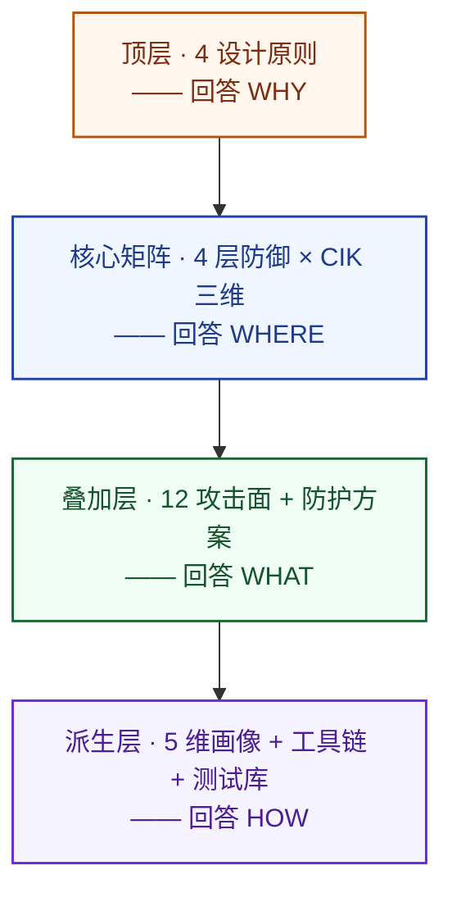

# 第 3 章 Agent 安全框架

---

## 3.1 整体结构:四层语义

智能体安全是一个多维度问题,直接把"原则、攻击面、防御层、画像、工具"等维度并列陈列,容易造成读者困惑——它们并非地位等同,而是承担着不同的认知角色。本书 framework 将这些维度按**四层语义结构**重新组织,从抽象到具体由内向外:

四层语义各回答一个根本性问题:

- **顶层**:**为什么必须这样防?** 4 设计原则是体系的哲学,回答"我们如何看待 LLM、信任、运营与验证"。
- **核心矩阵**:**在哪里防、防什么属性?** 4 层防御(时间维度)与 CIK 三维(属性维度)正交相乘,得到 12 个独立的验证单元格。
- **叠加层**:**防谁、用什么方案?** 12 攻击面是攻击坐标系;具体防护方案叠加在 核心矩阵上,以"覆盖面积"形式体现各方案的能力差异。
- **派生层**:**怎么落地运营?** 5 维画像、28 个开源工具、8 个测试集合——这些都是从 核心矩阵派生的运营产物。

这一结构有两个工程价值:

第一,**降级冗余**。任意维度的扩张(例如新增工具)只在 派生层发生,不动摇 核心矩阵——后续章节可以独立增删工具,不需要回头修改原则。

第二,**追溯链清晰**。任意防护工具向上可追溯到它覆盖哪些 核心矩阵单元格、回应哪些 顶层原则;任意攻击面向下可定位到它在 核心矩阵上的触达单元格、需要哪些工具拦截。读者无需跳读多个章节即可建立心智模型。

下方截图呈现 顶层四原则的卡片化布局,作为本章的视觉锚点之一:

---

## 3.2 顶层:4 设计原则

四个设计原则不是任选的"安全最佳实践"清单,而是为应对 第 1 章 §1.3 三个根本命题 + 第 2 章 R7 揭示的"去中心化信任执行结构性缺陷"所**必须遵循**的架构纪律。下面分别展开。

### 3.2.1 P1 默认零信任(Zero Trust by Default)

**回答的问题**:信任谁?
**立场**:谁都不信。LLM、Skill、工具返回值、记忆全部默认不可信。

默认零信任原则下展开为四条立论:

**立论 1.1 — LLM 输出默认不可信**。LLM 作为推理引擎可能因提示词注入、幻觉或被越狱而产出有害的工具调用。**即使是系统自身推理引擎的产出,也必须经过独立策略验证**。这一立场直接来自 R6 AEGIS 的威胁模型,把 LLM 视作不可信组件是整个防护体系的起点;它也是对 第 1 章 §2.1.2 所描述的结构性挑战——"LLM 推理是驱动智能体行动的必需品,又同时是最可能被操纵的攻击面"——的直接回应。

**立论 1.2 — 每个工具调用独立验证(No Tool Call Left Unchecked)**。无论发起者是用户还是系统推理引擎,每次工具调用都经过内容风险扫描和策略验证,不因来源"可信"而豁免。本立论的工程化样板见 R6 AEGIS 的三阶段管线——它在工具调用执行路径上插入框架无关的控制点,中位延迟 8.3ms,在 48 个攻击实例上达到 100% 拦截。

**立论 1.3 — 最小代理权(Least Agency)**。权限控制回答"能做什么",代理权回答"能自主决定多少"。二者不可混同——一个拥有只读权限的智能体仍然可能在没有审批的情况下自主发送数百封邮件。本立场继承自 R3 OWASP ASI 的 Least Agency 概念,操作上分三色管控:

- **绿色操作**:自动放行(只读、查询、低风险工具调用)。
- **黄色操作**:轻量确认(摘要呈现、一键批准)。
- **红色操作**:强制审批(破坏性操作、外联、大批量操作)。

读者需注意"零信任 / 最小权限 / 最小代理权"三概念的差异:**零信任**是顶层立场(信任谁?——不信);**最小权限**是经典安全(能做什么?——给最少 API);**最小代理权**是智能体特有(能自主决定多少?——红色操作必须人工审批)。三者层级不同、回答不同问题,缺一则体系出现盲区。

**立论 1.4 — 高危事前拦截优于事后观测**。安全控制点位于工具调用的执行路径上,在副作用产生之前完成拦截,且亚毫秒级决策使用户无感。智能体可以在数秒内完成数据外泄或系统破坏的全过程——"副作用产生之后再审计"对智能体场景已经太晚。R6 AEGIS 的工程实践与 R5 AGT 的 p99 < 0.1ms 基准共同证明了亚毫秒级事前拦截在工程上的可行性。

**立论 1.5 — 每边界评估(Per-Boundary Evaluation)**。信任评估必须发生在每个交互边界,而不是 session 边界。多 agent 系统中,授权不变量(authorization invariants)会随委托链、聚合推理、时间变化而崩溃——若在 session 开始时一次性授权,后续每次数据检索、工具调用、跨 agent 转交都缺乏独立验证。立论的工程化依据见 R30 Authorization Propagation(将在 v3.1 升入核心论据列表),它形式化了授权传播的三个独立子问题(传递委托 / 聚合推理 / 时间有效性)+ 7 项结构需求 N1-N7,具体落地见 第 6 章 §6.4 跨智能体层。这一立论是 P1 在多 agent 场景的工程化推论,与立论 1.2 "每工具调用独立验证" 形成"单 agent → 多 agent"的论证连续。

**行业共识注解**:P1「默认零信任」并非本书独创立场,而是 2026 年 agent 安全的跨生态共识——三类生态位置的代表各自独立指向同一方向:标准组织(R3 / R3b OWASP ASI 把 zero-trust 与 Least Agency 写入 Top 10)、平台厂商(R12 Microsoft AIRT 失效模式分类法以"组件默认不可信"为建模前提)、上游模型厂商(R38 Anthropic《Zero Trust for AI Agents》,2026-05,以第一方身份倡导对 agent 重新适配零信任,提出密码学根植身份 / 单任务权限范围 / 内存防毒化 / AI 速度防御四要素)。三源覆盖"标准—平台—模型"三层,使 P1 具备跨生态共识地位,而非单一视角的主张。需同时诚实标注一处张力:R38 在倡导零信任的同期,Anthropic 对 MCP 协议命令注入的披露答复 "expected behavior"、拒绝在协议层修复(见 OX Security 的 MCP 供应链 advisory,该材料属 MCP 簇,v3.1 待毕业)。"号召零信任"与"协议默认不安全且拒修"并存,暴露其隐含立场——安全是部署者的责任而非协议的责任;这恰好反向印证 §3.2.2 立论 2.1 "协议层统一强制"的必要性:把责任甩给实现者并不转移风险,只是模糊了风险的制造者。因此 R38 在本书仅作"行业共识 + 厂商立场"引用,不作工程参考——其四要素的工程深度分别落在 R5(DID 身份)、R30-N2(单任务有界委托,第 6 章 §6.4.3)、R12(内存投毒)、R33(攻击速度);四要素无新结构性贡献,R38 不升入核心论据列表(详见附录 C §C.6)。

### 3.2.2 P2 统一跨层策略执行(Unified Cross-Layer Policy Enforcement)

**回答的问题**:怎么执行?
**立场**:一个引擎管所有层,消除跨层信任缝隙。

统一跨层策略执行原则下展开为三条立论:

**立论 2.1 — 消除层间信任缝隙**。智能体架构的结构性缺陷是:**每一层都只验证自己的输入,不验证上游是否已验证、不感知下游是否失守**。这种去中心化的信任执行是跨层组合攻击(本书称之为 AT3 类攻击技术)的根本原因。R7 §5.4 的 SSRF→Token→Exec 三阶段未认证 RCE 链正是利用了网关、Token 管理、执行策略三层之间信任假设的不一致——三个独立看都只是"中等"的漏洞,组合起来构成"严重"的完整攻击路径。**消除这类漏洞的唯一可靠方案是让所有跨层策略决策通过同一个策略引擎**,并让每一层的策略判断都能看到全局上下文(调用链、已经过的层、上下游状态)。

**立论 2.2 — 语义意图判断而非词法匹配**。R7 §5.6 证明同一套 exec allowlist 可被三种完全独立的词法技巧绕过:行续接符(`\n`)、busybox 多路复用、GNU 长选项缩写。这不是"规则不全"的问题,而是"基于字符串匹配做策略决策"本身的根本缺陷——**有限的词法规则无法枚举攻击者的无限创造力**。正确的方向是:策略以"这个操作是否在被允许的意图范围内"的**语义判断**为基础,而非"这个字符串是否命中黑名单"。

**立论 2.3 — 统一策略描述语言**。使用可审计、可版本化、可形式验证的策略语言(R5 Microsoft AGT 原生支持 OPA Rego 与 Cedar),而非分散在各服务中的硬编码 if-else。这带来三个好处:审计方读一份权威策略文档,而非阅读多套代码;策略变更通过 Git 工作流管理;策略正确性可被形式化证明或模糊测试。R5 AGT 官方基准称提示词式安全的违反率为 26.67%,而应用层确定性策略执行为 0.00%——这一对比是统一跨层策略执行原则最精炼的工程证据。

### 3.2.3 P3 持续性安全运营(Continuous Security Operations)

**回答的问题**:怎么运营?
**立场**:安全是活的,不是一次性配置。

持续性安全运营原则下展开为三条立论:

**立论 3.1 — 五维画像运营**。单纯的事后审计日志不足以驱动运营。把安全运营落到五个**可持续演进的画像**上:

- **Skill 运营**:全生命周期追踪 + 风险评分。
- **行为运营**:全链路溯源 + Trace ID 关联。
- **权限运营**:最小权限动态调整 + 权限态势感知。
- **账号 / 设备画像**:关联图谱 + 风险联动。
- **模型上下文运营**(本书在前四维基础上扩展的第五维):记忆完整性 + 系统提示词漂移 + 知识库更新审计。

前四维是运维侧长期实践沉淀的工程综合,第五维是本书对 R9 CIK 中 Knowledge 维度被运营层长期忽视的现实的工程化回应(多维行为画像的有效性在 R38 Anthropic、R45 Google 前沿厂商实践中亦得到佐证,详见 第 6 章 §6.3.3)。R9 实证表明,单是对 Knowledge 维度投毒就能使攻击成功率从 24.6% 跃升至 64-74%——若运营画像只覆盖前四维,Knowledge 维度的风险就在视野之外被放大。

**立论 3.2 — 信任衰减(Trust Decay)**。信任不是布尔值,而是**随行为持续更新的动态评分**。一个两周前通过认证但此后从未被重新验证的身份,信任级别应当自动降级。本机制继承自 R5 Microsoft AGT 的 Trust Decay 设计——衰减可由时间触发,也可由异常行为触发(如调用从未使用过的 Skill、数据访问量突增 300%)。

**立论 3.3 — 持久状态完整性保护**。记忆、身份配置、技能库的"静息态"本身就是攻击面。R9 CIK 分类法指出 Capability、Identity、Knowledge 三维中任意一维被投毒都能触发 ASR 跃升;持久状态因此必须有完整性校验——写入时经密码学签名,读取时做语义完整性对比。

P3 的工程纪律是"每日不积压"——每天定时运行核心审计、显式上报全部 13 项指标(包括健康项),沉默被视为故障而非安全。这一具体实现见于 第 6 章 §6.3,本章不展开。

### 3.2.4 P4 可验证的安全保障(Verifiable Security Assurance)

**回答的问题**:怎么证明有效?
**立场**:「声称安全」与「证明安全」之间存在本质差距。

可验证的安全保障原则下展开为三条立论:

**立论 4.1 — 持续验证 > 一次性审计**。一次性渗透测试的结论仅对测试当天的系统配置成立——第二天一个 Skill 更新、一条策略调整、一个新智能体上线,结论就不再成立。**验证必须是持续的**:独立的验证系统以只读方式观测整个防护体系,周期性地对每个防护模块注入标准化攻击载荷、收集决策日志、输出合规报告。验证系统本身的防护由密码学签名和时间戳权威保护,不可被被验证系统篡改。

**立论 4.2 — 每个防护模块有明确的验证接口**。验证系统与防护系统的耦合仅限于四个标准化接口:① 攻击载荷注入接口(标准化的攻击用例输入格式);② 防护决策观测接口(allow / block / pending 决策日志的查询 API);③ 审计链校验接口(哈希链完整性的批量校验 API);④ 合规报告导出接口(签名证明的生成与验证 API)。这使得"验证系统团队"可以独立于"防护系统团队"工作。Schema 详见附录 B。

**立论 4.3 — 攻击链整体评估**。不仅评估单个漏洞的防护情况,还要沿"攻击面 × 对抗技术"二维矩阵检查漏洞间的组合关系。R7 §5.4 已证明三个单独看只是"中等"和"高危"的独立漏洞可以组合成完整的未认证 RCE 链——这种系统性脆弱只能通过攻击链层面的评估发现。第 7 章 的 CIK × 4 层 12 单元格验证矩阵正是针对这一需求设计。

**硬件实现注解**:P4 在敌对运维(adversarial ops)威胁模型下需要硬件信任根支撑——纯软件验证链可被特权对手(root / hypervisor / cloud operator)绕过。Confidential Computing 与 Remote Attestation 提供"代码在可信硬件中运行且未被篡改"的密码学证明,是 P4 在 high-stakes 部署中的硬件实现层。具体平台对比(Intel SGX/TDX、AMD SEV-SNP、ARM TrustZone/CCA、NVIDIA H100 CC)与代表系统(TEESlice / AttesMCP / CAEC 等)见 第 6 章 §6.1.5 硬件可信根 + 第 9 章 §9.2 行业适配;R32 Confidential Computing for Agentic AI 是这一注解的根据材料(survey 形态,不升核心,但触发 §6.1.5 新子节)。

### 3.2.5 4 原则的依存关系

四原则不是并列陈列,而是有清晰的依存关系。它们共同构成一条完整的决策链:

> **信任谁(P1)** → **怎么执行(P2)** → **怎么运营(P3)** → **怎么证明有效(P4)**

任一原则缺失,体系即在该处出现结构性漏洞:缺"默认零信任"则失去"不信"的根基,所有后续验证都是建立在错的前提之上;缺"统一跨层策略执行"则跨层组合攻击不可阻断,因为没有任何一处能看到完整的调用链;缺"持续性安全运营"则防护态势随时间退化,昨日有效的策略今日已经过时;缺"可验证的安全保障"则"声称安全"沦为口号,无人能独立检验它是否真的成立。这就是四个原则被定义为"必须遵循"而不是"建议遵循"的工程理由。

---

## 3.3 工程约束:落地必须兼顾

除四个原则外,本书识别出两条**工程约束**——它们不是原则,但落地时不可忽视。忽视它们会导致体系在工程上不可维护或不被运营团队接受。

### 3.3.1 安全可组合性

防护模块必须**独立部署、渐进采用**。小型部署可以只启用事前准入层;中型部署增加事中拦截层;大型部署启用全部四层。每个模块有独立的配置、独立的版本、独立的 SLO,模块间通过明确定义的接口通信。这一约束继承自 R5 Microsoft AGT 的七包架构理念——`pip install agent-governance-toolkit[full]` 可以全装,也可以 `pip install agent-os` 单装。第 9 章 §9.1 的部署形态选型直接基于本约束。

### 3.3.2 低摩擦运营

安全机制应当对正常业务**尽量无感**。亚毫秒级决策(立论 1.4)让用户无法感知策略检查的存在;绿色操作自动放行(立论 1.3)让日常工作流零中断;审批流只对红色操作触发。本书把这一约束称为**低摩擦运营**——审批流程永远存在不可消除的最小摩擦,用"低"而非"零"是为了准确表达工程现实。其方法学是用约 90% 的自动化放行换约 10% 的强制审批,资源集中在真正高危的操作上。

工程约束与原则的关系是:**原则定义"必须做什么",工程约束定义"必须避免什么"**。原则是体系的脊柱,约束是体系的关节——忽视脊柱体系无法成立,忽视关节体系无法移动。

---

## 3.4 核心矩阵:双主轴矩阵

framework 的核心是 核心矩阵——4 层防御(横轴)× CIK 三维(纵轴)= 12 个单元格。核心矩阵是 顶层原则的具体投射,也是 叠加层(攻击面 + 方案)与 派生层(画像 + 工具)的承载平台。

### 3.4.1 横轴:4 层防御(时间维度)

四层防御按"工具调用的时间顺序"组织,从部署到运行到审计再到协同:

| 层 | 简称 | 核心问题 |
|--|--|--|
| 事前准入(Pre) | 部署前 | 这个智能体 / 这个 Skill 可以上线吗? |
| 事中拦截(In) | 工具调用前 | 这次工具调用在被允许的意图范围内吗? |
| 事后运营(Post) | 调用后审计 | 智能体的长期状态健康吗? |
| 跨智能体(Cross) | 多智能体协同 | 不同智能体之间的信任关系是真实的吗? |

四层覆盖了智能体从"上线—运行—审计—协同"的完整生命周期。详细实施见 第 6 章。

### 3.4.2 纵轴:CIK 三维(属性维度)

CIK 三维回答"安全机制在保护哪一类属性":

- **C — Capability(能力)**:智能体能做什么?——工具调用 / 权限 / 参数约束。
- **I — Identity(身份)**:谁在做、对谁说话?——智能体身份 / 信任 / 凭证。
- **K — Knowledge(知识)**:智能体看到了什么?——上下文 / 记忆 / RAG。

R9 的实证给出了 CIK 三维**不可压缩**的关键证据:任意单维度被攻破,平均攻击成功率即从基线 24.6% 跃升至 64-74%。三维互不替代——必须独立验证。详细见 第 7 章。

### 3.4.3 12 单元格

横轴 × 纵轴得到 12 个单元格,各承担独立的验证单元角色:

| | 事前 | 事中 | 事后 | 跨智能体 |
|--|--|--|--|--|
| **C** | C-Pre Skill 准入 | C-In 工具调用守卫 ★ | C-Post Skill 画像 | C-Inter 技能继承审计 |
| **I** | I-Pre 身份基线 | I-In Token + Ring ★ | I-Post Trust Decay | I-Inter DID + 冒充检测 ⚓ |
| **K** | K-Pre 记忆基线 | K-In 上下文扫描 ★ | K-Post 记忆硬化 | K-Inter 知识库污染防护 |

★ 标注的 C-In / I-In / K-In 是**实时拦截主战场**——由于事中层位于工具调用执行路径上,本层失守会立刻产生副作用,因而验证密度最高。⚓ 标注的 I-Inter 是**跨智能体协作的信任锚**——多智能体场景的协议级信任必须在这里建立。

12 单元格中**最受关注的一格是 K-Post**(事后 × 知识),即"记忆硬化"。R12 Microsoft AIRT 把"Memory Poisoning"列为智能体特有失效模式之一;本书 第 10 章 §10.1 邮件助手记忆投毒案例正是这一格在真实场景下的演练——记忆在静息态被污染,数天后通过会话上下文加载触发恶意行为,且整个攻击过程中无单一时刻表现为明显异常。

下图把 CIK 三维与 4 层防御交叉的 12 单元格做了完整可视化展开。每格除标识"在保护哪一类属性、属于哪一防御层"外,还展开了该格关注的具体威胁、可用的防护手段、以及可量化的关键指标(检出率、延迟上限等):

### 3.4.4 各层主导维度

对 核心矩阵的另一个观察是:**不同层的 CIK 重心不同**——并非每层都对三个维度同等用力。

- **事前层**主导维度:I + C 并重(身份基线与 Skill 准入是部署门口的双闸)。
- **事中层**主导维度:C(实时拦截以"工具调用决策"为主战场)。
- **事后层**主导维度:K(长期运营核心是抗记忆漂移)。
- **跨智能体层**主导维度:I(多智能体协作首要解决信任问题)。

这一规律对工具栈的取舍至关重要——一个偏 K-Post 的方案不适合作为事中拦截的核心,反之亦然。详细的方案防护形状对比见 第 8 章。

---

## 3.5 叠加层:12 攻击面 + 防护方案

叠加层是叠加在 核心矩阵之上的两类信息:**12 攻击面**(系统轴)与**防护方案**(具体覆盖)。

### 3.5.1 12 攻击面 S1-S12

12 攻击面是攻击者视角的"入口枚举"。其中 S1-S10 继承 R7 OpenClaw 漏洞分类法的十层攻击面;S11(智能体部署管线)与 S12(智能体流程与决策逻辑)是本书针对 R12 Microsoft AIRT 提出的智能体特有失效模式所做的扩展——**Provisioning Poisoning** 与 **Agent Flow Manipulation** 不属于运行时架构的某一层,而是架构**之外**的元信息,但它们是真实存在的攻击面。

每个攻击面通过"触达单元格"映射到核心矩阵——例如"上下文窗口"这一攻击面同时触达"事中×知识"与"事后×知识"两格,因为它的威胁(直接/间接提示词注入、记忆投毒)既在事中发生,也在事后长期记忆中持续。下图给出 12 个攻击面的完整卡片视图——每张卡片含描述、典型威胁、所属架构层、以及在核心矩阵上的触达格点:

**build-time 枚举 vs runtime 涌现的方法论说明**:本书 12 攻击面 S1-S12 是 **build-time 完备**的——即,在 agent 系统构建与部署时,这 12 个攻击面对所有"已枚举的依赖与组件"形成完整覆盖。但 agent 运行时还存在另一类**涌现型(emergent)攻击形态**——它们不在 build-time 已知组件集合上,而是在 inference time 通过 action-perception loop 动态产生;典型代表是 R35 Supply Chain SOK 提出的 **Viral Agent Loop**(生成式蠕虫在多 agent 拓扑上自传播)。本书的方法论立场:**12 攻击面 build-time 完备,涌现型攻击 runtime 补充,两类视角并行而非替代**——不增设 S13 或扩张坐标系,而在 第 5 章 §5.2.8 给出 Viral Agent Loop 案例,在 附录 A §A.7 给出涌现型攻击的事后检测路径。R35 升入 v3.1 核心论据列表后,这一方法论说明是其在 framework 顶层的接入点.

详细的 12 攻击面定义见第 4 章。

### 3.5.2 防护方案叠加

具体防护方案是 叠加层的另一类信息——把"具体的工具或框架"叠加到 核心矩阵上,以"覆盖面积"形式直观体现各方案的能力差异。本书选取 5 个最具代表性的方案做横向对比:

| 方案 | 覆盖广度 | 主战场 | 定位 |
|--|--|--|--|
| **Microsoft AGT**(R5) | 9/12 格 | 事中 | 工具栈最广,确定性策略层 |
| **AEGIS**(R6) | 6/12 格 | 事中 | 预执行防火墙 + 防篡改审计链 |
| **Cisco DefenseClaw**(R4) | 6/12 格 | 事前 | 供应链扫描 + 沙箱 + A2A 审计 |
| **Knownsec**(R18) | 4/12 格 | 事后 | CVE 情报 + 实践指南 |
| **CaMeL**(R22) | 2/12 格 | 事中 | 「by-design」控制流分离(研究工件) |

观察五个方案的"防护形状",一个值得关注的事实是:**5 方案叠加之后,核心矩阵上仍有一个单元格完全空白——cross/K**(跨智能体知识库污染防护)。这一空白对应的能力是 Crescendo 多轮越狱检测、共享 RAG 知识库更新审计、跨会话语义漂移分析——目前生态中没有专门工具覆盖。下图是 5 个方案"防护形状"的并排迷你矩阵视图,以及叠加后未覆盖单元格的醒目标识:

本书第 8 章 §8.6 将以独立小节论述这一产业空白,并给出基于 R22 CaMeL「by-design」思想的自研建议。

---

## 3.6 派生层:运营产物

派生层是从 核心矩阵派生的运营产物——它们不是 framework 的根基,而是 framework 在工程上的具体落地形式。

### 3.6.1 5 维智能体画像

5 维画像在 §3.2.3 立论 3.1 已经介绍——Skill / 行为 / 权限 / 账号设备 / 模型上下文。它们是事后运营层的核心工作产物,详细见 第 6 章 §6.3。

### 3.6.2 工具链(28 个)

工具链按生命周期分四类:

- **类别一·安全评估**(9 个):ZeroShot、AEGIS 48 攻击实例集、arXiv 2604.03131 基准、CIK-Bench、1Password SCAM、PASB、ClawSafety、AgentDojo、PinchBench(对照基线)。
- **类别二·事前防护**(7 个):DefenseClaw 4 子项(Skill Scanner / MCP Scanner / CodeGuard / AI BoM)、ClawSafety Scanner(Rust)、ClawSec、Knownsec OpenClaw Security。
- **类别三·事中防护**(5 个):AEGIS 预执行防火墙、AGT Agent OS、AGT Agent Runtime、DefenseClaw 沙箱、CaMeL 解释器(设计参考)。
- **类别四·事后防护**(7 个):AEGIS 防篡改审计链、AGT Agent SRE、AGT Agent Compliance、AGT Agent Mesh、DefenseClaw A2A Scanner、OpenClaw CVE 追踪器、Splunk HEC + OTLP。

下图是工具栈按四类生命周期组织的全景:

完整的工具选型与协作架构见 第 8 章。

### 3.6.3 测试库(8 集合 + 1 对照)

测试库的 8 个公开集合 + PinchBench 功能对照,共同构成验证体系的载荷源。详细见 第 7 章 §7.3。

---

## 本章引用材料

- **R3 OWASP Top 10 for Agentic Apps 2026**(最小代理权概念源)
- **R5 Microsoft AGT**(P2 立论 2.3 + P3 立论 3.2 工程证据)
- **R6 AEGIS**(P1 立论 1.1 / 1.2 / 1.4 工程化样板)
- **R7 OpenClaw 漏洞分类法**(P2 立论 2.1 / 2.2 + 12 攻击面来源)
- **R9 Your Agent, Their Asset / CIK**(CIK 三维不可压缩性)
- **R12 Microsoft AIRT 失效模式**(S11 / S12 + Memory Poisoning)
- **R22 CaMeL**(「by-design」(从设计层面避免漏洞产生)路径 + 核心矩阵 cross-K 设计借鉴)
- **R38 Anthropic《Zero Trust for AI Agents》**(§3.2.1 P1 厂商共识锚 + 立论 3.1 多维画像佐证)
- **R45 Google《Beyond Zero》**(§3.2.1 P1 厂商收敛,per-action 授权呼应立论 1.5)
