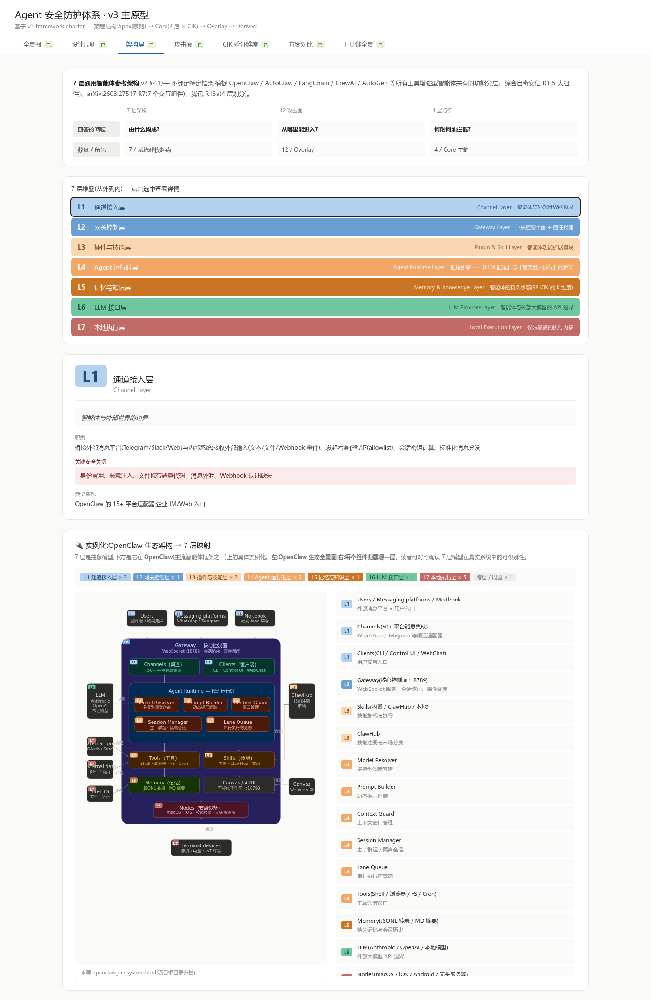

# 第 4 章 架构建模与攻击面

---

## 4.1 通用智能体参考架构:七层模型

### 4.1.1 从具体实例到抽象模型

当下主流的智能体框架——无论 OpenClaw、AutoClaw、LangChain、CrewAI 还是 Microsoft AutoGen——在实现细节上差异显著,但**架构层面呈现出高度一致的功能分层**。R1 奇安信 OpenClaw 安全使用指南将 OpenClaw 拆解为通道、网关、智能体工作空间、AI 接入网关、大模型服务五大核心组件;R7 OpenClaw 漏洞分类法则进一步把 OpenClaw 细化为通道系统、中央网关、插件与技能系统、Agent 运行时、记忆与知识系统、LLM 提供方、本地执行环境七个交互组件;R13a 腾讯大模型与智能体安全风险治理与防护从另一个视角将智能体分为交互层、认知层、工具交互层和环境交互层。

综合上述三家观点,本书提出一个**七层通用参考架构**。该架构不绑定任何特定的智能体框架,而是捕捉所有"工具增强型"智能体系统所共有的功能分层与数据流模式。每一层对应一组明确的功能职责、安全关切和潜在攻击面。

### 4.1.2 七层定义

**第一层:通道接入层(Channel Layer)**

通道接入层是智能体与外部世界的交互边界,负责把外部消息平台与内部系统桥接起来。在 OpenClaw 中,这一层由 Telegram、Discord、Slack 等十五个以上平台的适配器实现;在企业场景中,这一层通常是即时通信平台或 Web 界面。该层的核心职责包括接收外部输入(文本、文件、Webhook 事件)、执行发起者身份验证(allowlist 评估)、计算会话密钥、并把标准化消息分发到下一层。

**安全关切**:身份冒用、恶意注入、文件携带恶意代码、消息外泄、Webhook 认证缺失。

**第二层:网关控制层(Gateway Layer)**

网关控制层是整个智能体系统的中央控制平面与消息代理。它负责认证并多路复用所有入站连接——来自通道适配器、Agent 运行时、本地执行进程以及管理员操作。在 OpenClaw 中,Gateway 绑定 HTTP/WebSocket 服务器,维护已连接的本地执行节点注册表(NodeRegistry)、命令审批管理器(ExecApprovalManager),以及按会话串行化的命令队列。在企业架构中,这一层通常还承载负载均衡、输入输出过滤、数据防泄露(DLP)引擎与安全网关功能。

**安全关切**:WebSocket 认证绕过、SSRF(服务端请求伪造)、Token 泄露、策略执行不一致、全局级权限提升。**网关作为所有组件之间的信任代理,其安全水位直接决定整个系统的安全水位——网关失守等于全局沦陷。**

**第三层:插件与技能层(Plugin & Skill Layer)**

插件与技能层管理智能体功能扩展模块的加载与执行。技能(Skill)本质上是一组可被智能体调用的工具定义和执行脚本,它们通过指令文件(如 SKILL.md)在会话启动时加载到智能体的上下文窗口中。技能来源包括社区市场(以 ClawHub 为例,已有超过 23,000 个 Skill)、智能体自动生成,以及企业内部自研。该层在操作者级别的信任下运行——一个被系统加载的技能,会被 Agent 运行时视为可信指令来源。

**安全关切**:供应链投毒(恶意 Skill 上架)、后门与隐蔽 Prompt 注入、权限过度申请、版本篡改、自动生成代码的逻辑漏洞。R7 OpenClaw 漏洞分类法的研究表明,一个通过 ClawHub 分发的恶意技能(yahoofinance Skill)完全在 LLM 上下文内执行了两阶段 dropper,绕过了所有运行时执行策略原语——这是供应链信任升级最具代表性的实证案例。

**第四层:Agent 运行时层(Agent Runtime Layer)**

Agent 运行时层是智能体的"推理引擎",封装了 LLM 推理循环、工具调度与沙箱管理。它的核心运行逻辑是:组装上下文(系统提示词 + 技能指令 + 会话历史 + 记忆文件)→ 提交给 LLM → 接收模型输出 → 解析工具调用 → 调度执行(进程内处理或转发到本地执行层)。这一层是"LLM 推理"与"现实世界执行"之间的桥梁——它决定了模型的输出如何转化为实际行动。

**安全关切**:提示词注入(直接和间接)、上下文窗口污染、幻觉导致的错误工具调用、会话死循环、超权限工具调用。该层的特殊性在于:**LLM 作为推理引擎是不可信的**(它可能被注入攻击操纵),但 Agent 运行时必须依赖 LLM 的输出来驱动后续行为。这一信任矛盾是智能体安全的核心结构性挑战。

**第五层:记忆与知识层(Memory & Knowledge Layer)**

记忆与知识层管理智能体的持久状态:会话历史、长期上下文记忆、启动引导文件,以及知识库。每次 Agent 运行时启动时,系统提示词文件(如 CLAUDE.md)、已加载的技能指令和历史对话记录会被预置到 LLM 的上下文窗口,赋予智能体跨会话的持久记忆能力。R9 Your Agent, Their Asset / CIK 的分类法把此层的内容归为"知识"(Knowledge)维度——长期记忆构成了智能体"认知"的一部分。

**安全关切**:记忆投毒(向记忆文件注入虚假信息或恶意指令)、数据残留(任务结束后敏感数据未清理)、跨会话上下文污染、检索增强生成(RAG)注入。**这一层风险最显著的特征是延时性**:攻击者在当前会话注入的恶意内容,可能在数天后通过记忆文件加载而触发恶意行为,形成潜伏式攻击。

**第六层:LLM 接口层(LLM Provider Layer)**

LLM 接口层是智能体与外部大模型服务之间的 API 边界。Agent 运行时把组装好的提示词通过此接口发送给 LLM 提供方(Claude、GPT、Gemini 或本地部署模型),并接收流式补全结果。在多模型共存的企业场景中,这一层还承担模型路由、模型切换、上下文隔离与 Token 配额管理的职责。

**安全关切**:API 密钥泄露与滥用、模型切换时上下文数据跨提供方泄露、Token 消耗失控(恶意刷量)、响应解析漏洞、数据跨境合规。需要说明的是,R7 OpenClaw 漏洞分类法所收录的 190 个公开公告中此层尚无已确认漏洞——但其暂时缺席反映的是当前安全研究的边界,而非风险的真正缺位。

**第七层:本地执行层(Local Execution Layer)**

本地执行层运行在终端用户机器上,是整个架构中权限最高的组件。它以特权进程身份运行,接收来自网关的工具调用指令,通过三阶段执行策略管线(词法允许列表评估 → 审批状态查询 → 执行)决定是否执行命令。沙箱化的工具调用在 Docker 容器内通过 `docker exec` 执行;非沙箱化的调用则直接在宿主 Shell 上以完整文件系统和进程访问权限运行。

**安全关切**:命令执行策略绕过(词法解析缺陷)、沙箱逃逸(容器配置不当)、容器镜像篡改、宿主机提权、文件系统遍历。**本层是攻击者的最终目标——所有攻击链的"行动对目标"阶段都在此层发生。**

### 4.1.3 七层模型的适用性说明

需要强调的是,七层模型是**分析工具,而非部署规范**。在实际系统中,多个逻辑层可能合并为单个进程(例如小型部署中网关与 Agent 运行时可能共享进程),或一个逻辑层可能拆分为多个独立服务(例如企业部署中网关控制层可能由负载均衡器、Web 应用防火墙、DLP 引擎等多个组件共同实现)。模型的价值在于提供一个**统一的词汇表**,使得不同框架的安全分析可以在同一坐标系下相互比较。

---

## 4.2 OpenClaw 生态:七层架构的实例化

为了把抽象的七层模型与读者熟悉的真实系统建立直接联系,本节以 OpenClaw 完整生态为例,逐组件演示七层抽象在工程上的具体落点。

下图是 OpenClaw 生态架构的实例化映射图。图中的每个组件方块都标注了所属的层级编号(L1-L7),并在右侧给出"组件 → 层级"的明确对应关系,读者可凭此图建立"抽象模型 → 真实系统"的双向映射。

具体而言,OpenClaw 生态中的二十个左右关键组件,可以毫无歧义地归入七层中的某一层(或为周边支持组件):

- **第一层(通道接入)**对应 Users、外部消息平台、Moltbook 社交 feed、Channels(50+ 平台消息集成),以及 Clients(CLI、Control UI、WebChat)。这些组件共同构成"外部世界 ↔ 智能体"的入口面。
- **第二层(网关控制)**对应 Gateway 核心控制面(WebSocket :18789),它独立承担会话路由与事件调度。
- **第三层(插件与技能)**对应 Skills(内置 / ClawHub / 本地)与 ClawHub 技能注册市场。
- **第四层(Agent 运行时)**对应代理运行时内部的六个子组件:Model Resolver(多模型调度容错)、Prompt Builder(动态提示组装)、Context Guard(窗口管理)、Session Manager(主 / 群组 / 隔离会话)、Lane Queue(串行执行防竞态),以及 Tools(Shell、浏览器、文件系统、Cron)。运行时层组件最多,印证了"Agent 运行时是 LLM 推理与现实执行的桥梁"——结构上的复杂度直接来自于这一桥梁角色。
- **第五层(记忆与知识)**对应 Memory(JSONL 转录 + Markdown 摘要)。
- **第六层(LLM 接口)**对应 LLM(Anthropic / OpenAI / 本地模型)。
- **第七层(本地执行)**对应 Nodes(macOS、iOS、Android、无头服务器)、Terminal devices(手机、电脑、IoT 终端)、Host FS(宿主文件系统)、External tools(OAuth / SaaS),以及 External data(邮件 / 网页)。本层组件次于运行时,印证了"本地执行是攻击者最终目标"——攻击面的密集度与"权限最高"的属性相对应。
- **跨层周边组件**:Canvas / A2UI 是可视化工作区,不严格属于任意一层,而是横跨用户交互与运行时输出的辅助组件。

这一实例化映射有两个工程意义:其一,**抽象模型在真实系统上具备完整可识别性**——OpenClaw 二十个组件中没有任何一个无法归入七层(或明确标注为周边),这反过来增加了七层模型作为分析工具的可信度。其二,**层级密度反映了"为什么某些层格外脆弱"**——第四层 Agent 运行时与第七层本地执行各自承载五到六个核心组件,这两层在后续章节(尤其第六章事中拦截层)将获得最重的防护投入。

读者若使用其他智能体框架(LangChain、AutoGen、CrewAI 等),建议照此方法做一次类似的实例化映射,作为安全分析的起点。

---

## 4.3 从架构层到攻击坐标:十二个攻击面

### 4.3.1 七层架构不等于攻击面

七层模型捕捉的是智能体系统的**功能分层**,每一层的定义聚焦它承担的职责。但威胁建模需要的是**攻击入口的粒度**——攻击者并不关心"这个组件属于哪一层",而关心"我可以从哪里与这个系统交互"。两者之间存在三种典型的粒度错配:

**一层对应多个攻击面**。例如第七层"本地执行层"承担"接收指令 → 策略评估 → 沙箱隔离 → 宿主执行"全部职责;但从攻击者视角,执行策略引擎的词法规则、容器的 seccomp 配置、以及 Shell 的文件系统访问是三个独立的入口,需要分别枚举才能保证威胁建模的完备性。

**多层构成一个攻击面**。例如"智能体的上下文窗口"横跨第四层(运行时组装提示词)和第五层(记忆文件提供持久内容),但攻击者对这两者的注入方式在本质上没有差异——都是让恶意内容进入 LLM 的推理视野。

**超越架构的跨层攻击面**。还有两类攻击面无法归属于七层中的任何单一层,它们针对的是智能体的**生命周期**或**控制流**:

- **智能体部署管线**:新智能体上线、配置、系统提示词分发的工作流(R12 Microsoft AIRT 失效模式分类法称之为 Provisioning Poisoning 的入口)。
- **智能体流程与决策逻辑**:执行流程的顺序、分支、终止条件本身(R12 Microsoft AIRT 失效模式分类法称之为 Agent Flow Manipulation 的入口)。

这两者不属于运行时架构的某一层,而是架构**之外**的元信息——但它们是真实存在的攻击面,且被 R12 Microsoft AIRT 失效模式分类法识别为智能体特有的新型失效模式来源。

综合上述三类粒度错配,本书在七层架构之上定义**十二个攻击面**(S1-S12),作为全书从威胁目录到防护设计、从攻防映射到验证用例的统一坐标系。

### 4.3.2 攻击面定义

下表给出全部十二个攻击面的定义、对应架构层与核心威胁:

| 编号 | 攻击面 | 对应架构层 | 核心威胁 |
|------|--------|-----------|----------|
| S1 | 通道输入接口 | 第一层 | allowlist 绕过、身份冒用、Webhook 签名缺失、文件携带恶意代码 |
| S2 | 插件与技能分发 | 第三层 | 恶意 Skill 上架、隐蔽 Prompt 注入、版本篡改、依赖污染 |
| S3 | 智能体上下文窗口 | 第四层 + 第五层 | 直接 / 间接提示词注入、记忆投毒、对抗性 Token、RAG 注入 |
| S4 | 网关 API 接口 | 第二层 | WebSocket 认证绕过、SSRF、Token 泄露、方法级权限提升 |
| S5 | 工具调度接口 | 第四层 → 第七层 | 参数篡改、工具链组合攻击、未授权调用、信任利用 |
| S6 | 执行策略引擎 | 第七层 | 词法绕过(行续接符、busybox 多路复用、GNU 长选项缩写) |
| S7 | 容器边界 | 第七层 | 沙箱配置注入、容器逃逸、镜像篡改 |
| S8 | 宿主操作系统接口 | 第七层 | 任意命令执行、文件外泄、横向移动、持久化后门 |
| S9 | LLM 提供方接口 | 第六层 | API 密钥泄露、模型切换信息跨域、响应解析漏洞 |
| S10 | 智能体间通信 | 跨层(涉及第二、四层) | 智能体注入、冒充、消息伪造、跨智能体渐进式越狱 |
| **S11** | **智能体部署管线** | **跨层(架构之外)** | **Provisioning Poisoning:部署管线注入、系统提示词完整性破坏、新智能体上线审核缺失** |
| **S12** | **智能体流程与决策逻辑** | **跨层(架构之外)** | **Flow Manipulation:提前终止、流程重定向、跳过安全控制、过度代理、审批疲劳攻击** |

下图给出十二个攻击面的卡片化全景视图。每张卡片含攻击面描述、典型威胁、对应架构层,以及它在核心矩阵(第三章定义的"四层 × CIK")上触达的具体格点。读者凭此一图即可快速建立"威胁 → 攻击面 → 矩阵格"的双向追溯:

后续所有章节——第五章的威胁目录、第六章的防护层设计、附录 A 的攻防映射矩阵、第七章的验证用例体系——都将以 S1-S12 作为统一的攻击面标签。读者无须记忆所有细节,在遇到 S6、S11 等编号时回到本表查阅即可。

### 4.3.3 S1-S10 与既有研究的关系

本书所提的 S1-S10 直接继承自 R7 OpenClaw 漏洞分类法所定义的十层攻击面,只在命名与粒度上略作规范化:R7 原文的"操作者接口"与"操作者配置"两个攻击面在本书中合并进 S1 与 S5;而"沙箱边界"被拆分为 S6(策略引擎)与 S7(容器边界),因为这两者在实测漏洞中表现出独立的绕过方式。这一调整使得攻击面与第五章的漏洞分类有更清晰的对应关系。

### 4.3.4 S11 与 S12 的来源与理论意义

S11 与 S12 是本书相对 R7 OpenClaw 漏洞分类法的扩展,理论依据是 R12 Microsoft AIRT 失效模式分类法识别出的智能体特有新型失效模式。R12 指出,智能体系统面临的新型安全威胁不仅来自运行时组件的漏洞,也来自**生命周期管理**与**控制流设计**的缺失。S11 覆盖 Provisioning Poisoning 与 Agent Impersonation 的部署侧入口;S12 覆盖 Agent Flow Manipulation 与 Human-in-the-Loop Bypass 的控制流入口。

把 S11/S12 纳入统一的攻击面坐标系意味着,防护体系设计必须在七层运行时架构之外,额外关注部署管线(后续在事前准入层中讨论)与流程控制(后续在跨智能体层中讨论)两类专项防护。

---

## 4.4 信任边界与信任流分析

### 4.4.1 信任流的方向

在七层模型中,信任沿着"从外到内"的方向递增。通道接入层是最外层,信任级别最低;本地执行层是最内层,信任级别最高、权限最大。这一信任梯度意味着:**攻击者如果能从低信任层渗透到高信任层(权限提升),其造成的破坏将指数级增长**。

正常情况下,经过身份验证的消息从通道层流向网关层,再由网关分发到 Agent 运行时层;运行时调用 LLM 接口完成推理后,把工具调用经审批分发至本地执行层执行;执行结果回流到运行时,并写入记忆与知识层供后续会话使用;插件与技能层在加载时把 Skill 内容注入运行时上下文。整个信任流呈现"由外向内会合,由内向外回流"的拓扑结构。

### 4.4.2 五条关键信任边界

七层之间存在五条关键的信任边界。每条边界代表一次信任级别的跃迁,也是攻击者重点攻击的位置。

**边界一:外部世界 ↔ 通道接入层**。这是系统与不可信外部输入之间的第一道屏障,所有外部消息在此处经过身份验证与初步过滤。该边界对应攻击 Kill Chain 中的"初始访问"阶段。

**边界二:通道接入层 ↔ 网关控制层**。经过身份验证的消息在此处被接纳为系统内部流量。该边界的关键决策是:**哪些已认证用户的消息被允许到达智能体**——这是从"用户真实"到"消息可被处理"的跃迁。

**边界三:网关控制层 ↔ Agent 运行时层**。网关把用户消息转交给 Agent 运行时进行处理。这一边界的特殊性在于:Agent 运行时会把用户消息与系统提示词、技能指令、历史记忆等内部数据混合后送入 LLM——**外部输入与内部指令在 LLM 上下文窗口中失去了区分度**,构成提示词注入攻击的结构性入口。

**边界四:Agent 运行时层 ↔ 本地执行层**。这是整个架构中最关键的信任边界——**LLM 的推理输出(不可信)在此处转化为宿主机上的实际执行(高权限)**。R7 OpenClaw 漏洞分类法记载的三阶段未认证 RCE 组合链,正是在这条边界上完成"从不可信推理到可信执行"的跨越。

**边界五:系统 ↔ 供应链**。插件与技能层从外部市场引入第三方代码,这些代码一旦加载即获得系统级信任。该边界是供应链攻击的入口——恶意 Skill 绕过了所有运行时策略,**因为它在 LLM 上下文内直接以"可信指令"的身份运行**。

此外,S11(部署管线)与 S12(流程与决策逻辑)各自构成额外的信任跃迁——前者对应"构建/分发环境 ↔ 运行时实例"的边界,后者对应"设计时的控制流契约 ↔ 运行时的实际执行路径"的边界。这两条边界都不在上述五条之内,但同样是结构性的攻击入口。

### 4.4.3 去中心化信任执行的结构性缺陷

R7 OpenClaw 漏洞分类法的分析揭示出当前智能体架构在信任执行上的一个根本性问题:**认证与策略执行是逐层、逐调用点分散实施的,而非由统一的策略引擎集中管控**。

具体表现是:通道接入层有自己的 allowlist 验证逻辑,网关有自己的 Bearer Token 验证,Agent 运行时有自己的工具调度策略,本地执行层有自己的 exec allowlist。每一层的安全机制只对本层的输入做验证,既不验证上游层是否已经正确完成了验证,也不感知下游层的安全状态。

这种去中心化的信任执行模式导致了**跨层组合攻击的系统性脆弱**——攻击者在每一层单独看都没有突破该层的安全机制,但通过在不同层之间利用信任假设的不一致,可以串联出完整的攻击路径。第三章所提的"统一跨层策略执行"原则,正是针对这一结构性缺陷的架构级回应。

---

## 4.5 二维攻击分类框架:攻击面 × 对抗技术

### 4.5.1 为什么需要二维分类

传统的漏洞分类方法通常是一维的:要么按攻击技术分类(如 OWASP Top 10 按风险类型排列),要么按系统组件分类(如按网络层、应用层、数据层划分)。这两种一维分类各有局限——按攻击技术分类无法回答"这种攻击在架构哪里发生",按系统组件分类无法回答"这个组件面临哪些类型的攻击"。

R7 OpenClaw 漏洞分类法提出了一个二维分类框架,沿两个正交的轴同时组织漏洞信息。本书采纳这一框架,使用 §4.3 定义的十二个攻击面作为**系统轴**,使用下文定义的七类对抗技术作为**攻击轴**。两轴交叉得到一个 12 × 7 的二维矩阵,每个单元格回答一个具体问题:**在攻击面 Sx 上,攻击者是否可以使用技术 ATy?**

### 4.5.2 攻击轴:七类对抗技术

结合 R7 OpenClaw 漏洞分类法的分析与 R3 OWASP Top 10 for Agentic Applications 2026 的风险分类,本书把对抗技术归纳为以下七类:

**AT1 身份欺骗(Identity Spoofing)**。攻击者伪造或篡改身份信息,绕过认证与授权机制。包括通道层 allowlist 的可变身份字段绕过、智能体身份冒用、Webhook 认证绕过等。对应 OWASP ASI03。

**AT2 策略绕过(Policy Bypass)**。攻击者通过技术手段规避安全策略的执行。典型案例包括 exec allowlist 的词法绕过(行续接符、busybox 多路复用、GNU 长选项缩写)、沙箱配置注入导致隔离失效等。对应 OWASP ASI05。

**AT3 跨层组合(Cross-Layer Composition)**。攻击者把分布在不同架构层的中低危漏洞串联为完整的高危攻击路径。这是智能体架构特有的攻击模式,其可行性源于去中心化的信任边界(§4.4.3)。R7 §5.4 的三阶段 RCE 链(SSRF → Token → Exec)是此类攻击的典型实例。

**AT4 上下文操纵(Context Manipulation)**。攻击者通过任何能到达 LLM 上下文窗口的数据路径,注入对抗性指令,使模型产出攻击者期望的行为。这包括直接提示词注入、通过邮件/文档/网页的间接注入,以及记忆文件投毒。对应 OWASP ASI01 与 ASI06。

**AT5 供应链信任升级(Supply-Chain Escalation)**。攻击者通过在技能市场发布恶意 Skill,或篡改已有 Skill 的版本,把攻击代码引入系统。由于已加载的 Skill 在操作者信任级别运行,攻击者实际上完成了从"外部不可信第三方"到"系统内部可信指令源"的信任升级。对应 OWASP ASI04。当攻击发生在部署管线(S11)而非运行时 Skill 分发(S2)时,表现为 R12 Microsoft AIRT 失效模式分类法所述的 Provisioning Poisoning。

**AT6 工具滥用(Tool Misuse)**。智能体在对抗性影响下,使用合法工具执行非预期的操作。攻击者**不需要注入新工具**——通过操纵智能体的推理逻辑,使其以破坏性参数调用已有工具(例如以不当条件执行数据库删除)。对应 OWASP ASI02。

**AT7 信任利用(Trust Exploitation)**。攻击者利用人类对智能体输出的过度信任,诱导人类在审批流程中放行恶意操作。智能体可能以流畅、自信的语言表述恶意操作的合理性,使审批者难以辨别其真实意图。R12 Microsoft AIRT 失效模式分类法进一步指出"审批疲劳攻击"的新型变体——通过持续产生大量低危审批请求制造决策疲劳,诱导审批者对关键请求失去警觉。对应 OWASP ASI09。

### 4.5.3 分类矩阵的使用方法

12 × 7 的二维矩阵有三种常见用法:

**第一,威胁建模**。对一个新部署的智能体系统,安全团队可以逐格审查:每个"攻击面 × 攻击技术"的组合是否存在可利用的弱点?这确保威胁分析的完备性——不会因为分析者的经验偏差而遗漏某类风险。

**第二,防护覆盖率评估**。把已部署的防护措施标注到矩阵中(附录 A 将完成这一映射),可以直观识别"防护盲区"——哪些组合没有对应的防护措施。

**第三,组合攻击路径分析**。跨层组合攻击(AT3)的可行性可以通过矩阵中的路径搜索系统性地发现:如果攻击者在 S4(网关)上通过 AT1(身份欺骗)获得了初始立足点,他接下来可以到达矩阵中的哪些其他单元格?这种分析方法将在第十章的真实案例中具体运用。

---

## 4.6 智能体 Kill Chain:六阶段攻击模型

### 4.6.1 传统 Kill Chain 在智能体场景下的不足

Lockheed Martin 的 Cyber Kill Chain 与 MITRE ATT&CK 框架是网络安全领域最广泛采用的攻击阶段模型。它们把攻击过程分解为有序的阶段序列——侦察、武器化、投递、利用、安装、命令控制、行动——每个阶段代表攻击者必须完成的一步。

这些模型为传统信息系统设计,其隐含假设是:**攻击者需要利用软件实现中的缺陷(内存安全错误、逻辑漏洞)来获得代码执行能力**。在智能体场景下,这一假设不再成立。攻击者可以通过操纵 LLM 的推理上下文——完全不涉及任何代码执行漏洞——来诱导智能体自主产出恶意工具调用。LLM 推理层作为攻击面的存在,在传统 Kill Chain 中没有对应的阶段。

### 4.6.2 六阶段智能体 Kill Chain

R7 OpenClaw 漏洞分类法提出了一个面向智能体系统的六阶段 Kill Chain,其中五个阶段直接采用 MITRE ATT&CK 战术,并新增一个独有阶段。本书采纳这一模型,并把每个阶段与七层参考架构、十二攻击面以及 OWASP ASI 编号——关联。

**阶段一:初始访问(Initial Access)**

攻击者把恶意内容引入系统的输入边界。智能体系统中,这一边界异常宽泛,涵盖通过通道适配器发送的入站消息、从市场安装的插件与技能、操作者定义的配置文件、来自集成平台的 Webhook 载荷,以及部署管线向新智能体下发的系统提示词与配置。

主要攻击面:S1、S2、**S11**。对应 OWASP ASI04(供应链)、ASI03(身份滥用)。对应 MITRE ATT&CK:Initial Access(TA0001)。

**阶段二:上下文操纵(Context Manipulation)** ——**智能体特有阶段**

这是本 Kill Chain 模型的核心创新。攻击者通过腐蚀 LLM 的推理上下文,使其在没有任何直接代码执行的情况下产出攻击者期望的输出。**这一阶段在传统 MITRE ATT&CK 中没有等价物**,因为它利用的是 AI 推理层——一种传统入侵框架从未考虑的攻击面。

攻击者不需要执行代码,也不需要绕过任何策略控制——仅仅控制模型"相信什么"就足以诱导任意工具调用。攻击向量包括通过任意数据路径的提示词注入、对抗性 Token 操纵,以及对持久上下文源(会话历史、技能指令文件、记忆文件)的投毒。

主要攻击面:S3。对应 OWASP ASI01(目标劫持)、ASI06(记忆投毒)。无直接 MITRE ATT&CK 映射。

**阶段三:执行(Execution)**

受到攻击者影响的智能体发出它在正常情况下不会发出的工具调用或命令。与传统执行阶段不同,**触发源不是攻击者注入的可执行代码,而是智能体自身的推理引擎**——智能体"认为"这些操作是正当的。执行的形式包括工具调用、Shell 命令、文件操作、API 请求、浏览器自动化操作等。当攻击者通过控制流操纵使智能体跳过安全检查或提前终止在恶意状态时,本阶段还会涉及 S12。

主要攻击面:S5、S6、**S12**。对应 OWASP ASI02(工具滥用)、ASI05(意外代码执行)。对应 MITRE ATT&CK:Execution(TA0002)。

**阶段四:凭证获取(Credential Access)**

攻击者获取系统内部的认证凭证,为后续的权限提升与横向移动做准备。智能体系统中的凭证获取路径包括通过 SSRF 截获 WebSocket 连接中的 Bearer Token、通过工具调用读取 Workspace 中存储的 API 密钥、通过记忆文件获取持久化的认证信息。

主要攻击面:S4、S3(上下文窗口中暴露的凭证)。对应 OWASP ASI03。对应 MITRE ATT&CK:Credential Access(TA0006)。

**阶段五:权限提升(Privilege Escalation)**

攻击者利用已获取的凭证或已发现的策略绕过方式,把自身权限从低信任层提升到高信任层。智能体架构中典型的提升路径是:从网关的操作者角色提升到本地执行层的 Shell 执行权限;或从沙箱容器内的受限权限逃逸到宿主机的完整权限。在多智能体场景下,攻击者还可以通过操纵流程(S12)绕过设计时的权限分隔——例如诱导智能体在审批超时后自动降级为放行。

主要攻击面:S6、S7、**S12**。对应 OWASP ASI03、ASI10。对应 MITRE ATT&CK:Privilege Escalation(TA0004)。

**阶段六:行动对目标(Impact)**

攻击者达成最终目标。智能体场景下的常见目标包括敏感数据外泄(通过合法 API 侧信道、DNS 隧道等隐蔽方式)、系统破坏(删除关键文件、篡改配置)、持久化控制(在记忆文件或启动脚本中植入后门),以及横向移动到其他智能体或内部系统。

主要攻击面:S8、S10。对应 OWASP ASI07(不安全智能体间通信)、ASI08(级联故障)。对应 MITRE ATT&CK:Impact(TA0040)。

### 4.6.3 Kill Chain 的防御意义

Kill Chain 模型的核心防御价值在于"**链条可断**"原则:攻击者必须依次成功完成每个阶段才能达成最终目标,而防御方只需要在任意一个阶段成功阻断即可挫败整次攻击。

基于此,本书第六章的四层防护体系将在每个 Kill Chain 阶段都部署对应的防护能力——事前准入层对应阶段一与阶段二的部分(拦截恶意 Skill、已知注入模式、部署管线投毒);事中拦截层对应阶段二至阶段五(预执行防火墙、策略引擎、沙箱隔离、人工审批);事后运营层对应阶段六的检测与响应(审计日志、行为基线、熔断机制);跨智能体层作为第四道防线,专门针对 S10、S11、S12 相关的多智能体与流程型攻击。附录 A 的攻防映射矩阵将精确标注每个防护模块拦截的 Kill Chain 阶段。

---

## 4.7 与既有框架的映射

为确保本章建立的分析框架能与安全行业既有知识体系兼容互操作,本节给出智能体 Kill Chain 与三个主流框架的精确映射。

### 4.7.1 与 MITRE ATT&CK 的映射

| 智能体 Kill Chain 阶段 | MITRE ATT&CK 战术 | 映射关系 |
|---------------------|-----------------|---------|
| 阶段一:初始访问 | TA0001 Initial Access | 直接映射 |
| 阶段二:上下文操纵 | **无直接映射** | 新增阶段,对应 LLM 推理层 |
| 阶段三:执行 | TA0002 Execution | 扩展映射:执行的触发源从代码漏洞扩展到 LLM 推理输出 |
| 阶段四:凭证获取 | TA0006 Credential Access | 直接映射 |
| 阶段五:权限提升 | TA0004 Privilege Escalation | 直接映射 |
| 阶段六:行动对目标 | TA0040 Impact | 直接映射 |

关键差异在阶段二。MITRE ATT&CK 的所有战术都假设攻击者需要通过技术手段(漏洞利用、恶意代码)来获得控制权。**上下文操纵阶段打破了这一假设——攻击者通过操纵数据(而非代码)来控制系统行为**。这意味着传统基于代码签名、漏洞扫描的防御措施对阶段二完全无效,需要内容级别的语义分析才能检测和拦截。

### 4.7.2 与执行链阶段的映射

R8 OpenClaw 系统性安全评估采用了一个五阶段执行链模型:输入摄取 → 规划推理 → 工具执行 → 状态更新 → 结果返回。这一模型从智能体的内部执行视角出发,与本章从攻击者视角出发的六阶段 Kill Chain 形成互补。

R8 OpenClaw 系统性安全评估的研究发现"**输入摄取与状态更新阶段的防御成功率最低**"——在 Kill Chain 视角下可解读为:阶段一/二(对应输入摄取)与阶段六(对应状态更新)是当前智能体系统防御最薄弱的环节。本书的防护体系设计将在这两个环节重点部署防护能力。

### 4.7.3 与 OWASP ASI01-ASI10 的映射

R3 OWASP Top 10 for Agentic Applications 2026 是以"风险类型"为轴的一维分类。本章建立的二维框架可以精确定位每个 ASI 风险在架构中的发生位置:

| OWASP ASI | Kill Chain 阶段 | 主要攻击面 |
|-----------|---------------|---------|
| ASI01 目标劫持 | 阶段二 | S3 |
| ASI02 工具滥用 | 阶段三 | S5 |
| ASI03 身份权限滥用 | 阶段一/四/五 | S1、S4 |
| ASI04 供应链漏洞 | 阶段一 | S2、**S11** |
| ASI05 意外代码执行 | 阶段三/五 | S5、S6 |
| ASI06 记忆投毒 | 阶段二 | S3 |
| ASI07 不安全通信 | 阶段六 | S10 |
| ASI08 级联故障 | 阶段六 | S10、S8 |
| ASI09 信任利用 | 阶段三 | S5、**S12**(审批疲劳) |
| ASI10 流氓智能体 | 阶段五/六 | S8、**S12**(流程操纵致流氓化) |

这一映射使得安全团队在使用 OWASP ASI 进行合规检查时,可以快速定位每个风险对应的架构层、攻击面与 Kill Chain 阶段,从而有针对性地部署或验证防护措施。

---

## 本章小结

本章建立了全书的"系统轴"——七层通用智能体参考架构 + 十二攻击面。前者把任意智能体框架抽象为一组功能层次,后者把"攻击者从哪里能进入"明确枚举。两者通过 OpenClaw 生态的实例化映射建立了"抽象 ↔ 真实"的双向对应,使得分析框架既具备理论严谨性,也具备工程可操作性。

信任流分析揭示了"**去中心化信任执行**"是跨层组合攻击的根本成因——这一发现直接驱动了第三章所提的"统一跨层策略执行"原则在工程实现上的优先级。二维攻击分类框架(12 攻击面 × 7 对抗技术)与六阶段 Kill Chain 共同构成本章的"攻击坐标系",其中"上下文操纵"作为智能体特有阶段填补了传统 MITRE ATT&CK 的空白。

下一章将以本章的攻击坐标系为索引,系统列出每个"攻击面 × 对抗技术"组合下的实证级威胁案例——本章建立坐标系,下一章填上案例。

---

## 本章引用材料

- **R1 奇安信 OpenClaw 安全使用指南**(七层模型源头之一,5 大核心组件视角)
- **R3 OWASP Top 10 for Agentic Applications 2026**(七类对抗技术与 ASI01-10 的映射基准)
- **R7 OpenClaw 漏洞分类法**(arXiv:2603.27517,十层攻击面 + 三阶段 RCE 链 + 六阶段 Kill Chain 的源头)
- **R8 OpenClaw 系统性安全评估**(arXiv:2604.03131,五阶段执行链模型)
- **R9 Your Agent, Their Asset / CIK**(arXiv:2604.04759,记忆与知识层归类为知识维度的依据)
- **R12 Microsoft AIRT 失效模式分类法**(S11 / S12 攻击面来源,Provisioning Poisoning + Agent Flow Manipulation)
- **R13a 腾讯大模型与智能体安全风险治理与防护**(七层模型源头之一,4 层划分视角)
